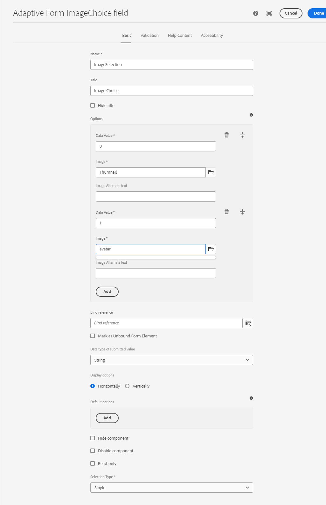

# Adaptive Form ImageChoice field {#image-choice}

The Image Choice component in a form allows users to make selections based on visual representations, such as images, rather than text-based options. It presents a series of images, each representing a distinct choice. Users can select one or more images, with visual feedback indicating their selection. This component is useful for options like product variants, survey answers, or profile pictures. It enhances user engagement and clarity by offering an intuitive, visually appealing selection method. 

## Usage

There are several key features of Image Choice Component such as:

- **Image Representation:** Users see images instead of traditional text labels or radio buttons. Each image corresponds to a choice that they can select, providing a visual representation of the options available.

- **Clickable Images:** Users can select an option by clicking directly on the image. The selected image often becomes highlighted to indicate it has been chosen.

- **Single or Multiple Selections:** Depending on the component's design, users can either select a single image or multiple images.

## Version and Compatibility {#version-and-compatibility}

The Adaptive Forms Image Choice Component was released as part of the Core Components 2.0.64. Here's a table showing all supported versions, AEM compatibility, and links to corresponding documentation:

|||
|---|---|
|Component Version|AEM as a Cloud Service|
|--- |--- |
|v1|Compatible with [release 2.0.64](/help/adaptive-forms/version.md) and later|Compatible|Compatible|

For information on Core Component versions and releases, refer to the [Core Components Versions](/help/adaptive-forms/version.md) document.

## Technical Details {#technical-details}

Get the latest information on the Adaptive Forms Image Choice Core Component in the technical documentation on [GitHub](https://github.com/adobe/aem-core-forms-components/tree/master/ui.af.apps/src/main/content/jcr_root/apps/core/fd/components/form/). For more on developing Core Components, check out the [Core Components developer documentation](/help/developing/overview.md).

## Configure Dialog {#configure-dialog}

You can easily customize your Image Choice component experience for visitors with the Configure Dialog.

### Basic Tab {#basic-tab}

- **Name** - You can identify a form component easily with its unique name both in the form and in the rule editor, but the name must not contain spaces or special characters.

- **Title** - With its Title, you can easily identify a component type in an adaptive form and by default, the title appears at the beside of the component. 

- **Hide Title** - You can hide the title by checking the Hide Title box.

- **Options** - It helps you to add single or multiple image(s) and customize the image choice properties. Image choice properties include Data Value, Image reference asset, and Alt text, for each of the images.
      
- **Bind Reference** - A bind reference is a reference to a data element that is stored in an external data source and used in a form. The bind reference allows you to dynamically bind data to form fields, so that the form can display the most up-to-date data from the data source.

    For example, a bind reference can be used to display a customer's name and address in a form, based on the customer's ID entered into the form. The bind reference can also be used to update the data source with data entered into the form. In this way, AEM Forms enable you to create forms that interact with external data sources, providing a seamless user experience for collecting and managing data.

- **Mark as Unbound Form Element**: Select the option to configure a form field not linked to any schema. This option allows you to save data without updating the data source. It also enables you to handle data in a custom way, separate from standard database integration.

- **Data type of submitted value**: This option specifies the data type of the value sent when any option is selected. If the **data type of submitted value** is set to `Number` and you add string data to **Data Value** ​​on the **Options** tab, the screen displays a `Value type mismatch` error message.

- **Display Options**: It gives you an option to display your image choice field horizontally or vertically.

- **Default Value**: This option allows you to add a default value (data value) in a form field. If a **Disabled Component** or **Read-Only Component** is selected, the default value is displayed on the screen. If no value is entered by the user in the form field, this value is submitted at the time of form submission.

- **Hide Component**: Select the option to hide the component from the form. The component remains accessible for other purposes, such as using it for calculations in the Rule Editor. This is useful when you need to store information that doesn't need to be seen or directly changed by the user.

- **Disable Component**: Select the option to disable or lock the component. The disabled component is not active or editable by the end user. The user can see the value of the field but cannot modify it. The component remains accessible for other purposes, such as using it for calculations in the Rule Editor.

- **Read Only**: This option allows you to add a default value (data value) in a form field. If a **Disabled Component** or **Read-Only Component** is selected, the default value is displayed on the screen. If no value is entered by the user in the form field, this value is submitted at the time of form submission.

- **Selection Type**: This option allows your users to select single or multiple selections of image choice fields.

### Validation Tab {#validation-tab}

- **Required** - Select this option, if you want to display the component in an Adaptive Form. After selecting the option, you must make a selection before proceeding with a form submission. You cannot select the **Hide Component** or **Disable Component in the **Basic** tab when this option is selected.

- **Error Message** - This option allows you to enter a message that is displayed if the **Required** checkbox is checked and the image choice field is not selected.

- **Script Validation Message** - This option allows you to enter a message to be displayed if the script validation fails.

### Help Content Tab {#helpcontent-tab}

- **Short description** - A short description is a brief text explanation that provides additional information or clarification about the purpose of a specific form field. It helps the user understand what type of data should be entered into the field and can provide guidelines or examples to help ensure that the information entered is valid and meets the desired criteria. By default, short descriptions remain hidden. Enable the **Always show short description** option to display it below the component.

- **Always show short description** - Enable the option to display the Short description below the component.

- **Help text** -  Help text refers to additional information or guidance that is provided to the user to assist them in filling out a form field correctly. It appears when the user clicks the help icon (i) placed next to the component. Help text provides more detailed information than a form field's label or placeholder text, and is designed to help the user understand the requirements or constraints of the field. It can also offer suggestions or examples to make filling out the form easier and more accurate.

### Accessibility Tab {#accessibility-tab}

- **Text for screen readers** - Text for screen readers refers to additional text that is intended to be read by assistive technologies, such as screen readers, used by visually impaired individuals. This text provides an audio description of the form field's purpose, and can include information about the field's title, description, name, and any relevant messages (Custom text). The screen reader text helps ensure that the form is accessible to all users, including those with visual impairments, and provides them with a complete understanding of the form field and its requirements. 
  - **Custom text**: Select this option to use the custom text for ARIA accessibility labels. Selecting this option displays the Custom Text dialog box. You can add relevant information in the Custom Text dialog box.
  - **Title**: Select this option to use the title for ARIA accessibility labels.

## Related Articles {#related-articles}

{{more-like-this}}

## See Also {#see-also}

{{see-also}}

