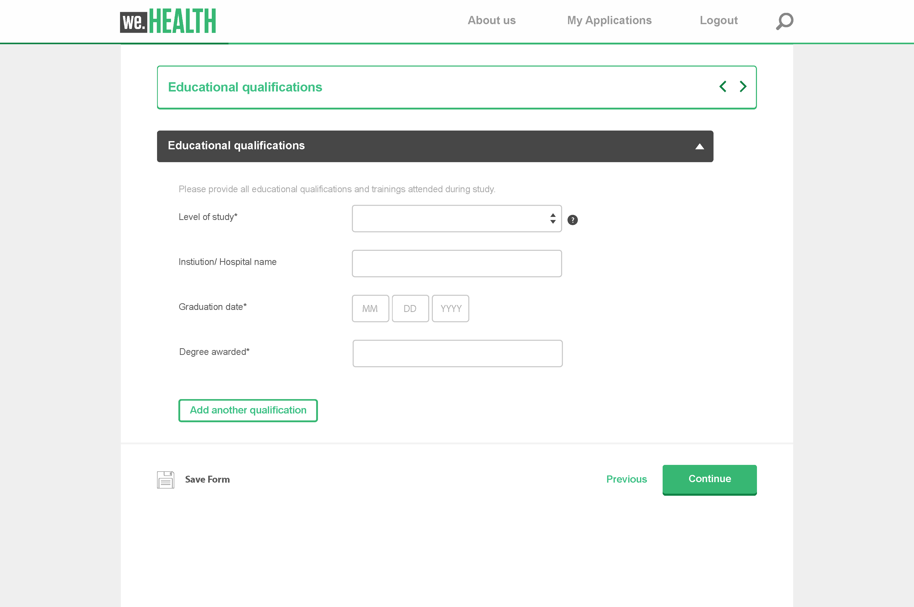

# Adaptive Forms Core Components  {#adaptive-forms-core-components-introduction}

Using the Adaptive Forms Core Components in Adobe Experience Manager, you can create compelling enrollment experiences. 

## Core Components {#overview}

In Adobe Experience Manager (AEM), components are the building blocks used to create pages and forms. They provide a simple and powerful way for authors to create and manage content, while also providing developers with the flexibility and extensibility needed to create custom components. These are designed to speed up development time and reduce maintenance costs for websites and forms, be flexible and can be easily customized to match the specific needs of a website and form.

The Core Components are also designed to be responsive and support a wide range of devices, including desktops, tablets, and smartphones. They also adhere to the latest web standards and best practices, making them a robust and reliable solution for creating web content.

Overall, the Core Components are an essential tool for creating and managing web content in AEM, providing a powerful and flexible solution that can help to reduce development time and maintenance costs, while also providing a great user experience to the website visitors. 

## Adaptive Forms Core Components

The Adaptive Forms Core Components are a set of 29 open-source, BEM-compliant components that are built on the foundation of the Adobe Experience Manager WCM Core Components. They are specifically designed to be used for creating Adaptive Forms, which are forms that adapt to the device, browser and screen size of the user.

These components can be used to create exceptional data capture and enrollment experiences by providing a wide range of form field options, including text fields, checkboxes, drop-down menus, and more. They also include features like validation, conditional logic, and responsive design, which can be used to create forms that are user-friendly and easy to use.

Additionally, as these components are open-source, developers have the ability to easily customize and extend the components to match the specific needs of their organization. And, These components are built on the BEM methodology, which ensures that they are scalable and maintainable.

## Features {#features}

|||
|---|---|
|Production-Ready| The Adaptive Forms Core Components are 24 robust WCM components.|
|Cloud-Ready| Available for [AEM Forms as a Cloud Service](https://experienceleague.adobe.com/docs/experience-manager-cloud-service/content/forms/home.html).|
|Versatile| The components represent generic concepts with which the Forms authors can assemble nearly any layout.|
|Configurable| Template-level [content policies](https://experienceleague.adobe.com/docs/experience-manager-cloud-service/content/implementing/developing/full-stack/components-templates/templates.html#content-policies) define which features are allowed to use or not use.|
|Accessible| They provide ARIA labels, support keyboard navigation, and text for assistive technologies such as screen readers.|
|Theme able| The components implement the [Style System](https://experienceleague.adobe.com/docs/experience-manager-cloud-service/content/sites/authoring/features/style-system.html), and the markup follows [BEM CSS conventions](https://getbem.com/).|
|Customizable| Several patterns allow easy customization, from adjusting the HTML to advanced functionality reuse.|
|Versioning| The [versioning policy](https://github.com/adobe/aem-core-wcm-components/wiki/Versioning-policies) ensures that the Core Components won't break your site when improving things that might impact you.|
|Open Sourced| If something is not as it should, contribute your improvement.|

<!-- comply with [WCAG 2.1 standard](https://www.w3.org/TR/WCAG21/), -->

 
## Benefits {#benefits}

Data capture experiences are crucial for lead generation and enrollment, and the Adaptive Forms Core Components provide a powerful solution for creating forms that are optimized for data capture. Some of the reasons to use Core Components to create these experiences over foundation components are: 

*   **[Availability on GitHub](https://github.com/adobe/aem-core-forms-components)**: The AEM Adaptive Forms Core Components are open-source and available on GitHub, along with comprehensive documentation. This makes it easier for developers to understand the components and how they work, as well as contribute to their development. The [aemcomponents.dev](https://www.aemcomponents.dev/) website is also a valuable resource, where developers can see the components in action and access detailed documentation.

*   **[BEM Model for Styling](https://experienceleague.adobe.com/en/docs/experience-manager-cloud-service/content/forms/adaptive-forms-authoring/authoring-adaptive-forms-core-components/create-an-adaptive-form-on-forms-cs/using-themes-in-core-components)**: The Core Components follow the BEM (Block Element Modifier) model for styling, which is a well-established and widely used methodology for organizing CSS. This makes it easier for developers to understand how the styles are organized and how to modify them to fit their specific needs.

*   **No Dependency on Third-Party Libraries**: One of the advantages of the Core Components is that they have no dependency on third-party JavaScript libraries, including JQuery and Underscore. This makes the components faster and more lightweight, as well as easier to integrate into an existing AEM implementation.

*   **Focus on Performance and Accessibility**: The Core Components are built with performance and accessibility in mind, which is reflected in their high Google Lighthouse and web vitals scores. This makes it easier for developers to create accessible and high-performing web pages, which is increasingly important in today's digital landscape.

*   **Form Components in Sites 30 Template and Themes**: The Core Components provide support for form components in the Sites 30 template and themes, making it easier for developers to create and customize forms within AEM.

*   **[Easier to Style](https://experienceleague.adobe.com/en/docs/experience-manager-cloud-service/content/forms/adaptive-forms-authoring/authoring-adaptive-forms-core-components/create-an-adaptive-form-on-forms-cs/using-themes-in-core-components)**: The Core Components are easier to style than their foundation component counterparts. The theme creation process is similar to Sites, with the ability to inherit the same theme/CSS from the parent Sites page. Additionally, the BEM model for styling makes it easier to understand and modify the styles.

*   **Accessibility**: Adaptive Forms Core Components support accessibility standards and guidelines to ensure that forms can be used by people with disabilities, including those using assistive technologies such as screen readers.

* **[Versioning](https://experienceleague.adobe.com/en/docs/experience-manager-cloud-service/content/forms/adaptive-forms-authoring/authoring-adaptive-forms-core-components/create-an-adaptive-form-on-forms-cs/add-comments-annotations-versioning-adaptive-form-core-components)**: You can create and manage multiple versions of a Core Components based Adaptive Forms, engage in collaborative discussions through comments, and attach annotations to specific form components, thereby enhancing the overall form-building experience. 

## Available Components: A breakdown by component type

The current version of AEM Forms has the following Core Components, [Foundation Components](https://experienceleague.adobe.com/en/docs/experience-manager-cloud-service/content/forms/adaptive-forms-authoring/authoring-adaptive-forms-foundation-components/create-an-adaptive-form-on-forms-cs/introduction-forms-authoring#component-toolbar), and [Form Block Components (Edge Delivery Services)](https://experienceleague.adobe.com/en/docs/experience-manager-cloud-service/content/edge-delivery/build-forms/forms-references/form-components). 

| Components | Foundation Components | Core Components | Form Block Components | Additional information |
|------------|:---------------------:|:---------------:|:---------------------:|-----------------------|
| Adobe Sign Block | ✔️ | | | [Adobe Sign integration](https://experienceleague.adobe.com/en/docs/experience-manager-cloud-service/content/forms/integrate/services/adobe-sign-integration-adaptive-forms#adobe-acrobat-sign-for-government) is available only for Foundation Components. |
| Accordion | ✔️ | [✔️](/help/adaptive-forms/components/accordion.md) | | For Foundation Components, you can configure the accordion layout in [panel component properties](https://experienceleague.adobe.com/en/docs/experience-manager-cloud-service/content/forms/adaptive-forms-authoring/authoring-adaptive-forms-foundation-components/configure-layout-of-an-adaptive-form/layout-capabilities-adaptive-forms#panel-layout). |
| Adaptive Form Fragment | ✔️ | ✔️ | | For Foundation Components, you can [add a fragment](https://experienceleague.adobe.com/en/docs/experience-manager-65/content/forms/adaptive-forms-basic-authoring/adaptive-form-fragments#insert-a-fragment-in-an-adaptive-form) from Assets Browser. |
| reCAPTCHA | ✔️ | ✔️ | ✔️ | For Foundation Components, use the Captcha component to [add Google reCaptcha to a form](https://experienceleague.adobe.com/en/docs/experience-manager-cloud-service/content/forms/adaptive-forms-authoring/authoring-adaptive-forms-foundation-components/add-components-to-an-adaptive-form/captcha-adaptive-forms#google-reCAPTCHA). |
| Button | ✔️ | [✔️](/help/adaptive-forms/components/button.md) | ✔️ | |
| Chart | ✔️ | | | |
| Check Box | ✔️ | ✔️ | | |
| Check Box Group | ✔️ | [✔️](/help/adaptive-forms/components/checkbox-group.md) | ✔️ | For Foundation Components, use the checkbox component to add multiple checkboxes |
| Date Input Field | ✔️ | | | For Core Components, use the [date picker](/help/adaptive-forms/components/date-picker.md) component. You can also add separate [textbox](/help/adaptive-forms/components/text-box.md) or [numeric box](/help/adaptive-forms/components/numeric-box.md) components to capture the day, month, and year. |
| Date Picker | ✔️ | [✔️](/help/adaptive-forms/components/date-picker.md) | ✔️ | |
| Drop-down List | ✔️ | [✔️](/help/adaptive-forms/components/drop-down-list.md) | ✔️ | |
| Email | ✔️ | [✔️](/help/adaptive-forms/components/email-input.md) | ✔️ | |
| File Attachment | ✔️ | [✔️](/help/adaptive-forms/components/file-attachment.md) | ✔️ | |
| File Attachment Listing | ✔️ | | | |
| Footer | ✔️ | [✔️](/help/adaptive-forms/components/footer.md) | ✔️ | |
| Footnote Placeholder | ✔️ | | | |
| Form Container | ✔️ | [✔️](/help/adaptive-forms/components/form-container.md) | ✔️ | For Foundation Components, use the [Root Panel component](https://experienceleague.adobe.com/en/docs/experience-manager-learn/cloud-service/forms/create-first-af/configure-root-panel). |
| Form Title | ✔️ | ✔️ | | For Foundation Components, use the title component. |
| hCaptcha | ✔️ | [✔️](/help/adaptive-forms/components/hcaptcha.md) |  | |
| Header | ✔️ | [✔️](/help/adaptive-forms/components/header.md) | ✔️ | |
| Horizontal Tabs | ✔️ | [✔️](/help/adaptive-forms/components/horizontal-tabs.md) | | For Foundation Components, you can configure the [tabs on top (horizontal tabs) layout](https://experienceleague.adobe.com/en/docs/experience-manager-cloud-service/content/forms/adaptive-forms-authoring/authoring-adaptive-forms-foundation-components/configure-layout-of-an-adaptive-form/layout-capabilities-adaptive-forms#panel-layout) in panel component properties. |
| Image | ✔️ | [✔️](/help/adaptive-forms/components/image.md) | ✔️ | |
| Image Choice | ✔️ | | | |
| Next Button | ✔️ | ✔️ | | Use the [wizard component](/help/adaptive-forms/components/wizard.md) for the next and previous buttons to move between multiple panels. |
| Numeric Box | ✔️ | [✔️](/help/adaptive-forms/components/numeric-box.md) | ✔️ | |
| Numeric Stepper | ✔️ | | | |
| Panel | ✔️ | [✔️](/help/adaptive-forms/components/panel.md) | ✔️ | |
| Password Box | ✔️ | | ✔️ | |
| Telephone / Phone | ✔️ | [✔️](/help/adaptive-forms/components/telephone-input.md) | ✔️ | |
| Previous button | ✔️ | | | Use the [wizard component](/help/adaptive-forms/components/wizard.md) for the next and previous buttons to move between multiple panels. |
| Radio Button | ✔️ | [✔️](/help/adaptive-forms/components/radio-button.md) | | |
| Radio Button Group | | | ✔️ | |
| Reset Button | ✔️ | [✔️](/help/adaptive-forms/components/reset-button.md) | ✔️ | |
| Scribble Signature | ✔️ | | | |
| Separator | ✔️ | | | |
| Submit Button | ✔️ | [✔️](/help/adaptive-forms/components/submit-button.md) | ✔️ | |
| Summary Step | ✔️ | | | |
| Switch | ✔️ |   [✔️](/help/adaptive-forms/components/switch.md) | | |
| Table | ✔️ | | | |
| Terms and Conditions | ✔️ | ✔️ | | |
| Text | ✔️ | [✔️](/help/adaptive-forms/components/text.md) | ✔️ | |
| Text Box | ✔️ | [✔️](/help/adaptive-forms/components/text-box.md) | ✔️ | |
| Title | ✔️ | | | For Core Components, use the [Form Title](/help/adaptive-forms/components/title.md) component. |
| Turnstile Captcha | ✔️ | | | [Turnstile Captcha](https://experienceleague.adobe.com/en/docs/experience-manager-cloud-service/content/forms/adaptive-forms-authoring/authoring-adaptive-forms-foundation-components/add-components-to-an-adaptive-form/integrate-adaptive-forms-turnstile) is available only for Foundation Components. |
| Vertical Tabs | ✔️ | ✔️ | | For Foundation Components, you can configure the [tabs on the left (vertical tabs) layout](https://experienceleague.adobe.com/en/docs/experience-manager-cloud-service/content/forms/adaptive-forms-authoring/authoring-adaptive-forms-foundation-components/configure-layout-of-an-adaptive-form/layout-capabilities-adaptive-forms#panel-layout) in panel component properties |
| Wizard | ✔️ | [✔️](/help/adaptive-forms/components/wizard.md) | ✔️ | For Foundation Components, you can configure the [wizard layout](https://experienceleague.adobe.com/en/docs/experience-manager-cloud-service/content/forms/adaptive-forms-authoring/authoring-adaptive-forms-foundation-components/configure-layout-of-an-adaptive-form/layout-capabilities-adaptive-forms#panel-layout) in panel component properties |

>[!NOTE]
>
>
> * In addition to the components listed above, Forms block supports all valid [HTML5 input types](https://developer.mozilla.org/en-US/docs/Web/HTML/Element/input#input_types) and [text area](https://developer.mozilla.org/en-US/docs/Web/HTML/Element/textarea) as components. 
> * Need a component not listed above? Request it by emailing aem-forms-ea@adobe.com from your official address.

<!-- >
* [Accordion](/help/adaptive-forms/components/accordion.md)
* [Button](/help/adaptive-forms/components/button.md)
* [Check Box Group](/help/adaptive-forms/components/checkbox-group.md)
* [Date Picker](/help/adaptive-forms/components/date-picker.md)
* [Drop-down list](/help/adaptive-forms/components/drop-down-list.md)
* [Email-input](/help/adaptive-forms/components/email-input.md)
* [Form Container](/help/adaptive-forms/components/form-container.md)
* [File Attachment](/help/adaptive-forms/components/file-attachment.md)
* [Footer](/help/adaptive-forms/components/footer.md)
* [Header](/help/adaptive-forms/components/header.md)
* [Horizontal Tabs](/help/adaptive-forms/components/horizontal-tabs.md)
* [Image](/help/adaptive-forms/components/image.md)
* [Numeric Box](/help/adaptive-forms/components/numeric-box.md)
* [Panel](/help/adaptive-forms/components/panel.md)
* [Radio Button](/help/adaptive-forms/components/radio-button.md)
* [Reset Button](/help/adaptive-forms/components/reset-button.md)
* [Submit Button](/help/adaptive-forms/components/submit-button.md)
* [Telephone input](/help/adaptive-forms/components/telephone-input.md)
* [Text Box](/help/adaptive-forms/components/text-box.md)
* [Text](/help/adaptive-forms/components/text.md)
* [Title](/help/adaptive-forms/components/title.md)
* [Wizard](/help/adaptive-forms/components/wizard.md)

--> 

## Easy-to-use forms editor

The editor for Core Components based Adaptive Forms is similar to the one you already use for creating AEM Sites Pages. Here's what you get:

* **Familiar UI elements and settings**: When configuring properties for form components, you see a properties dialog looks just like the ones you are using to for WCM Core Components. This makes it quicker to find the options you need. Like WCM Core Components, for form components, the properties dialog appear in the center of the editor with clear tabs separating basic and advanced options, help text, and accessibility information – all in a tabs format for easy navigation.

* **[Rule Editor](https://experienceleague.adobe.com/en/docs/experience-manager-cloud-service/content/forms/adaptive-forms-authoring/authoring-adaptive-forms-core-components/create-an-adaptive-form-on-forms-cs/rule-editor-core-components)**: You can add logic and dynamic features to your forms without writing code. You can use the built-in rule editor to:
    * Show or hide fields based on user choices
    * Enable or disable an object
    * Set a value for an object
    * Perform calculations
    * Set property of an object
    * Validate data entry
    * Invoke a service (call external functionality)
    * Use built-in functions (predefined functions for common tasks)
    * Use custom functions (your own code for specific needs)
    * Validate fields and panels (ensure that data meets requirements)
    * Validate the value of an object
    * Execute functions to compute the value of an object
    * Invoke a Form Data Model (FDM) service and perform an operation
    * Dynamically add styles (change the appearance based on conditions)
    * Create other rules (chain actions and logic)
    * and more!

    The rule editor does not have the code editor. You can use [custom functions](https://experienceleague.adobe.com/en/docs/experience-manager-cloud-service/content/forms/adaptive-forms-authoring/authoring-adaptive-forms-core-components/create-an-adaptive-form-on-forms-cs/create-and-use-custom-functions) to add your own code for specific needs to the rule editor. 

* **Pre-filling forms**: You can automatically populate certain fields in a form with existing data when a user opens it. This saves users time and effort by eliminating the need to manually enter information that might already be available. The Core Components editor provides an OOTB pre-fill service to populate form fields with the help of a Form Data Model. You can also create custom prefill services for more complex scenarios.

* **[Document of Record (DoR)](https://experienceleague.adobe.com/en/docs/experience-manager-cloud-service/content/forms/adaptive-forms-authoring/authoring-adaptive-forms-core-components/create-an-adaptive-form-on-forms-cs/generate-document-of-record-core-components)**: A Document of Record (DoR) refers to a formal, printable representation of the data submitted through the form. It serves as a permanent record of the information a user entered, providing a snapshot of the submitted data in a user-friendly format, typically a PDF document. You can use the editor to easily configure a custom template or use an OOTB template to generate a DoR. 

* **[Form Data Model](https://experienceleague.adobe.com/en/docs/experience-manager-cloud-service/content/forms/integrate/use-form-data-model/using-form-data-model)**: An Adaptive Forms Data Model (FDM) acts as a bridge between your Adaptive Forms and your data sources. It essentially defines the structure and organization of the data that your forms collect and interact with. You can use the editor to easily connect your form with a Forms Data Model (FDM). 

* **[Form Submissions](https://experienceleague.adobe.com/en/docs/experience-manager-cloud-service/content/forms/adaptive-forms-authoring/authoring-adaptive-forms-core-components/create-an-adaptive-form-on-forms-cs/configure-submit-actions-core-components#:~:text=Adaptive%20Form%20Submit%20Action&text=Adobe%20recommends%20using%20Core%20Components,to%20create%20standalone%20Adaptive%20Forms.&text=A%20Submit%20Action%20lets%20you,button%20on%20an%20Adaptive%20Form)**: A form submission refers to the process of users completing and sending their filled-out forms. This triggers a series of actions defined within the form's configuration, ultimately leading to the storage or processing of the submitted data. The Adaptive Forms editor offers a variety of options for configuring form submissions. Some of the common submit actions are:

    * [Send email](https://experienceleague.adobe.com/en/docs/experience-manager-cloud-service/content/forms/adaptive-forms-authoring/authoring-adaptive-forms-core-components/create-an-adaptive-form-on-forms-cs/configure-submit-actions-core-components#:~:text=Adaptive%20Form%20Submit%20Action&text=Adobe%20recommends%20using%20Core%20Components,to%20create%20standalone%20Adaptive%20Forms.&text=A%20Submit%20Action%20lets%20you,button%20on%20an%20Adaptive%20Form.)
    * [Invoke a Power Automate flow](https://experienceleague.adobe.com/en/docs/experience-manager-cloud-service/content/forms/integrate/services/forms-microsoft-power-automate-integration)
    * [Submit to SharePoint](https://experienceleague.adobe.com/en/docs/experience-manager-cloud-service/content/forms/adaptive-forms-authoring/authoring-adaptive-forms-core-components/create-an-adaptive-form-on-forms-cs/configure-submit-action-sharepoint)
    * [Invoke a Workfront Fusion](https://experienceleague.adobe.com/en/docs/experience-manager-cloud-service/content/forms/adaptive-forms-authoring/authoring-adaptive-forms-core-components/create-an-adaptive-form-on-forms-cs/configure-submit-actions-core-components#:~:text=Invoke%20a%20Workfront%20Fusion)
    * [Submit using Form Data Model (FDM)](https://experienceleague.adobe.com/en/docs/experience-manager-cloud-service/content/forms/integrate/use-form-data-model/using-form-data-model)
    * [Submit to Azure Blob Storage](https://experienceleague.adobe.com/en/docs/experience-manager-cloud-service/content/forms/adaptive-forms-authoring/authoring-adaptive-forms-core-components/create-an-adaptive-form-on-forms-cs/configure-submit-actions-core-components#:~:text=Submit%20to%20Azure%20Blob%20Storage)
    * [Submit to REST endpoint](https://experienceleague.adobe.com/en/docs/experience-manager-cloud-service/content/forms/adaptive-forms-authoring/authoring-adaptive-forms-core-components/create-an-adaptive-form-on-forms-cs/configure-submit-action-restpoint)
    * [Submit to OneDrive](https://experienceleague.adobe.com/en/docs/experience-manager-cloud-service/content/forms/adaptive-forms-authoring/authoring-adaptive-forms-core-components/create-an-adaptive-form-on-forms-cs/configure-submit-actions-core-components#:~:text=to%20REST%20endpoint-,Submit%20to%20OneDrive,-Invoke%20an%20AEM)
    * [Invoke an AEM Workflow](https://experienceleague.adobe.com/en/docs/experience-manager-cloud-service/content/forms/adaptive-forms-authoring/authoring-adaptive-forms-core-components/create-an-adaptive-form-on-forms-cs/configure-submit-actions-core-components#:~:text=Invoke%20an%20AEM%20Workflow)

* [Adaptive Forms Core Components in Sites Page editor](https://experienceleague.adobe.com/en/docs/experience-manager-cloud-service/content/forms/adaptive-forms-authoring/create-or-add-an-adaptive-form-to-aem-sites-page): You can enable and use Adaptive Forms Core Components in AEM Page Editor and AEM Experience Fragments to directly create data capture experience along with builidng a Sites page. 

    >[!VIDEO](https://video.tv.adobe.com/v/3419284?quality=12&learn=on)

<!-- 
* **Preview Forms**: You can use the editor to  simulates how the form would appear on various devices like desktops, tablets, and smartphones.
--> 

## Enable Adaptive Forms Core Components

Enabling Adaptive Forms Core Components on AEM Forms as a Cloud Service, allows you to start creating, publishing, and delivering Core Components based Adaptive Forms and Headless Forms using your AEM Forms Cloud Service instances to multiple channels. For detailed instructions to enable Adaptive Form Core Components, see [Enable Adaptive Forms Core Components on AEM Forms as a Cloud Service and local development environment](https://experienceleague.adobe.com/docs/experience-manager-cloud-service/content/forms/setup-configure-migrate/enable-adaptive-forms-core-components.html).

The Adaptive Forms Core Components have the following requirements.

|AEM Version|AEM Forms add-on|Adaptive Forms Core Components|
|---|---|---|
|AEM as a Cloud Service|Forms - Digital Enrollment|[Release 2.0.10](version.md)+|
|AEM 6.5 | Forms add-on |[Release 1.1.12](version.md)+|

If your AEM Cloud Service SDK version older than 2023.02.0, [ensure that you have `prerelease` flag enabled on your environment](https://experienceleague.adobe.com/docs/experience-manager-cloud-service/content/release-notes/prerelease.html?lang=en#new-features) as Adaptive Forms Core Components were part of pre-prelease before the 2023.02.0 release.

## Create a Core Components based Adaptive Form

You can perform the following actions on both AEM Forms as a Cloud Service or AEM 6.5 Forms environments:

| Action | AEM Forms Version |
|--------|------------------|
| Create a standalone Adaptive Form | [AEM Forms as Cloud Service](https://experienceleague.adobe.com/docs/experience-manager-cloud-service/content/forms/adaptive-forms-authoring/authoring-adaptive-forms-core-components/create-an-adaptive-form-on-forms-cs/creating-adaptive-form-core-components.html) |
| Create an Adaptive Form in AEM Sites Page | [AEM 6.5 Forms](https://experienceleague.adobe.com/docs/experience-manager-65/forms/adaptive-forms-basic-authoring/create-or-add-an-adaptive-form-to-aem-sites-page.html?lang=en#create-an-adaptive-form-in-sites-editor-or-experience-fragment), [AEM Forms as Cloud Service](https://experienceleague.adobe.com/docs/experience-manager-cloud-service/content/forms/adaptive-forms-authoring/create-or-add-an-adaptive-form-to-aem-sites-page.html#create-an-adaptive-form-in-sites-editor-or-experience-fragment) |
| Create an Adaptive Form in AEM Experience Fragment | [AEM 6.5 Forms](https://experienceleague.adobe.com/docs/experience-manager-65/forms/adaptive-forms-basic-authoring/create-or-add-an-adaptive-form-to-aem-sites-page.html?lang=en#create-an-adaptive-form-in-experience-fragment), [AEM Forms as Cloud Service](https://experienceleague.adobe.com/docs/experience-manager-cloud-service/content/forms/adaptive-forms-authoring/create-or-add-an-adaptive-form-to-aem-sites-page.html#create-an-adaptive-form-in-experience-fragment) |
| Convert an Adaptive Form to an Experience Fragment | [AEM 6.5 Forms](https://experienceleague.adobe.com/docs/experience-manager-65/forms/adaptive-forms-basic-authoring/create-or-add-an-adaptive-form-to-aem-sites-page.html?lang=en#convert-an-adaptive-form-in-sites-page-to-an-experience-fragment), [AEM Forms as Cloud Service](https://experienceleague.adobe.com/docs/experience-manager-cloud-service/content/forms/adaptive-forms-authoring/create-or-add-an-adaptive-form-to-aem-sites-page.html#convert-an-adaptive-form-in-sites-page-to-an-experience-fragment) |

<!-- >, such as  [WCAG 2.1 standard](https://www.w3.org/TR/WCAG21/), to ensure that forms can be used by people with disabilities, including those using assistive technologies such as screen readers.

*   **Alignment with AEM Sites**: The Core Components are designed to be more aligned with AEM Sites, making it easier for Sites users to adopt and use them without having to learn anything new. The components use the same front-end pipeline as Sites, making it easier to style and modify their appearance. 

<!-- Additionally, the following points further illustrate this alignment:

    *   **Authoring experience inline with Page editor**: The Core Components have an authoring experience that is inline with the Sites editor, with dialogs and other experiences similar to the Page editor. This makes it easier for Sites users to create and manage forms within the familiar context of the Sites editor.

    *   **Inline form editing in Sites editor**: The Core Components allow  inline form editing within the Sites editor, avoiding the need to switch back and forth between editors. This streamlines the authoring experience and makes it easier to create and manage forms.

    *   **Inheriting Sites features in Forms**: Forms authored within a Sites page inherit the same features as Sites. This provides a seamless and integrated experience for creating and managing forms within the context of AEM Sites 
    
    <!--including Multi Site Manager, the ability to use Sites components within a form for static content, support for scheduled publish/unpublish, form translation aligned with Sites translation, versioning, and targeting -->

## See Also {#see-also}

{{see-also}}
