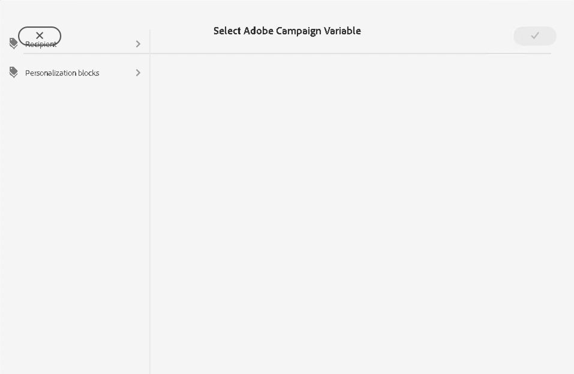
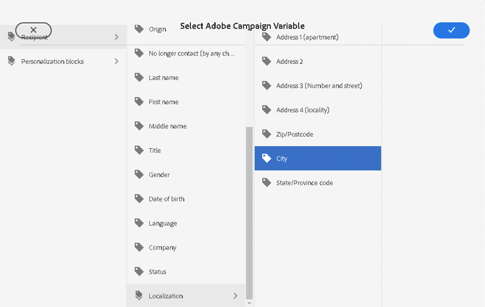
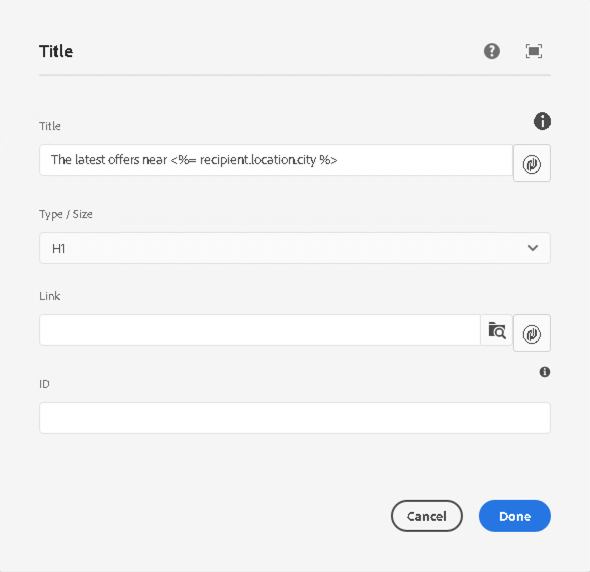

# Campaign Variables {#campaign-variables}

Use campaign variables to compose personalized email content. Campaign variables act as placeholders for Adobe Campaign values which you can insert into your email content. When the content is sent via Adobe Campaign, Campaign replaces those variables with the personalized content of the recipient.

## Usage {#usage}

The Email Core Components make campaign variables easily accessible via personalization buttons next to common text fields. When pressed, a dialog appears from which you can select a personalization field.

The list of available personalization fields is synchronized with your Adobe Campaign instance. The fields are managed in Adobe Campaign in the schema `nms:seedMember`. All fields in `nms:seedMember` must also be present in your recipient table.

## Select Adobe Campaign Variable Dialog {#dialog}

The Select Adobe Campaign Variable dialog is available in many edit dialogs of the Email Core Components. To use it simply click on the **Select Adobe Campaign Variable** icon next to the applicable field. This icon can take two forms.

Clicking both icons opens the **Select Adobe Campaign Variable** dialog.

Use the column view to locate the variable that you wish to insert. Clicking a node in a column shows its children in a new column to the right. In this way, you can navigate the variable content structure.

Select the variable that you wish to insert and then click the checkmark at the top-right of the dialog.

The variable is then inserted into the field of the edit dialog of the Email Core Component.

Click the X at the top-left of the dialog at any time to cancel and close the dialog.
