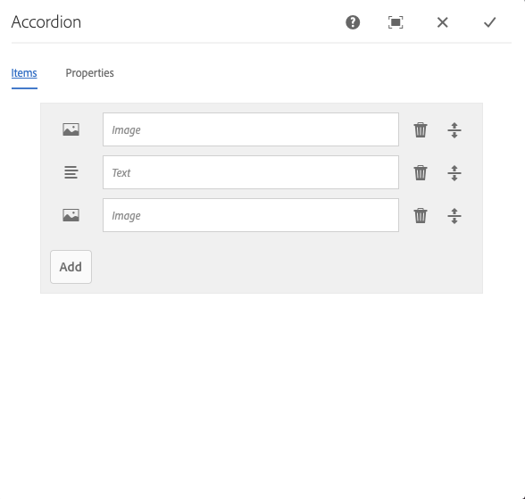
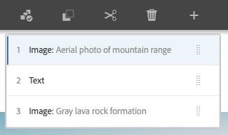

# Accordion Component{#accordion-component}

The Core Component Accordion component allows for the creation of a collection of panels arranged in an accordion on a page.

## Usage {#usage}

The Core Component Accordion component allows for the creation of a collection of components, composed as panels, and arranged in an accordion on a page, similar to the [Tabs Component](tabs.md), but allows for expanding and collapsing of the panels.

* The accordion's properties can be defined in the [configure dialog](#configure-dialog).
* The order of the panels of the accordion can be defined in the configure dialog as well as the [select panel popover](#select-planel.md)
* Defaults for the Accordion Component when adding it to a page can be defined in the [design dialog](#design-dialog).

## Version and Compatibility {#version-and-compatibility}

The current version of the Accordion Component is v1, which was introduced with release 2.5.0 of the Core Components in June 2019, and is described in this document.

The following table details all supported versions of the component, the AEM versions with which the versions of the component is compatible, and links to documentation for previous versions.

|Component Version|AEM 6.3|AEM 6.4|AEM 6.5|
|--- |--- |--- |---|
|v1|Compatible|Compatible|Compatible|

For more information about Core Component versions and releases, see the document [Core Components Versions](versions.md).

## Sample Component Output {#sample-component-output}

To experience the Accordion Component as well as see examples of its configuration options as well as HTML and JSON output, visit the [Component Library](http://opensource.adobe.com/aem-core-wcm-components/library/accordion.html).

## Technical Details {#technical-details}

The latest technical documentation about the Download Component [can be found on GitHub](https://github.com/adobe/aem-core-wcm-components/tree/master/content/src/content/jcr_root/apps/core/wcm/components/accordion/v1/accordion).

Further details about developing Core Components can be found in the [Core Components developer documentation](developing.md).

## Configure Dialog {#configure-dialog}

The configure dialog allows the content author to define the accordion item, its panels, and how it will behave and appear for a visitor to the page.

### Items Tab {#items-tab}

Use the **Add** button to open the component selector to choose which component to add as a panel. Once added, an entry is added to the list, which contains the following columns:

* **Icon** - The icon of the component type of the panel for easy identification in the list. Mouse over to see the full component name as a tooltip.
* **Description** - The description used as the text of the panel, defaulting to the name of the component selected for the panel.
* **Delete** - Tap or click to delete the panel from the accordion component.
* **Rearrange** - Tap or click and drag to rearrange the order of the panels.

### Properties Tab {#properties-tab}

* **Single item expansion** - When selected, this option forces a single accordion item to be expanded at a time. Expanding one item will then collapse all others.
* **Expanded items** - This option defines the items that are expanded by default when the page is loaded.
  * When **Single item expansion** is selected, one panel must be selected. By default the first panel is selected.
  * When **Single item expansion** is not selected, this option is a multi-select and is optional.

## Select Panel Popover {#seelct-panel-popover}

The content author can use the **Select Panel** option on the component toolbar to change to a different panel for editing as well as to easily rearrange the order of the panels within the accordion.

Once selecting the **Select Panel** option in the component toolbar, the configured accordion panels are displayed as a drop-down.

* The list is ordered by the assigned arrangement of the panels and is reflected in the numbering.
* The component type of the panel is displayed first, followed by the description of the panel in lighter font.
* Tapping or clicking an entry in the dropdown, switches the view in the editor to that panel.
* The panels can be rearranged in-place by using the drag handles.

## Design Dialog {#design-dialog}

The design dialog allows the template author to define the options available to the content author who uses the Accordion Component and the defaults set when placing the Accordion Component.

### Properties Tab {#properties-tab-design}

* **Allowed Heading Elements** - This multi-select drop-down defines the accordion item heading HTML elements that are allowed to be selected by an author.
* **Default Heading Element** - This drop-dpown defines the default accordion item heading HTML element.

### Allowed Components Tab {#allowed-components-tab}

The **Allowed Components** tab is used to define which components can be added as items to panels in the Accordion Component by the content author.

The Allowed Components tab functions in the same way as the tab of the same name when [defining the policy and properties of a Layout Container in the Template Editor.](https://helpx.adobe.com/experience-manager/6-5/sites/authoring/using/templates.html)

### Styles Tab {#styles-tab}

The Accordion Component supports the AEM [Style System](authoring.md#component-styling).
