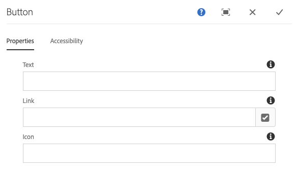
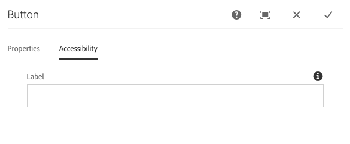

# Button Component{#button-component}

The Core Component Button component allows for the configuration and display of a button item on a page.

## Usage {#usage}

The Core Component Button component allows for the inclusion of a button on a page.

* The button's properties can be selected in the [configure dialog](#configure-dialog).
* Styles for the Button Component can be defined in the [design dialog](#design-dialog).

## Version and Compatibility {#version-and-compatibility}

The current version of the Button Component is v1, which was introduced with release 2.5.0 of the Core Components in June 2019, and is described in this document.

The following table details all supported versions of the component, the AEM versions with which the versions of the component is compatible, and links to documentation for previous versions.

|Component Version|AEM 6.3|AEM 6.4|AEM 6.5|AEM as a Cloud Service|
|--- |--- |--- |---|---|
|v1|Compatible|Compatible|Compatible|Compatible|

For more information about Core Component versions and releases, see the document [Core Components Versions](versions.md).

## Sample Component Output {#sample-component-output}

To experience the Button Component as well as see examples of its configuration options as well as HTML and JSON output, visit the [Component Library](https://adobe.com/go/aem_cmp_library_button).

## Technical Details {#technical-details}

The latest technical documentation about the Button Component [can be found on GitHub](https://adobe.com/go/aem_cmp_tech_button_v1).

Further details about developing Core Components can be found in the [Core Components developer documentation](developing.md).

## Configure Dialog {#configure-dialog}

The configure dialog allows the content author to define the button and how it will behave and appear for a visitor to the page.

### Properties Tab {#properties-tab}

* **Text** - The text to display on the button
* **Link** - Link to a content page within AEM, an external resource, or an anchor
  * Use the **Selection Dialog** to choose a path within AEM.
* **Icon** - Identifier for displaying an icon in the button

### Accessibility Tab {#accessibility-tab}

On the **Accessibility** tab, values can be set for [ARIA accessibility](https://www.w3.org/WAI/standards-guidelines/aria/) labels for the component.

* **Label** - Value of an ARIA label attribute for the component

## Design Dialog {#design-dialog}

### Styles Tab {#styles-tab}

The Image Component supports the AEM [Style System](authoring.md#component-styling).
