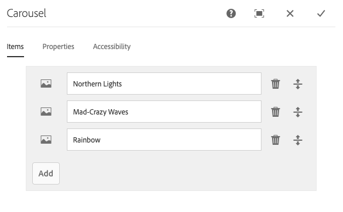
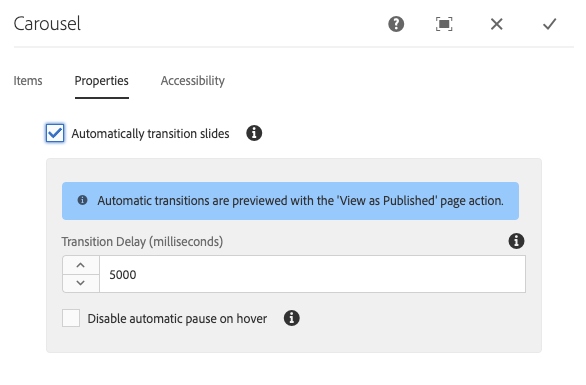
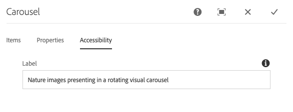
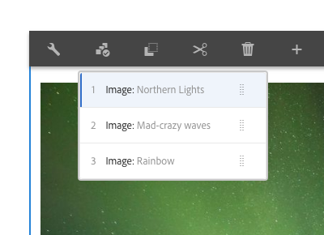
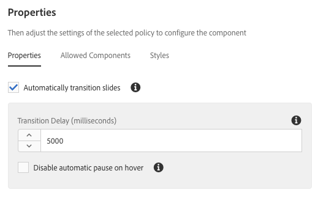

# Carousel Component{#carousel-component}

The Core Component Carousel Component allows the content author to present content in a navigable carousel.

## Usage {#usage}

Using the Carousel Component, the content author to organize content in a rotating carousel of slides.

The [edit dialog](#edit-dialog) allows the content author to create, name, and order multiple slides as well as enable auto-transition with delay. Using the [design dialog](#design-dialog), the template author can define which components can be added to the carousel, enable or disable automatic transitions, and customize the styles.

## Version and Compatibility {#version-and-compatibility}

The current version of the Carousel Component is v1, which was introduced with release 2.2.0 of the Core Components in October 2018, and is described in this document.

The following table details all supported versions of the component, the AEM versions with which the versions of the component is compatible, and links to documentation for previous versions.

|Component Version|AEM 6.3|AEM 6.4|AEM 6.5|
|--- |--- |--- |--- |
|v1|Compatible|Compatible|Compatible|

For more information about Core Component versions and releases, see the document [Core Components Versions](versions.md).

## Sample Component Output {#sample-component-output}

To experience the Carousel Component as well as see examples of its configuration options as well as HTML and JSON output, visit the [Component Library](http://opensource.adobe.com/aem-core-wcm-components/library/carousel.html).

### Technical Details {#technical-details}

The latest technical documentation about the Carousel Component [can be found on GitHub](https://github.com/adobe/aem-core-wcm-components/blob/master/content/src/content/jcr_root/apps/core/wcm/components/carousel/v1/carousel).

Further details about developing Core Components can be found in the [Core Components developer documentation](developing.md).

## Edit Dialog {#edit-dialog}

The edit dialog allows the content author to add, rename, and rearrange slides as well as define the auto-transition settings.

### Items Tab {#items-tab}

Use the **Add** button to open the component selector to choose which component to add as a tab. Once added, an entry is added to the list, which contains the following columns:

* **Icon** - The icon of the component type of the tab for easy identification in the list. Mouse over to see the full component name as a tooltip.
* **Description** - The description used as the text of the tab, defaulting to the name of the component selected for the tab.
* **Delete** - Tap or click to delete the tab from the tabs component.
* **Reorder** - Tap or click and drag to order the tabs.

>[!TIP]
>
>If the viewport of the page is reduced so that the edit dialog becomes full screen, the **Add** button will be hidden. Components can still be added to the Carousel Component by [dragging from the components browser and dropping on the Carousel Component in the page editor](https://helpx.adobe.com/experience-manager/6-5/sites/authoring/using/editing-content.html#InsertingaComponent).

### Properties Tab {#properties-tab}

On the **Properties** tab, the content author can set the slides to automatically transition.

* **Automatically transition slides** - When active, the component will automatically advance to the next slide after a specified delay.
* **Transition Delay** - When Automatically transition slides is selected, this value is used to define the delay between transitions (in milliseconds).
* **Disable automatic pause on hover** - When **Automatically transition slides** is selected, the carousel transition will automatically pause whenever the cursor hovers over the carousel. Select this option so that the transition will not pause.

>[!NOTE]
>
>The slide advance controls are not enabled when in **Edit** mode. Use [**Preview** mode](https://helpx.adobe.com/experience-manager/6-5/sites/authoring/using/editing-content.html) or the **[View as Published](https://helpx.adobe.com/experience-manager/6-5/sites/authoring/using/editing-content.html)** option to interact with the carousel as a reader of the published content would.
>
>The auto-advance feature is not enabled when in **Edit** mode. Use **[View as Published](https://helpx.adobe.com/experience-manager/6-5/sites/authoring/using/editing-content.html)** option to see the auto-advance feature as a reader of the published content would.

### Accessibility Tab {#accessibility-tab}

On the **Accessibility** tab, values can be set for [ARIA accessibility](https://www.w3.org/WAI/standards-guidelines/aria/) labels for the component.

* **Label** - Value of an ARIA label attribute for the component

## Select Panel {#select-panel}

The content author can use the **Select Panel** option on the component toolbar to change to a different slide for editing as well as to easily rearrange the order of the slides.

Once selecting the **Select Panel** option in the component toolbar, the configured slides are displayed as a drop-down.

* The list is ordered by the assigned arrangement of the slides and is reflected in the numbering.
* The component type of the slide is displayed first, followed by the description of the slide in lighter font.

* Tapping or clicking an entry in the dropdown, switches the view in the editor to that slide.
* The slide can be reordered in-place by using the drag handles.

## Design Dialog {#design-dialog}

The design dialog allows the template author to define which components can be added as slides to the carousel component as well as define auto-transition defaults and which custom styles are available to the content author.

### Properties Tab {#properties-tab-1}

The **Properties** tab is used to define the default settings for the slide transitions when a content author adds the carousel component to a page.

* **Automatically transition slides** - Defines if by default the option to automatically advance the carousel to the next slide is enabled when the content author adds the carousel component to a page.
* **Transition Delay** - Defines the default value of the transition delay between slides (in milliseconds) when a content author adds the carousel component to a page.
* **Disable automatic pause on hover** - Defines if by default the option to disable the automatic slide pausing is enabled when **Automatically transition slides** is selected by the content author.

### Allowed Components Tab {#allowed-components-tab}

The **Allowed Components** tab is used to define which components can be added as slides to the Carousel Component by the content author.

The Allowed Components tab functions in the same way as the tab of the same name when [defining the policy and properties of a Layout Container in the Template Editor.](https://helpx.adobe.com/experience-manager/6-5/sites/authoring/using/templates.html)

### Styles Tab {#styles-tab}

The Carousel Component supports the AEM [Style System](authoring.md#component-styling).
