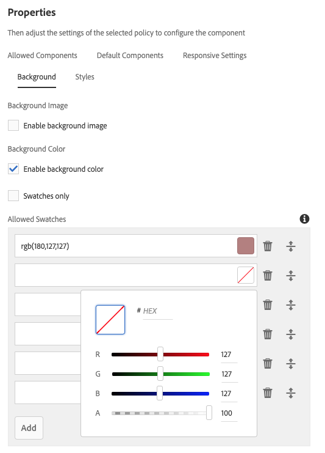

# Container Component{#container-component}

The Core Component Container component allows for the creation of a container for multiple additional components on a page.

## Usage {#usage}

The Core Component Container component allows for the creation of a container for multiple additional components on a page and can be used to group other components and apply a common style or layout.

* The container's properties can be selected in the [configure dialog](#configure-dialog).
* Defaults for the Container Component when adding it to a page can be defined in the [design dialog](#design-dialog).

## Version and Compatibility {#version-and-compatibility}

The current version of the Container Component is v1, which was introduced with release 2.5.0 of the Core Components in June 2019, and is described in this document.

The following table details all supported versions of the component, the AEM versions with which the versions of the component is compatible, and links to documentation for previous versions.

|Component Version|AEM 6.3|AEM 6.4|AEM 6.5|
|--- |--- |--- |---|
|v1|Compatible|Compatible|Compatible|

For more information about Core Component versions and releases, see the document [Core Components Versions](versions.md).

## Sample Component Output {#sample-component-output}

To experience the Container Component as well as see examples of its configuration options as well as HTML and JSON output, visit the [Component Library](http://opensource.adobe.com/aem-core-wcm-components/library/container.html).

## Technical Details {#technical-details}

The latest technical documentation about the Download Component [can be found on GitHub](https://github.com/adobe/aem-core-wcm-components/tree/master/content/src/content/jcr_root/apps/core/wcm/components/container/v1/container).

Further details about developing Core Components can be found in the [Core Components developer documentation](developing.md).

## Configure Dialog {#configure-dialog}

The configure dialog allows the content author to define the container item and how it will behave and appear for a visitor to the page.

* **Layout** - This option defines the behavior or the layout behavior of the Container Component.
  * **Simple** - Defines a container as a simple collection of components
  * **Responsive Grid** - Defines a container as an [AEM Responsive Grid](https://helpx.adobe.com/experience-manager/6-5/sites/authoring/using/responsive-layout.html)
* **ID** - Use this option to define the HTML ID attribute to apply to the component.

## Design Dialog {#design-dialog}

The design dialog allows the template author to define the options available to the content author who uses the Container Component.

### Allowed Components Tab {#allowed-components-tab}

The **Allowed Components** tab is used to define which components can be added as items to the Container Component by the content author.

The Allowed Components tab functions in the same way as the tab of the same name when [defining the policy and properties of a Layout Container in the Template Editor.](https://helpx.adobe.com/experience-manager/6-5/sites/authoring/using/templates.html)

### Default Components Tab {#default-components-tab}

The Default Components tab is used to define which component is added to the component when a particular asset type is dropped on the container, similar to [how default components are defined on the page template](https://helpx.adobe.com/experience-manager/6-5/sites/authoring/using/templates.html#EditingTemplatesTemplateAuthors).

### Responsive Settings Tab {#responsive-settings-tab}

* **Columns** - Defines the number of columns in the grid of the resulting container.

### Background Tab {#background-tab}

* **Background Image**
  * **Enable background image** - Select this option to enable the content author to define a background image for the container.
* **Background Color**
  * **Enable background color** - Select this option to enable the content author to define a background color for the container.
  * **Swatches only** - Select this option to only allow the content author to select from pre-defined color swatches for the container background color.
    * Only available when **Enable background color** is selected
* **Allowed Swatches** - Define pre-defined colors from which the content author can select the container background color
  * Use the **Add** button to add a pre-defined color swatch. Once added, an entry is added to the list, which contains the following columns:
  * **Value** - Define the color manually via RGB values
    * Tap or click the color picker to more easily select a color by adjusting individual RGB values or defining a hex value.
  * **Delete** - Tap or click to delete a swatch.
  * **Rearrange** - Tap or click and drag to rearrange the order of the swatches.

### Styles Tab {#styles-tab}

The Container Component supports the AEM [Style System](authoring.md#component-styling).
