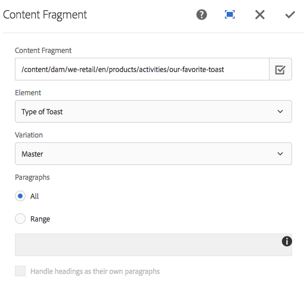

# Content Fragment Component{#content-fragment-component}

The Core Component Content Fragment component allows for the display of a [content fragment](https://helpx.adobe.com/experience-manager/6-5/assets/using/content-fragments.html).

>[!NOTE]
>
>Prior to release 2.4.0 of the Core Components, the Content Fragment component was available as an extension to the core components and had to be separately downloaded and explicitly enabled.

## Usage {#usage}

The Core Component Content Fragment Component allows for the inclusion of a [content fragment](https://helpx.adobe.com/experience-manager/6-5/assets/using/content-fragments.html) on a page.

* The fragment and its properties can be selected in the [configure dialog](#configure-dialog).
* Resource types to handle certain images and grids can be defined in the [design dialog](#design-dialog).
* The edit option will open the selected fragment within the [content fragment editor](https://helpx.adobe.com/content/help/en/experience-manager/6-5/assets/using/content-fragments.html).

## Version and Compatibility {#version-and-compatibility}

The current version of the Content Fragment Component is v1, which was introduced with release 1.1.0 of the Core Components in October 2017, and is described in this document.

The following table details all supported versions of the component, the AEM versions with which the versions of the component is compatible, and links to documentation for previous versions.

|Component Version|AEM 6.3|AEM 6.4|AEM 6.5|
|--- |--- |--- |---|
|v1|Compatible|Compatible|Compatible|

>[!NOTE]
>
>Prior to release 2.4.0, the Content Fragment component was located in the extensions folder.
>
> `apps/core/wcm/extension/components/contentfragment/v1/contentfragment`
> 
>From 2.4.0 it has been moved to the following location.
>
>`apps/core/wcm/components/contentfragment/v1/contentfragment`
>
>Although both are v1, any Content Fragment component that was used from the extensions folder will require a migration of its related proxy components to use the new resource type when upgrading to release 2.4.0 or higher of the Core Components. 

For more information about Core Component versions and releases, see the document [Core Components Versions](versions.md).

## Sample Component Output {#sample-component-output}

To experience the Content Fragment Component as well as see examples of its configuration options as well as HTML and JSON output, visit the [Component Library](http://opensource.adobe.com/aem-core-wcm-components/library/content-fragment.html).

## Technical Details {#technical-details}

The latest technical documentation about the Content Fragment Component [can be found on GitHub](https://github.com/adobe/aem-core-wcm-components/tree/master/content/src/content/jcr_root/apps/core/wcm/components/contentfragment/v1/contentfragment).

Further details about developing Core Components can be found in the [Core Components developer documentation](developing.md). 

## Configure Dialog {#configure-dialog}

The configure dialog allows the content author to define the which content fragment and the elements of that fragment to be included.

* **Content Fragment**

  * Path to the desired content fragment
  * The **Selection Dialog** can be used to locate the fragment

* **Element** - The element of the content fragment to include
* **Variation** - Which variation of the content fragment to use (defaults to **Master**)

* **Paragraphs**

  * **All** - Display all paragraphs
  * **Range**

    * Specify ranges of paragraphs which should be displayed, separated by a semicolon
    * For instance `1;3-5;7;9-*` to include the 1st, the 3rd to 5th, the 7th, and the 9th to the final paragraphs

* **Handle heading as their own paragraphs**

## Design Dialog {#design-dialog}

The design dialog allows the template author to define the resource types used to handle mixed-media images and responsive grids.

* **Mixed-media image type**

  * A Sling resource type that is used for rendering mixed-media images

* **Internal responsive grid**

  * The Sling resource type that is used for the internal responsive grid