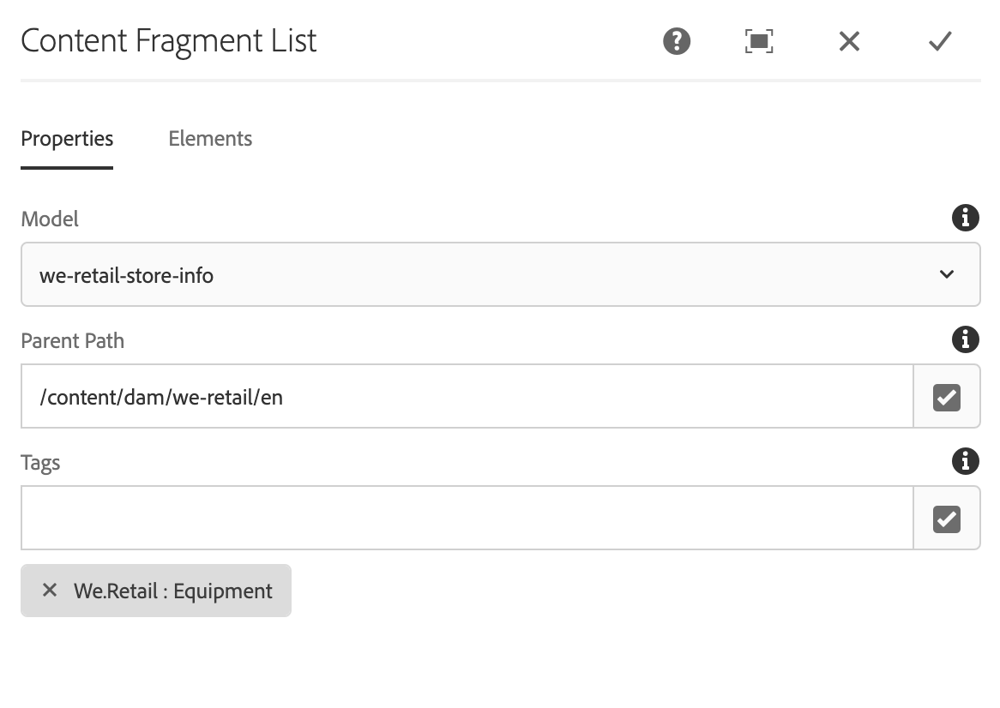
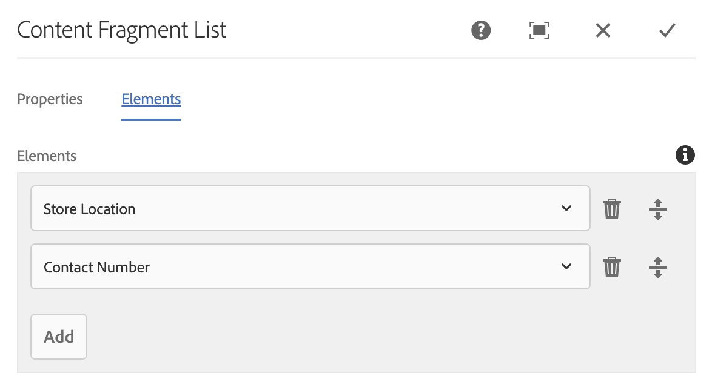

# Content Fragment List Component{#content-fragment-list-component}

The Core Component Content Fragment List component allows for the display of a list of [content fragments](https://helpx.adobe.com/experience-manager/6-5/assets/using/content-fragments.html).

## Usage {#usage}

The Core Component Content Fragment List Component allows for the inclusion of a list of [content fragments](https://helpx.adobe.com/experience-manager/6-5/assets/using/content-fragments.html) on a page based on a Content Fragment model. This can be especially useful for creating [headless content](https://helpx.adobe.com/experience-manager/6-5/sites/developing/user-guide.html?topic=/experience-manager/6-5/sites/developing/morehelp/headless.ug.js) that can be easily consumed by other applications.

* The list and its properties can be selected in the [configure dialog](#configure-dialog).
* Styles can be applied to the component in the [design dialog](#design-dialog).

## Version and Compatibility {#version-and-compatibility}

The current version of the Content Fragment Component is v1, which was introduced with release 2.4.0 of the Core Components in May 2019, and is described in this document.

The following table details all supported versions of the component, the AEM versions with which the versions of the component is compatible, and links to documentation for previous versions.

|Component Version|AEM 6.3|AEM 6.4|AEM 6.5|
|--- |--- |--- |---|
|v1|Compatible|Compatible|Compatible|

For more information about Core Component versions and releases, see the document [Core Components Versions](versions.md).

## Sample Component Output {#sample-component-output}

To experience the Content Fragment List Component as well as see examples of its configuration options as well as HTML and JSON output, visit the [Component Library](http://opensource.adobe.com/aem-core-wcm-components/library/content-fragment-list.html).

## Technical Details {#technical-details}

The latest technical documentation about the Content Fragment List Component [can be found on GitHub](https://github.com/adobe/aem-core-wcm-components/blob/master/content/src/content/jcr_root/apps/core/wcm/components/contentfragmentlist/v1/contentfragmentlist).

Further details about developing Core Components can be found in the [Core Components developer documentation](developing.md). 

## Configure Dialog {#configure-dialog}

The configure dialog allows the content author to define the which content fragments comprise the list and the elements of those fragments to be included.

### Properties Tab

The **Properties** tab defines which Content Fragments are included in the list. This is primarily based on a selected Content Fragment Model, but there are other filter options available.

* **Model** - Path to the Content Fragment Model on which the list is based. 
    * By default, all content fragments of the model defined as **Model Path** are included in the list.
* **Parent Path** - Parent path from which the list should be built.
    * The content fragments based on the selected **Model Path** will be filtered to those on the specified **Parent Path**.
    * Click or tap the **Open Selection Dialog** button at the right side of the field to specify the path.
* **Tags** - Only the Content Fragments with the specified tags will be included in the list.
    * Click or tap the **Open Selection Dialog** button at the right side of the field to specify the tags.
    * Click or tap the X next to selected tags to remove them.

### Elements Tab

By default, all elements of the Content Fragment Model will be included in the list. The **Elements** allows you to specify only specific elements to include.

* **Elements** - Only the elements of the content fragments in the list specified will appear.
    * Click or tap the **Add** button to add a new element
    * Click or tap the **Delete** button to remove a selected element
    * Drag the **Order** handle to rearrange the order of the elements.

## Design Dialog {#design-dialog}

The design dialog allows the template author to define the styles applied to the Content Fragment List Component.