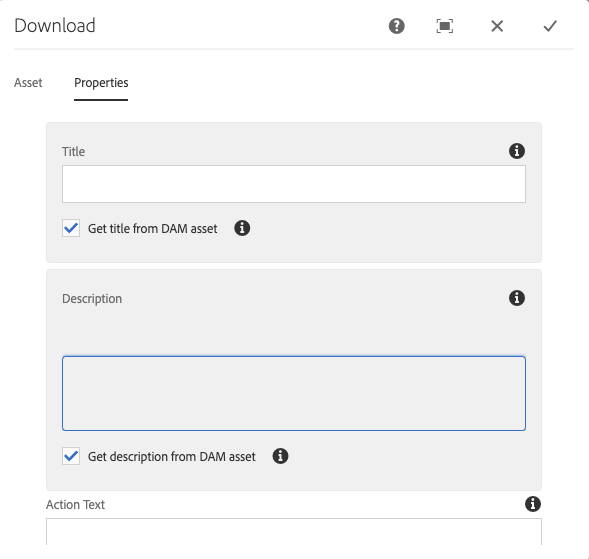
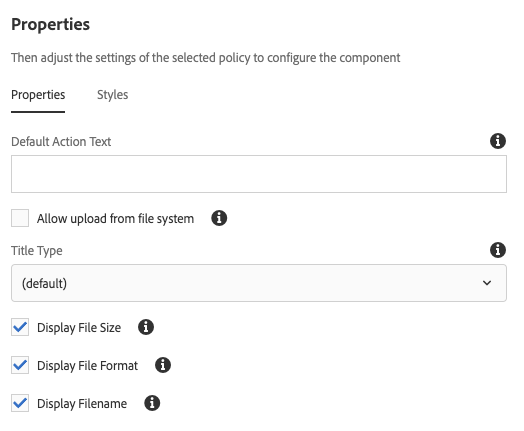

# Download Component{#download-component}

The Core Component Download component allows for the creation of a download option on a page.

## Usage {#usage}

The Core Component Download component allows for the inclusion of a download option and its associated asset on a page.

* The download option's properties can be selected in the [configure dialog](#configure-dialog).
* Defaults for the download component can be defined in the [design dialog](#design-dialog).

## Version and Compatibility {#version-and-compatibility}

The current version of the Download Component is v1, which was introduced with release 2.5.0 of the Core Components in June 2019, and is described in this document.

The following table details all supported versions of the component, the AEM versions with which the versions of the component is compatible, and links to documentation for previous versions.

|Component Version|AEM 6.3|AEM 6.4|AEM 6.5|
|--- |--- |--- |---|
|v1|Compatible|Compatible|Compatible|

For more information about Core Component versions and releases, see the document [Core Components Versions](versions.md).

## Sample Component Output {#sample-component-output}

To experience the Download Component as well as see examples of its configuration options as well as HTML and JSON output, visit the [Component Library](http://opensource.adobe.com/aem-core-wcm-components/library/download.html).

## Technical Details {#technical-details}

The latest technical documentation about the Download Component [can be found on GitHub](https://github.com/adobe/aem-core-wcm-components/tree/master/content/src/content/jcr_root/apps/core/wcm/components/download/v1/download).

Further details about developing Core Components can be found in the [Core Components developer documentation](developing.md).

## Configure Dialog {#configure-dialog}

The configure dialog allows the content author to define the download item and how it will behave and appear for a visitor to the page.

### Asset Tab {#asset-tab}

The selection of a download asset is very similar to the functionality of the [Image Component](image.md) and likewise leverages AEM's DAM.

* **Download Asset**
  * Drop an asset from the [asset browser](https://helpx.adobe.com/experience-manager/6-5/sites/authoring/using/author-environment-tools.html) or tap the **browse** option to upload from a local file system.
  * Tap or click **Clear** to de-select the currently selected image.
  * Tap or click **Edit** to [mange the renditions of the asset](https://helpx.adobe.com/experience-manager/6-5/assets/using/managing-assets-touch-ui.html) in the asset editor.

### Properties Tab {#properties-tab}

* **Title** - Displays as a headline for the download item
  * **Get title from DAM asset** - When selected, the title is automatically populated with the DAM asset's title.
* **Description** - Displays as a descriptive subheadline of the download item
  * **Get description from DAM asset** - When selected, the description is automatically populated with the DAM asset's description.
* **Action Text** - Displays as action text for the download item
  * **Display inline** - When selected the provided **Action Text** will display inline.

## Design Dialog {#design-dialog}

The design dialog allows the template author to define the options available to the content author who uses the Download Component.

### Properties Tab {#properties-tab-design}

* **Default Action Text** - Defines the default **Action Text** provided when an author adds the Download Component to a page.
* **Allow upload from file system** - Allows the content author to upload an asset from his/her local filesystem as the download asset.
  * The default value is unselected.
* **Title Type** - The HTML element used for the Download Component's title.
  * If no value is selected, the default value is H3.
* **Display File Size** - When selected the file size of the asset will be displayed in the download component.
  * The default value is selected.
* **Display File Format** - When selected the file format of the asset will be displayed in the download component.
  * The default value is selected.
* **Display Filename** - When selected the filename of the asset will be displayed in the download component.
  * The default value is selected.

### Styles Tab {#styles-tab}

The Image Component supports the AEM [Style System](authoring.md#component-styling).
