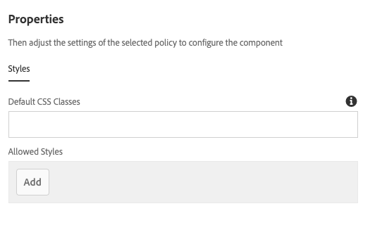

# Embed Component{#embed-component}

The Core Components Embed Component enables embedding external content in an AEM content page.

## Usage {#usage}

The Core Component Embed Component allows the content author to define selected external content to be embedded within an AEM content page. In addition, there is an option to define free-form HTML to be embedded as well.

* The components's properties can be defined in the [configure dialog](#configure-dialog).
* Defaults for the component when adding it to a page can be defined in the [design dialog](#design-dialog).

## Version and Compatibility {#version-and-compatibility}

The current version of the Embed Component is v1, which was introduced with release 2.7.0 of the Core Components in September 2019, and is described in this document.

The following table details all supported versions of the component, the AEM versions with which the versions of the component is compatible, and links to documentation for previous versions.

|Component Version|AEM 6.3|AEM 6.4|AEM 6.5|
|--- |--- |--- |---|
|v1|Compatible|Compatible|Compatible|

For more information about Core Component versions and releases, see the document [Core Components Versions](versions.md).

## Sample Component Output {#sample-component-output}

To experience the Embed Component as well as see examples of its configuration options as well as HTML and JSON output, visit the [Component Library](http://opensource.adobe.com/aem-core-wcm-components/library/embed.html).

## Technical Details {#technical-details}

The latest technical documentation about the Embed Component [can be found on GitHub](https://github.com/adobe/aem-core-wcm-components/tree/master/content/src/content/jcr_root/apps/core/wcm/components/embed/v1/embed).

Further details about developing Core Components can be found in the [Core Components developer documentation](developing.md).

## Configure Dialog {#configure-dialog}

The configure dialog allows the content author to select the experience fragment variation that should be rendered on the page.

Use the **Open Selection Dialog** button to open the component selector to choose which experience fragment component variation to add to the content page.

## Design Dialog {#design-dialog}

The design dialog allows the template author to define the options available to the content author who uses the Embed Component and the defaults set when placing the Embed Component.

The Embed Component supports the AEM [Style System](authoring.md#component-styling).
