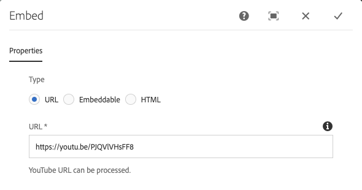
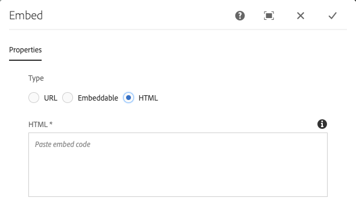

# Embed Component{#embed-component}

The Core Components Embed Component allows embedding external content in an AEM content page.

## Usage {#usage}

The Core Component Embed Component allows the content author to define selected external content to be embedded within an AEM content page. In addition, there is an option to define free-form HTML to be embedded as well.

* The component's properties can be defined in the [configure dialog](#configure-dialog).
* Defaults for the component when adding it to a page can be defined in the [design dialog](#design-dialog).

## Version and Compatibility {#version-and-compatibility}

The current version of the Embed Component is v1, which was introduced with release 2.7.0 of the Core Components in September 2019, and is described in this document.

The following table details all supported versions of the component, the AEM versions with which the versions of the component is compatible, and links to documentation for previous versions.

|Component Version|AEM 6.3|AEM 6.4|AEM 6.5|
|--- |--- |--- |---|
|v1|Compatible|Compatible|Compatible|

For more information about Core Component versions and releases, see the document [Core Components Versions](versions.md).

## Sample Component Output {#sample-component-output}

To experience the Embed Component as well as see examples of its configuration options as well as HTML and JSON output, visit the [Component Library](http://opensource.adobe.com/aem-core-wcm-components/library/embed.html).

## Technical Details {#technical-details}

The latest technical documentation about the Embed Component [can be found on GitHub](https://github.com/adobe/aem-core-wcm-components/tree/master/content/src/content/jcr_root/apps/core/wcm/components/embed/v1/embed).

Further details about developing Core Components can be found in the [Core Components developer documentation](developing.md).

## Configure Dialog {#configure-dialog}

The configure dialog allows the content author to define the external resource to be embedded on the page. First choose which type of resource should be embedded: **URL**, **Embeddable**, or **HTML**.

### URL {#url}

The simplest embed is the URL. Simply paste the URL of the resource you wish to embed in the **URL** field. The component will attempt to access the resource and if it can be rendered by one of the processors, it will display a confirmation message below the **URL** field. If not, the field will be marked in error.

The Embed Component ships with processors for the following types of resources:

* Resources that comply with the [oEmbed standard](https://oembed.com/) including Facebook Post, Instagram, SoundCloud, Twitter, and YouTube
* Pinterest

Developers can add additional URL processors by [following the developer documentation of the Embed Component.](https://github.com/adobe/aem-core-wcm-components/tree/master/content/src/content/jcr_root/apps/core/wcm/components/embed/v1/embed#extending-the-embed-component)

### Embeddable {#embeddable}

Embeddables allow for more customization of the embedded resource, which can be parameterized and include additional information. An author is able to select from pre-configured trusted embeddables and the component ships with a Youtube embeddable out-of-the-box.

The **Embeddable** field defines the type of processor you want to use. In the case of the YouTube embeddable you can then define:

* **Video ID** - The unique video ID from YouTube of the resource you want to embed
* **Width** - The width of the embedded video
* **Height** - The height of the embedded video

Other embeddables would offer similar fields and can be defined by a developer by [following the developer documentation of the Embed Component.](https://github.com/adobe/aem-core-wcm-components/tree/master/content/src/content/jcr_root/apps/core/wcm/components/embed/v1/embed#extending-the-embed-component)

>[!NOTE]
>Embeddables must be enabled at the template level via the [Design Dialog](#design-dialog) to be available to the page author.

### HTML {#html}

You can add free-form HTML to your page using the Embed Component.

>[!NOTE]
>Any unsafe tags such as scripts will be filtered from the entered HTML and will not be rendered on the resulting page.

## Design Dialog {#design-dialog}

The design dialog allows the template author to define the options available to the content author who uses the Embed Component and the defaults set when placing the Embed Component.

* **Disable URL** - Disables the **URL** option for the content author when selected
* **Disable Embeddables** - Disables the **Embeddable** option for the content author when selected, regardless of which embeddable processors are allowed.
* **Disable HTML** - Disables the **HTML** option for the content author when selected.
* **Allowed Embeddables** - Multislect that defines which embeddable processors are available to the content author, provided that the **Embeddable** option is active.
