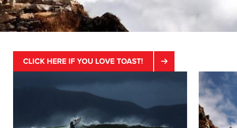

# Form Button Component (v1){#form-button-component-v}

The Core Component Form Button component allows for the inclusion of a button field in a form to trigger an action.

## Usage {#usage}

The Core Component Form Button component allows for the creation of button field, often to trigger the submission of the form and is intended to be used along with the [form container component](../using/form-container.md).

The button properties can be defined by the content editor in the [configure dialog](../using/form-button-v1.md#main-pars_title).

## Version and Compatibility {#version-and-compatibility}

This document describes v1 of the Form Button Component, originally introduced with release 1.0.0 of the Core Components with AEM 6.3.

The following table lists the compatibility of v1 of the Form Button Component.

<table border="1" cellpadding="1" cellspacing="0" width="100%"> 
 <tbody> 
  <tr> 
   <td><strong>AEM Version</strong></td> 
   <td><strong>Form Button</strong><br /> <strong>Component v1</strong></td> 
  </tr> 
  <tr> 
   <td>6.3</td> 
   <td>Compatible</td> 
  </tr> 
  <tr> 
   <td>6.4</td> 
   <td>Compatible</td> 
  </tr> 
 </tbody> 
</table>

>[!CAUTION]
>
>This document describes v1 of the Form Button Component.
>
>For details of the current version of the Form Button Component, see the [Form Button Component](../using/form-button.md) document.

## Sample Component Output {#sample-component-output}

The following is sample taken from [We.Retail](/content/help/en/experience-manager/6-3/sites/developing/using/we-retail).

### Screenshot {#screenshot}

 

### HTML {#html}

```
<div class="cmp cmp-button aem-GridColumn aem-GridColumn--default--12">
    <div class="cmp cmp-button">
        <button type="BUTTON" class="btn btn-action btn-primary" name="loveToast" value="ILoveToast">
            Click here if you love toast!
        </button>
    </div>
</div>
```

### JSON {#json}

```
"container": {
              "columnClassNames": "aem-GridColumn aem-GridColumn--default--12",
              "columnCount": 12,
              "gridClassNames": "aem-Grid aem-Grid--12 aem-Grid--default--12",
              ":items": {
                "button": {
                  "columnClassNames": "aem-GridColumn aem-GridColumn--default--12",
                  ":type": "weretail/components/form/button",
                  "name": "loveToast",
                  "jcr:title": "Click here if you love toast!",
                  "type": "submit",
                  "value": "ILoveToast"
                }
              },
              ":itemsOrder": [
                "button"
              ],
              ":type": "weretail/components/form/container"
            }
```

>[!NOTE]
>
>JSON export from the Core Components requires release 1.1.0 of the Core Components. Please see the [compatibility information for Core Components v1](../using/versions.md#main-pars_title_236368006) for more information.

## Configure Dialog {#configure-dialog}

The configure dialog allows the content author to define the parameters of the button.


* **Type**

    * **Button**
    * **Submit**

* **Title** - The text displayed on the button

    * If none provided it defaults to the button type

* **Name** - The name of the button, which is submitted with the form data
* **Value** - The value of the button, which is submitted with the form data

## Design Dialog {#design-dialog}

There is no design dialog for the Form Button component.

## Technical Details {#technical-details}

The latest technical documentation about the Form Button Component [can be found on GitHub](https://github.com/adobe/aem-core-wcm-components/tree/master/content/src/content/jcr_root/apps/core/wcm/components/form/button/v1/button).

The entire core components project can be downloaded from GitHub.

Further details about developing Core Components can be found in the [Core Components developer documentation](../using/developing.md). 
