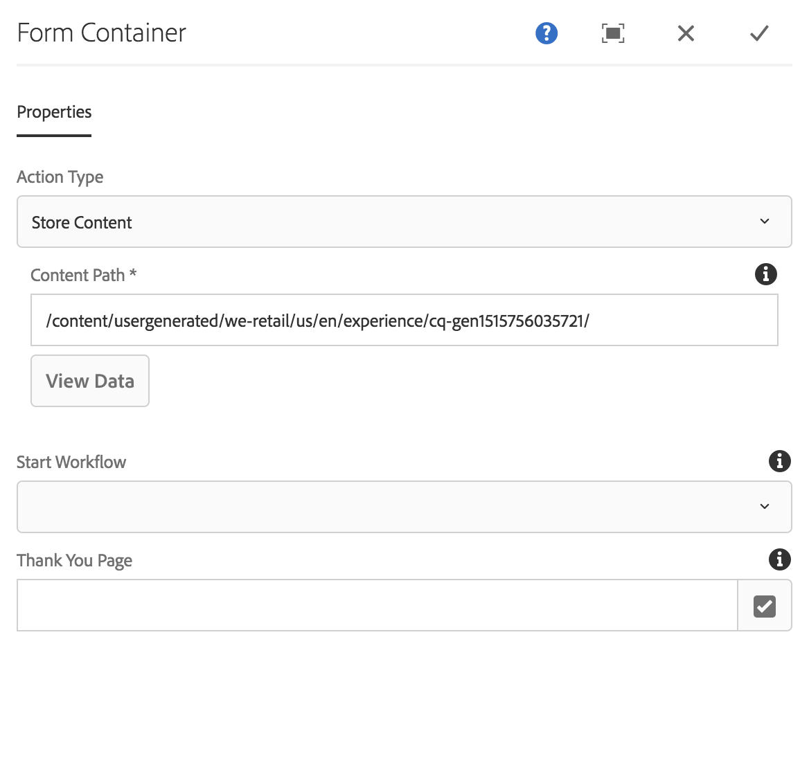
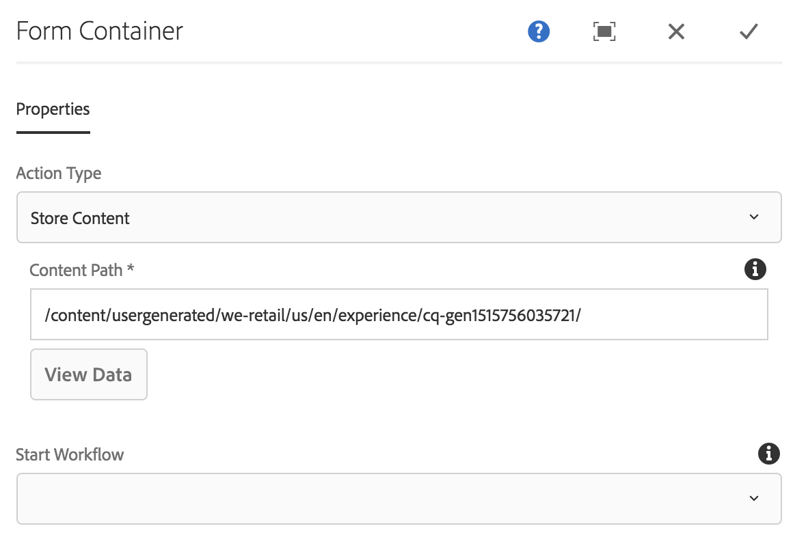

# Form Container Component{#form-container-component}

The Core Component Form Container Component allows for the creation of simple submission forms.

## Usage {#usage}

The form Container Component enables the building of simple information submission forms and features by supporting simple WCM forms and by using a nested structure to allow additional form components.

By using the [configure dialog](#configure-dialog) the content editor can define the action triggered by form submission, where the submitted content should be stored, and whether a workflow should be triggered. The template author can use the [design dialog](#design-dialog) to define the allowed components and their mappings similar to the design dialog for the [standard layout container in the template editor](https://helpx.adobe.com/experience-manager/6-4/sites/authoring/using/templates.html#main-pars_title_1754153843).

>[!NOTE]
>
>The core components Form Container Component only supports the use of core components form components (button, text, hidden, etc.). Using [foundation components](https://helpx.adobe.com/experience-manager/6-4/sites/authoring/using/default-components-foundation.html#main-pars_title_14) form components within the core components form container (and vice versa) is not supported.

## Version and Compatibility {#version-and-compatibility}

The current version of the Form Container Component is v2, which was introduced with release 2.0.0 of the Core Components in January 2018, and is described in this document.

The following table details all supported versions of the component, the AEM versions with which the versions of the component is compatible, and links to documentation for previous versions.

|Component Version|AEM 6.3|AEM 6.4|
|--- |--- |--- |
|v2|Compatible|Compatible|
|[v1](form-container-v1.md)|Compatible|Compatible|

For more information about Core Component versions and releases, see the document [Core Components Versions](versions.md).

## Configure Dialog {#configure-dialog}

The configure dialog allows the content author to define what actions are taken when the component is submitted. 

Depending on the selected **Action Type**, the available options within the container will change. The available action types are:

* [Mail](#mail)
* [Store Content](#store-content)
* [Submit Order](#submit-order)
* [Update Order](#update-order)

Regardless of the type, there are [general settings](#general-settings) that apply to each action.

### Mail {#mail}

When the form is submitted, the mail action type will send an email to designated recipients.

* **Subject**
  The subject of the email that will be sent on form submission
* **From**
  The from email address of the email that will be send on form submission
* **To**
  The addresses of the recipients who will receive an email upon form submission

  * Tap or click the **Add** button to add additional addresses
  * Tap or click the **Delete** button to remove an email address
* **CC**
  The addresses of recipients who will receive a carbon copy the email sent upon form submission
  * Tap or click the **Add** button to add additional addresses
  * Tap or click the **Delete** button to remove an email address

### Store Content {#store-content}

When the form is submitted, the content of the form will be stored in a designated repository location.

* **Content Path**
  Content repository path where submitted content is stored
* **View Data**
  Tap or click to view stored submitted data as JSON
* **Start Workflow**
  Configure to start a workflow with the stored content as payload upon form submission

### Submit Order {#submit-order}

When the form is submitted, the order will be submitted.

### Update Order {#update-order}

When the form is submitted, the order will be updated.

### General Settings {#general-settings}

Regardless of the action type selected, a thank you page can always be defined.

The user will be redirected to the specified page after completion of the form submission.

* Use the Selection Dialog to select a resource within AEM.
* If the thank you page is not in AEM, specify the absolute URL. Non-absolute URLs will be interpreted relative to AEM.
* Leave blank to redisplay the form after submission.

## Design Dialog {#design-dialog}

The design dialog allows the template author to define the allowed components and their mappings for the container similar to the design dialog for the [standard layout container in the template editor](https://helpx.adobe.com/experience-manager/6-4/sites/authoring/using/template.html#main-pars_title_1754153843).

## Technical Details {#technical-details}

The latest technical documentation about the Form Container Component [can be found on GitHub](https://github.com/adobe/aem-core-wcm-components/blob/master/content/src/content/jcr_root/apps/core/wcm/components/form/container/v2/container).

The entire core components project can be downloaded from GitHub.

Further details about developing Core Components can be found in the [Core Components developer documentation](developing.md).
