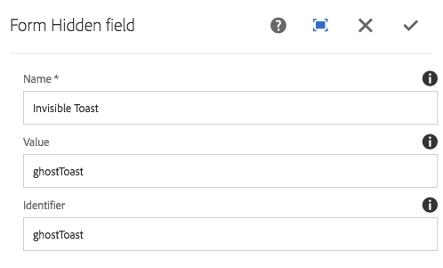

# Form Hidden Component (v1){#form-hidden-component-v}

The Core Component Form Hidden component allows for the display of a hidden field.

## Usage {#usage}

The Core Component Form Hidden Component allows for the creation of hidden fields to pass information about the current page back to AEM and is intended to be used along with the [form container component](form-container.md).

The field properties can be defined by the content editor in the [configure dialog](#configure-dialog).

## Version and Compatibility {#version-and-compatibility}

This document describes v1 of the Form Hidden Component, originally introduced with release 1.0.0 of the Core Components with AEM 6.3.

The following table lists the compatibility of v1 of the Form Hidden Component.

|AEM Version|Form Hidden  Component v1|
|--- |--- |
|6.3|Compatible|
|6.4|Compatible|

>[!CAUTION]
>
>This document describes v1 of the Form Hidden Component.
>
>For details of the current version of the Form Hidden Component, see the [Form Hidden Component](form-hidden.md) document.

## Sample Component Output {#sample-component-output}

The following is sample taken from [We.Retail](https://helpx.adobe.com/experience-manager/6-4/sites/developing/using/we-retail.html).

### HTML {#html}

```
<div class="cmp cmp-form aem-GridColumn aem-GridColumn--default--12">
 <form method="POST" action="/content/we-retail/us/en/experience.html" id="new_form" name="new_form" enctype="multipart/form-data" class="aem-Grid aem-Grid--12 aem-Grid--default--12 ">
  <input type="hidden" name=":formstart" value="/content/we-retail/us/en/experience/jcr:content/root/responsivegrid/container">
   <div class="visible aem-GridColumn aem-GridColumn--default--12">
    <input type="hidden" id="ghostToast" name="Invisible Toast" value="ghostToast">
   </div>
 </form>
</div>
```

### JSON {#json}

```
"container": {
              "columnClassNames": "aem-GridColumn aem-GridColumn--default--12",
              "columnCount": 12,
              "gridClassNames": "aem-Grid aem-Grid--12 aem-Grid--default--12",
              ":items": {
                "hidden": {
                  "columnClassNames": "aem-GridColumn aem-GridColumn--default--12",
                  ":type": "weretail/components/form/hidden",
                  "name": "Invisible Toast",
                  "id": "ghostToast",
                  "value": "ghostToast"
                }
              },
              ":itemsOrder": [
                "hidden"
              ],
              ":type": "weretail/components/form/container"
            }
```

>[!NOTE]
>
>JSON export from the Core Components requires release 1.1.0 of the Core Components. Please see the [compatibility information for Core Components v1](versions.md#release-history-and-compatibility) for more information.

## Configure Dialog {#configure-dialog}

The configure dialog allows the content author to define the parameters of the hidden field.



* **Name** - The name of the field, which is submitted with the form data
* **Value** - The value of the field, which is submitted with the form data
* **Identifier** - The identifier should be unique on the page and can be used to bind scripts to this form field

## Design Dialog {#design-dialog}

There is no design dialog for the Form Hidden component.

## Technical Details {#technical-details}

The latest technical documentation about the Form Hidden Component [can be found on GitHub](https://github.com/adobe/aem-core-wcm-components/tree/master/content/src/content/jcr_root/apps/core/wcm/components/form/hidden/v1/hidden).

The entire core components project can be downloaded from GitHub.

Further details about developing Core Components can be found in the [Core Components developer documentation](developing.md). 
