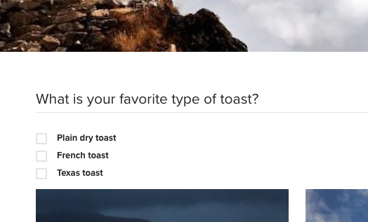
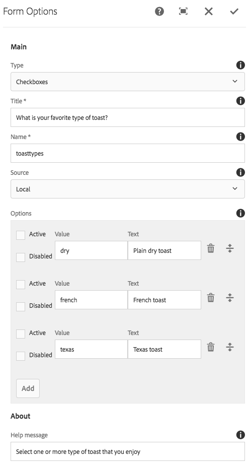

# Form Options Component (v1){#form-options-component-v}

The Core Component Form options component allows for the selection from pre-defined options in various formats.

## Usage {#usage}

The Core Component Form Options Component allows for the submission of different types of options presented in many different ways and is intended to be used along with the [form container component](../using/form-container.md).

The presentation of the options, labels, and individual options can be defined by the content editor in the [configure dialog](../using/form-options-v1.md#main-pars_title).

## Version and Compatibility {#version-and-compatibility}

This document describes v1 of the Form Options Component, originally introduced with release 1.0.0 of the Core Components with AEM 6.3.

The following table lists the compatibility of v1 of the Form Options Component.

<table border="1" cellpadding="1" cellspacing="0" width="100%"> 
 <tbody> 
  <tr> 
   <td><strong>AEM Version</strong></td> 
   <td><strong>Form Options<br /> Component v1</strong><br /> </td> 
  </tr> 
  <tr> 
   <td>6.3</td> 
   <td>Compatible</td> 
  </tr> 
  <tr> 
   <td>6.4</td> 
   <td>Compatible</td> 
  </tr> 
 </tbody> 
</table>

>[!CAUTION]
>
>This document describes v1 of the Form Options Component.
>
>For details of the current version of the Form Options Component, see the [Form Options Component](../using/form-options.md) document.

## Sample Component Output {#sample-component-output}

The following is sample taken from [We.Retail](/content/help/en/experience-manager/6-3/sites/developing/using/we-retail).

### Screenshot {#screenshot}

 

### HTML {#html}

```
<div class="cmp cmp-form aem-GridColumn aem-GridColumn--default--12">
<form method="POST" action="/content/we-retail/us/en/experience.html" id="new_form" name="new_form" enctype="multipart/form-data" class="aem-Grid aem-Grid--12 aem-Grid--default--12 ">
    <input type="hidden" name=":formstart" value="/content/we-retail/us/en/experience/jcr:content/root/responsivegrid/container">
    
    <div class="cmp cmp-options aem-GridColumn aem-GridColumn--default--12">

    <fieldset class="form-group checkbox">
        <legend>What is your favorite type of toast?</legend>
        
        <div class="checkbox-item">
            <label>
              <input type="checkbox" name="toasttypes" value="dry">
              Plain dry toast
            </label>
        </div>
<div class="checkbox-item">
            <label>
              <input type="checkbox" name="toasttypes" value="french">
              French toast
            </label>
        </div>
<div class="checkbox-item">
            <label>
              <input type="checkbox" name="toasttypes" value="texas">
              Texas toast
            </label>
        </div>

    </fieldset>
    
</div>
    
</form></div>
```

### JSON {#json}

```
"container": {
              "columnClassNames": "aem-GridColumn aem-GridColumn--default--12",
              "columnCount": 12,
              "gridClassNames": "aem-Grid aem-Grid--12 aem-Grid--default--12",
              ":items": {
                "options": {
                  "columnClassNames": "aem-GridColumn aem-GridColumn--default--12",
                  ":type": "weretail/components/form/options",
                  "name": "toastTypes",
                  "jcr:title": "What is your favorite type of toast?",
                  "source": "local",
                  "type": "checkbox"
                }
              },
              ":itemsOrder": [
                "options"
              ],
              ":type": "weretail/components/form/container"
            }
```

>[!NOTE]
>
>JSON export from the Core Components requires release 1.1.0 of the Core Components. Please see the [compatibility information for Core Components v1](../using/versions.md#main-pars_title_236368006) for more information.

## Configure Dialog {#configure-dialog}

The configure dialog allows the content author to define the type of options that should be presented, labels, and which options are available.



* **Types** - How the options will be presented

    * **Checkboxes**
    * **Radio buttons**
    * **Drop-down**
    * **Multi-select drop-down**

* **Title** - The title that will be displayed as the label for the options
* **Name** - The name of the field submitted with the form data
* **Source** - Where the options are defined

    * **Local** - Defined within the component

        * Tap or click the **Add** button to add a value, **Delete** to remove a value
        
        * **Value** - The value saved when that option is selected when the form is submitted
        * **Text** - The label for the option displayed on the form
        * **Active** - The option is marked as selected when the form loads
        * **Disabled** - The option is not selectable but still displayed

    * **List** - A static list defined elsewhere in AEM is used for the options

        * **List** - The path of the static list in AEM

            * Use the Browse button to locate the list resource

    * **Data source** - A data source is used for the options

        * **Data source** - resource type of the data source

* **Help message** - A hint for the user of what can be entered in the field

## Design Dialog {#design-dialog}

There is no design dialog for the Form Options component.

## Technical Details {#technical-details}

The latest technical documentation about the Form Options Component [can be found on GitHub](https://github.com/adobe/aem-core-wcm-components/tree/master/content/src/content/jcr_root/apps/core/wcm/components/form/options/v1/options).

The entire core components project can be downloaded from GitHub.

Further details about developing Core Components can be found in the [Core Components developer documentation](../using/developing.md). 
