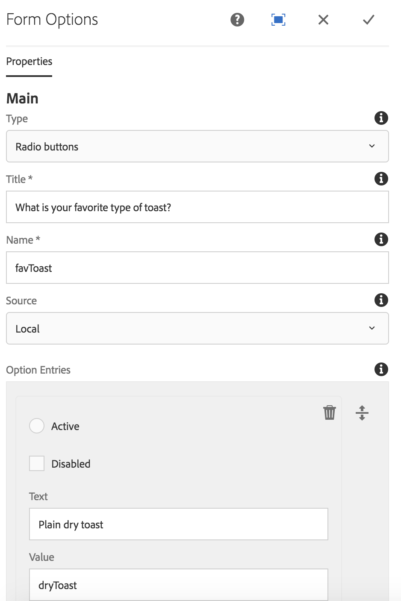

# Form Options Component{#form-options-component}

The Core Component Form Options component allows for the selection from pre-defined options in various formats.

## Usage {#usage}

The Core Component Form Options component allows for the submission of different types of options presented in many different ways and is intended to be used along with the [Form Container component](form-container.md).

The presentation of the options, labels, and individual options can be defined by the content editor in the [configure dialog](form-options.md#main-pars_title).

## Version and Compatibility {#version-and-compatibility}

The current version of the Form Options Component is v2, which was introduced with release 2.0.0 of the Core Components in January 2018, and is described in this document.

The following table details all supported versions of the component, the AEM versions with which the versions of the component is compatible, and links to documentation for previous versions.

<table border="1" cellpadding="1" cellspacing="0" width="100%"> 
 <tbody> 
  <tr> 
   <td>Component Version<br /> </td> 
   <td>AEM 6.3</td> 
   <td>AEM 6.4</td> 
  </tr> 
  <tr> 
   <td>v2<br /> </td> 
   <td>Compatible</td> 
   <td>Compatible</td> 
  </tr> 
  <tr> 
   <td><a href="../using/form-options.md">v1</a></td> 
   <td>Compatible<a href="../using/list-v1.md"></a></td> 
   <td>Compatible</td> 
  </tr> 
 </tbody> 
</table>

For more information about Core Component versions and releases, see the document [Core Components Versions](versions.md).

## Sample Component Output {#sample-component-output}

The following is sample taken from [We.Retail](https://helpx.adobe.com/experience-manager/6-3/sites/developing/using/we-retail.html).

### Screenshot {#screenshot}

 

### HTML {#html}

```
<form method="POST" action="/content/we-retail/us/en/experience.html" id="new_form" name="new_form" enctype="multipart/form-data" class="cmp-form aem-Grid aem-Grid--12 aem-Grid--default--12">
    <input type="hidden" name=":formstart" value="/content/we-retail/us/en/experience/jcr:content/root/responsivegrid/container">
    
    <div class="hidden aem-GridColumn aem-GridColumn--default--12">
<input type="hidden" id="form-hidden-66464844" name="hidden">

</div>
<div class="hidden aem-GridColumn aem-GridColumn--default--12">
<input type="hidden" id="form-hidden-858231075" name="hidden">

</div>
<div class="hidden aem-GridColumn aem-GridColumn--default--12">
<input type="hidden" id="form-hidden-862566768" name="hidden">

</div>
<div class="container responsivegrid aem-GridColumn aem-GridColumn--default--12">

    <input type="hidden" name=":formstart" value="/content/we-retail/us/en/experience/jcr:content/root/responsivegrid/container/container">
    
    <div class="options aem-GridColumn aem-GridColumn--default--12">

    <fieldset class="cmp-form-options">
        
            <legend class="cmp-form-options__legend">What is your favorite type of toast?</legend>
            <label class="cmp-form-options__field-label">
                <input class="cmp-form-options__field cmp-form-options__field--radio" type="radio" name="favToast" value="dryToast">
                Plain dry toast
            </label>
<label class="cmp-form-options__field-label">
                <input class="cmp-form-options__field cmp-form-options__field--radio" type="radio" name="favToast" value="frenchToast">
                French Toast
            </label>
<label class="cmp-form-options__field-label">
                <input class="cmp-form-options__field cmp-form-options__field--radio" type="radio" name="favToast" value="texasToast">
                Texas Toast
            </label>

    </fieldset>

</div>

</div></form>
```

### JSON {#json}

```
"container":{  
                           "columnClassNames":"aem-GridColumn aem-GridColumn--default--12",
                           "columnCount":12,
                           "gridClassNames":"aem-Grid aem-Grid--12 aem-Grid--default--12",
                           ":items":{  
                              "options_816658469":{  
                                 "columnClassNames":"aem-GridColumn aem-GridColumn--default--12",
                                 "id":"form-options-269951232",
                                 "title":"What is your favorite type of toast?",
                                 "name":"favToast",
                                 "type":"RADIO",
                                 "items":[  
                                    {  
                                       "value":"dryToast",
                                       "text":"Plain dry toast",
                                       "selected":false,
                                       "disabled":false
                                    },
                                    {  
                                       "value":"frenchToast",
                                       "text":"French Toast",
                                       "selected":false,
                                       "disabled":false
                                    },
                                    {  
                                       "value":"texasToast",
                                       "text":"Texas Toast",
                                       "selected":false,
                                       "disabled":false
                                    }
                                 ],
                                 ":type":"core/wcm/sandbox/components/form/options/v2/options"
                              }
                           },
                           ":itemsOrder":[  
                              "options_816658469"
                           ],
                           ":type":"core/wcm/sandbox/components/form/container/v2/container"
                        }
```

## Configure Dialog {#configure-dialog}

The configure dialog allows the content author to define the type of options that should be presented, labels, and which options are available.



* **Types** - How the options will be presented

    * **Checkboxes**
    * **Radio buttons**
    * **Drop-down**
    * **Multi-select drop-down**

* **Title** - The title that will be displayed as the label for the options
* **Name** - The name of the field submitted with the form data
* **Source** - Where the options are defined

    * **Local** - Defined within the component

        * Tap or click the **Add** button to add a value, **Delete** to remove a value
        
        * **Value** - The value saved when that option is selected when the form is submitted
        * **Text** - The label for the option displayed on the form
        * **Active** - The option is marked as selected when the form loads
        * **Disabled** - The option is not selectable but still displayed

    * **List** - A static list defined elsewhere in AEM is used for the options

        * **List** - The path of the static list in AEM

            * Use the Browse button to locate the list resource

    * **Data source** - A data source is used for the options

        * **Data source** - resource type of the data source

* **Help message** - A hint for the user of what can be entered in the field

## Design Dialog {#design-dialog}

### Styles Tab {#styles-tab}

The Form Options Component supports the AEM [Style System](authoring.md#main-pars_header).

## Technical Details {#technical-details}

The latest technical documentation about the Form Options Component [can be found on GitHub](https://github.com/adobe/aem-core-wcm-components/blob/master/content/src/content/jcr_root/apps/core/wcm/components/form/options/v2/options).

The entire core components project can be downloaded from GitHub.

Further details about developing Core Components can be found in the [Core Components developer documentation](developing.md). 
