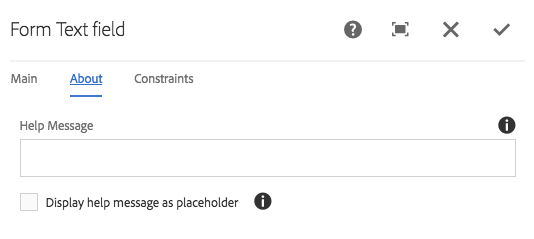
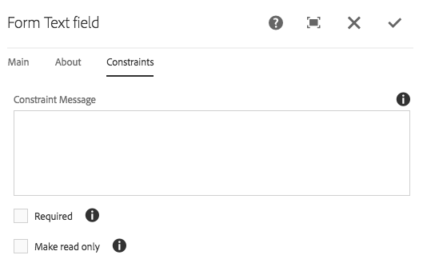

# Form Text Component{#form-text-component}

The Core Component Form Text component allows the entry of form text for submission.

## Usage {#usage}

The Form Text component allows for the submission of different types of text and is intended to be used along with the [form container component](form-container.md). The type of text validation, labels, and help messages can be defined by the content editor in the [configure dialog](form-text.md#main-pars_title).

## Version and Compatibility {#version-and-compatibility}

The current version of the Form Text Component is v2, which was introduced with release 2.0.0 of the Core Components in January 2018, and is described in this document.

The following table details all supported versions of the component, the AEM versions with which the versions of the component is compatible, and links to documentation for previous versions.

<table border="1" cellpadding="1" cellspacing="0" width="100%"> 
 <tbody> 
  <tr> 
   <td>Component Version<br /> </td> 
   <td>AEM 6.3</td> 
   <td>AEM 6.4</td> 
  </tr> 
  <tr> 
   <td>v2<br /> </td> 
   <td>Compatible</td> 
   <td>Compatible</td> 
  </tr> 
  <tr> 
   <td><a href="form-text-v1.md">v1</a></td> 
   <td>Compatible</td> 
   <td>Compatible</td> 
  </tr> 
 </tbody> 
</table>

For more information about Core Component versions and releases, see the document [Core Components Versions](versions.md).

## Sample Component Output {#sample-component-output}

The following is sample taken from [We.Retail](https://helpx.adobe.com/experience-manager/6-3/sites/developing/using/we-retail.html).

### Screenshot {#screenshot}

 

### HTML {#html}

```
<div class="text aem-GridColumn aem-GridColumn--default--12">
   <div class="cmp-form-text">
      <label for="form-text-2146967">How many pieces of toast would you like?
      </label>
   <input class="cmp-form-text__text" type="number" id="form-text-2146967" name="pieces">
   </div>
</div>
```

### JSON {#json}

```
"text":{  
                     "columnClassNames":"aem-GridColumn aem-GridColumn--default--12",
                     "id":"form-text-2146967",
                     "title":"How many pieces of toast would you like?",
                     "name":"pieces",
                     "value":"",
                     "helpMessage":"",
                     "type":"number",
                     "readOnly":false,
                     "required":false,
                     "requiredMessage":"",
                     "constraintMessage":"",
                     "rows":2,
                     "defaultValue":"",
                     ":type":"core/wcm/components/form/text/v2/text"
                  }
```

## Configure Dialog {#configure-dialog}

The configure dialog allows the content author to define the type of text to be input as well as default values and labels.

### Main Tab {#main-tab}


* **Constraint** - The type of text to be input and will be validated against

    * **Text**
    * **Text Area**
    * **Email**
    * **Tel**
    * **Date**
    * **Number**
    * **Password**

* **Text lines** - Number of lines to be displayed in the text area (only displayed when **Constraint** is set to **Text Area**)

* **Label** - The label that will be displayed for the field
* **Hide the label from being displayed** - Needed if the label is required only for accessibility purposes and does not impart any additional visual information about the field
* **Element Name** - The name of the field that is submitted with the form data
* **Value** - Default value that is prepopulated in the field

### About Tab {#about-tab}



* **Help Message** - A hint to the user of what can be entered in the field
* **Display help message as placeholder** - To display the help message inside the form input when it is empty and not focused

### Constraints Tab {#constraints-tab}



* **Constraint Message**

    * Message displayed as tooltip when submitting the form if the value does not validate the Type chosen
    * Not displayed for **Text** and **Text Area** constraint types

* **Required** - If selected the user must fill in a value before submitting the form
* **Make read only** - If selected the user cannot modify the value of the field

## Design Dialog {#design-dialog}

There is no design dialog for the Form Text component.

## Technical Details {#technical-details}

The latest technical documentation about the Form Text Component [can be found on GitHub](https://github.com/adobe/aem-core-wcm-components/tree/master/content/src/content/jcr_root/apps/core/wcm/components/form/text/v2/text).

The entire core components project can be downloaded from GitHub.

Further details about developing Core Components can be found in the [Core Components developer documentation](developing.md). 
