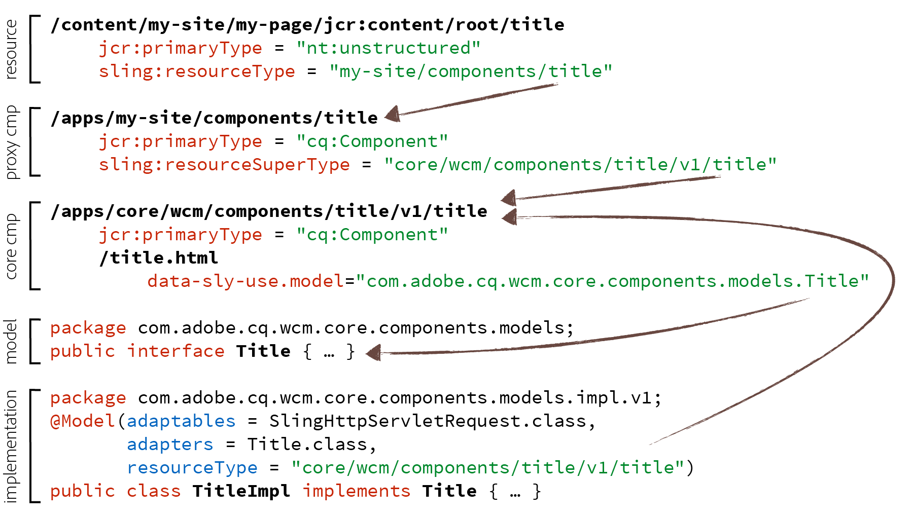

# Component Guidelines{#component-guidelines}

The [Core Components](developing.md) follow modern implementation patterns that are quite different from the foundation components.

This page explains these patterns, and when to use them to build your own authorable components. The first section [General Component Patterns](guidelines.md#main-pars_title_2052363702) applies to any kind of component, while the second section [Reusable Component Patterns](guidelines.md#main-pars_title_1548950278) applies to components that are intended to be reused across sites or projects, like the Core Components for instance.

## General Component Patterns {#general-component-patterns}

The guidelines in this section are recommended for any kind of component, regardless whether the component is specific to a single project, or whether the component is meant to be widely reused across sites or projects.

### Configurable Components {#configurable-components}

Components can have dialogs with a variety of options. This should be leveraged to make components flexible and configurable, and avoid implementing multiple components that are mostly variations of each other.

Typically, if a wireframe or design contains variations of similar elements, these variations should not be implemented as different components, but as the one component with options to choose between the variations.

To take this a step further, if components are reused across sites or projects, see the [Pre-Configurable Capabilities](guidelines.md#PreConfigurableCapabilities) section.

### Separation of Concerns {#separation-of-concerns}

Keeping the logic (or model) of a component separate from the markup template (or view) is usually a good practice. There are several ways to achieve that, however the recommended one is to use [Sling Models](https://sling.apache.org/documentation/bundles/models.html) for the logic and the [HTML Template Language](/content/help/en/experience-manager/htl/using/overview) (HTL) for the markup, like the Core Components also do.

Sling Models are a set of Java annotations to easily access needed variables from POJOs, and therefore offer a simple, powerful and performant way to implement Java logic for components.

HTL has been designed to be a secure and simple template language that is tailored for AEM. It can call many forms of logic, which makes it very flexible.

## Reusable Component Patterns {#reusable-component-patterns}

The guidelines in this section can be used as well for any kind of component, but they make most sense for components that are intended to be reused across sites or projects, like the Core Components for instance. These guidelines can therefore be ignored for components that are only used on a single site or project.

### Pre-Configurable Capabilities {#pre-configurable-capabilities}

In addition to the edit dialog that is used by page authors, components can also have a design dialog for template authors to pre-configure them. The [Template Editor](/content/help/en/experience-manager/6-3/sites/authoring/using/templates) allows to setup all these pre-configurations, which are called "Policies".

To make components as reusable as possible, they should be provided with meaningful options to pre-configure. This will allow to enable or to disable features of the components to match the specific needs of different sites.

<!-- 

Comment Type: annotation
Last Modified By: ims-author-CE1E2CE451D1F0680A490D45@AdobeID
Last Modified Date: 2017-04-17T17:49:04.584-0400

Unclear how I can add my own capability toggle (for example, if i extend a component and want to toggle that extended functionality ... )

 -->

### Proxy Component Pattern {#proxy-component-pattern}

As each content resource has a `sling:resourceType` property that references the component to render it, it is usually good practice to have these properties pointing to site-specific components, instead of pointing to components that are shared by multiple sites. This will offer more flexibility and avoid content refactoring if one site needs a different behavior for a component, because this customization can then be achieved on the site-specific component and won't affect the other sites.

However, for the project-specific components not to duplicate any code, they should each refer to the shared parent component with the `sling:resourceSuperType` property. These project-specific components that mostly just refer to parent components are called "proxy components". Proxy components can be entirely empty if they fully inherit the functionality, or they can redefine some aspects of the component.

### Component Versioning {#component-versioning}

Components should be kept fully compatible over time, yet sometimes changes that cannot be kept compatible are necessary. One solution to these opposing needs is to introduce component versioning by adding a number in their resource type path, and in the fully qualified Java class names of their implementations. This version number represents a major version as defined by [semantic versioning guidelines](https://semver.org/), which is incremented only for changes that are not backward-compatible.

Incompatible changes to the following aspects of components will result in a new version of them:

* Sling Models (following semantic versioning guidelines)
* HTL Scripts and Templates
* HTML Markup and CSS Selectors
* JSON Representation
* Dialogs

For further details, see the [Versioning Policies](https://github.com/adobe/aem-core-wcm-components/wiki/Versioning-Policies) document in GitHub.

Component versioning creates a form of contract that is important for upgrades as it clarifies when something might need to be refactored. See also the section [Upgrade Compatibility of Customizations](customizing.md#UpgradeCompatibilityofCustomizations), which explains what considerations different forms of customizations require for an upgrade.

To avoid painful content migrations, it is important to never directly point to versioned components from content resources. As rule of thumb, a `sling:resourceType` of the content must never have a version number in it, or upgrading components will require the content to be refactored too. The best way to avoid this is to follow the [Proxy Component Pattern](#ProxyComponentPattern) described above.

### Model Interfaces {#model-interfaces}

This pattern is about HTL's `data-sly-use` instruction to point to a Java interface, while the Sling Model implementation is also registering itself to the resource type of the component.

When combined with the [Proxy Component Pattern](#ProxyComponentPattern) described above, this form of double-binding offers following nice extension points:

1. A site can redefine the implementation of a Sling Model by registering it to the resource type of the proxy component, without having to mind about the HTL file, which can still point to the interface.
1. A site can redefine the HTL markup of a component, without having to mind about which implementation logic it should point to.

## Putting it all together {#putting-it-all-together}

Below is an overview of the entire resource type binding structure, taking the example of the Title Core Component. It illustrates how a site-specific proxy component allows to resolve component versioning, to avoid that the content resource contains any version number. It then shows how the component's `title.html` [HTL](/content/help/en/experience-manager/htl/using/overview) file uses to the model interface, while the implementation binds to the specific version of the component through [Sling Model](https://sling.apache.org/documentation/bundles/models.html) annotations.

Below is another overview, which doesn't show the details of the implementation POJO, but reveals how the associated [templates and policies](/content/help/en/experience-manager/6-3/sites/developing/using/page-templates-editable) are referenced.

The `cq:allowedTemplates` property tells which templates can be used for a site, and the `cq:template` tells for each page what the associated template is. Every template is made of following three parts:

* `structure` contains the resources that will be forced on each page to be present, and that the page author won't be able delete, like for instance the page header and footer components.
* `initial` contains the initial content that will be duplicated to the page when it is created.
* `policies` contains for each component the mapping to a policy, which is the component's pre-configuration. This mapping allows policies to be reused across templates, and therefore to be centrally managed.

**Read next:**

* [Using Core Components](using.md) - get up-and-running with Core Components in your own project.
* [Customizing Core Components](customizing.md) - to learn how to style and customize the core components.

