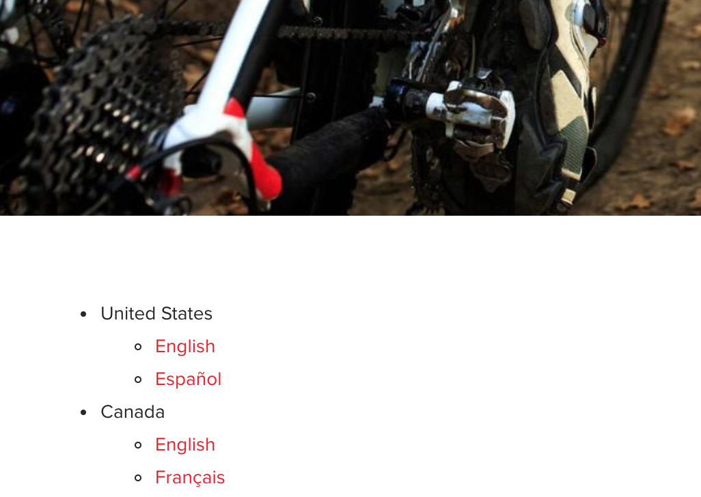
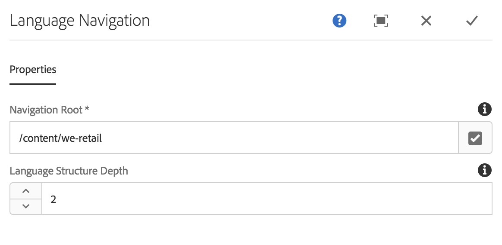

# Language Navigation Component{#language-navigation-component}

The Language Navigation Component provides a language/country navigation for a site, so that visitors can navigate to the same page in a different locale.

## Usage {#usage}

Often websites are provided in multiple languages for different regions. The language navigation component allows a visitor to view the same page in different languages/locales.

The [edit dialog](language-navigation.md#main-pars_title) allows the definition of the global site navigation root as well as how deep into the structure the navigation should go. Using the [design dialog](language-navigation.md#main-pars_title_1995166862), the template author can set the default values for the same options.

## Version and Compatibility {#version-and-compatibility}

The current version of the Language Navigation Component is v1, which was introduced with release 2.0.0 of the Core Components in January 2018, and is described in this document.

The following table details all supported versions of the component, the AEM versions with which the versions of the component is compatible, and links to documentation for previous versions.

<table border="1" cellpadding="1" cellspacing="0" width="100%"> 
 <tbody> 
  <tr> 
   <td><strong>Language Navigation Component Version</strong></td> 
   <td><strong>AEM 6.3</strong></td> 
   <td><strong>AEM 6.4</strong></td> 
  </tr> 
  <tr> 
   <td>v1</td> 
   <td>Compatible<br /> </td> 
   <td>Compatible</td> 
  </tr> 
 </tbody> 
</table>

For more information about Core Component versions and releases, see the document [Core Components Versions](versions.md).

## Sample Component Output {#sample-component-output}

The following is sample taken from [We.Retail](https://helpx.adobe.com/experience-manager/6-3/sites/developing/using/we-retail.html).

### Screenshot {#screenshot}

 

### HTML {#html}

```
<nav class="cmp-languagenavigation">
    <ul class="cmp-languagenavigation__group">
        
    <li class="cmp-languagenavigation__item cmp-languagenavigation__item--langcode-en cmp-languagenavigation__item--level-0 cmp-languagenavigation__item--active">
        
    <span class="cmp-languagenavigation__item-title" lang="en">United States</span>

    <ul class="cmp-languagenavigation__group">
        
    <li class="cmp-languagenavigation__item cmp-languagenavigation__item--langcode-en cmp-languagenavigation__item--level-1 cmp-languagenavigation__item--active">

    <a class="cmp-languagenavigation__item-link" href="/content/we-retail/us/en/equipment.html" hreflang="en" lang="en" rel="alternate" title="English">English</a>

    </li>

    <li class="cmp-languagenavigation__item cmp-languagenavigation__item--langcode-es cmp-languagenavigation__item--level-1">

    <a class="cmp-languagenavigation__item-link" href="/content/we-retail/us/es.html" hreflang="es" lang="es" rel="alternate" title="Español">Español</a>

    </li>

    </ul>

    </li>

    <li class="cmp-languagenavigation__item cmp-languagenavigation__item--countrycode-CA cmp-languagenavigation__item--langcode-en-CA cmp-languagenavigation__item--level-0">
        
    <span class="cmp-languagenavigation__item-title" lang="en-CA">Canada</span>

    <ul class="cmp-languagenavigation__group">
        
    <li class="cmp-languagenavigation__item cmp-languagenavigation__item--countrycode-CA cmp-languagenavigation__item--langcode-en-CA cmp-languagenavigation__item--level-1">

    <a class="cmp-languagenavigation__item-link" href="/content/we-retail/ca/en/equipment.html" hreflang="en-CA" lang="en-CA" rel="alternate" title="English">English</a>

    </li>

    <li class="cmp-languagenavigation__item cmp-languagenavigation__item--countrycode-CA cmp-languagenavigation__item--langcode-en-CA cmp-languagenavigation__item--level-1">

    <a class="cmp-languagenavigation__item-link" href="/content/we-retail/ca/fr.html" hreflang="en-CA" lang="en-CA" rel="alternate" title="Français">Français</a>

    </li>

    </ul>

    </li>

    <li class="cmp-languagenavigation__item cmp-languagenavigation__item--countrycode-CH cmp-languagenavigation__item--langcode-de-CH cmp-languagenavigation__item--level-0">
        
    <span class="cmp-languagenavigation__item-title" lang="de-CH">Switzerland</span>

    <ul class="cmp-languagenavigation__group">
        
    <li class="cmp-languagenavigation__item cmp-languagenavigation__item--countrycode-CH cmp-languagenavigation__item--langcode-de-CH cmp-languagenavigation__item--level-1">

    <a class="cmp-languagenavigation__item-link" href="/content/we-retail/ch/de.html" hreflang="de-CH" lang="de-CH" rel="alternate" title="Deutsch">Deutsch</a>

    </li>

    <li class="cmp-languagenavigation__item cmp-languagenavigation__item--countrycode-CH cmp-languagenavigation__item--langcode-de-CH cmp-languagenavigation__item--level-1">

    <a class="cmp-languagenavigation__item-link" href="/content/we-retail/ch/fr.html" hreflang="de-CH" lang="de-CH" rel="alternate" title="Français">Français</a>

    </li>

    <li class="cmp-languagenavigation__item cmp-languagenavigation__item--countrycode-CH cmp-languagenavigation__item--langcode-de-CH cmp-languagenavigation__item--level-1">

    <a class="cmp-languagenavigation__item-link" href="/content/we-retail/ch/it.html" hreflang="de-CH" lang="de-CH" rel="alternate" title="Italiano">Italiano</a>

    </li>

    </ul>

    </li>

    <li class="cmp-languagenavigation__item cmp-languagenavigation__item--langcode-de cmp-languagenavigation__item--level-0">
        
    <span class="cmp-languagenavigation__item-title" lang="de">Germany</span>

    <ul class="cmp-languagenavigation__group">
        
    <li class="cmp-languagenavigation__item cmp-languagenavigation__item--langcode-de cmp-languagenavigation__item--level-1">

    <a class="cmp-languagenavigation__item-link" href="/content/we-retail/de/de.html" hreflang="de" lang="de" rel="alternate" title="Deutsch">Deutsch</a>

    </li>

    </ul>

    </li>

    <li class="cmp-languagenavigation__item cmp-languagenavigation__item--langcode-fr cmp-languagenavigation__item--level-0">
        
    <span class="cmp-languagenavigation__item-title" lang="fr">France</span>

    <ul class="cmp-languagenavigation__group">
        
    <li class="cmp-languagenavigation__item cmp-languagenavigation__item--langcode-fr cmp-languagenavigation__item--level-1">

    <a class="cmp-languagenavigation__item-link" href="/content/we-retail/fr/fr.html" hreflang="fr" lang="fr" rel="alternate" title="Français">Français</a>

    </li>

    </ul>

    </li>

    <li class="cmp-languagenavigation__item cmp-languagenavigation__item--langcode-es cmp-languagenavigation__item--level-0">
        
    <span class="cmp-languagenavigation__item-title" lang="es">Spain</span>

    <ul class="cmp-languagenavigation__group">
        
    <li class="cmp-languagenavigation__item cmp-languagenavigation__item--langcode-es cmp-languagenavigation__item--level-1">

    <a class="cmp-languagenavigation__item-link" href="/content/we-retail/es/es.html" hreflang="es" lang="es" rel="alternate" title="Español">Español</a>

    </li>

    </ul>

    </li>

    <li class="cmp-languagenavigation__item cmp-languagenavigation__item--langcode-it cmp-languagenavigation__item--level-0">
        
    <span class="cmp-languagenavigation__item-title" lang="it">Italy</span>

    <ul class="cmp-languagenavigation__group">
        
    <li class="cmp-languagenavigation__item cmp-languagenavigation__item--langcode-it cmp-languagenavigation__item--level-1">

    <a class="cmp-languagenavigation__item-link" href="/content/we-retail/it/it.html" hreflang="it" lang="it" rel="alternate" title="Italiano">Italiano</a>

    </li>

    </ul>

    </li>

    </ul>
</nav>
```

### JSON {#json}

```
"languagenavigation":{  
                     "columnClassNames":"aem-GridColumn aem-GridColumn--default--12",
                     "items":[  
                        {  
                           "children":[  
                              {  
                                 "children":[  

                                 ],
                                 "level":1,
                                 "active":true,
                                 "title":"English",
                                 "locale":"en",
                                 "country":"",
                                 "language":"en",
                                 "url":"/content/we-retail/us/en/equipment.html",
                                 "path":"/content/we-retail/us/en/equipment",
                                 "description":null,
                                 "lastModified":1515760174857
                              },
                              {  
                                 "children":[  

                                 ],
                                 "level":1,
                                 "active":false,
                                 "title":"Español",
                                 "locale":"es",
                                 "country":"",
                                 "language":"es",
                                 "url":"/content/we-retail/us/es.html",
                                 "path":"/content/we-retail/us/es",
                                 "description":null,
                                 "lastModified":1474673505454
                              }
                           ],
                           "level":0,
                           "active":true,
                           "title":"United States",
                           "locale":"en",
                           "country":"",
                           "language":"en",
                           "url":"/content/we-retail/us/en/equipment.html",
                           "path":"/content/we-retail/us/en/equipment",
                           "description":null,
                           "lastModified":1515760174857
                        },
                        {  
                           "children":[  
                              {  
                                 "children":[  

                                 ],
                                 "level":1,
                                 "active":false,
                                 "title":"English",
                                 "locale":"en_CA",
                                 "country":"CA",
                                 "language":"en-CA",
                                 "url":"/content/we-retail/ca/en/equipment.html",
                                 "path":"/content/we-retail/ca/en/equipment",
                                 "description":null,
                                 "lastModified":1477493028617
                              },
                              {  
                                 "children":[  

                                 ],
                                 "level":1,
                                 "active":false,
                                 "title":"Français",
                                 "locale":"en_CA",
                                 "country":"CA",
                                 "language":"en-CA",
                                 "url":"/content/we-retail/ca/fr.html",
                                 "path":"/content/we-retail/ca/fr",
                                 "description":null,
                                 "lastModified":1474673388792
                              }
                           ],
                           "level":0,
                           "active":false,
                           "title":"Canada",
                           "locale":"en_CA",
                           "country":"CA",
                           "language":"en-CA",
                           "url":"/content/we-retail/ca/en/equipment.html",
                           "path":"/content/we-retail/ca/en/equipment",
                           "description":null,
                           "lastModified":1477493028617
                        },
                        {  
                           "children":[  
                              {  
                                 "children":[  

                                 ],
                                 "level":1,
                                 "active":false,
                                 "title":"Deutsch",
                                 "locale":"de_CH",
                                 "country":"CH",
                                 "language":"de-CH",
                                 "url":"/content/we-retail/ch/de.html",
                                 "path":"/content/we-retail/ch/de",
                                 "description":null,
                                 "lastModified":1474673744891
                              },
                              {  
                                 "children":[  

                                 ],
                                 "level":1,
                                 "active":false,
                                 "title":"Français",
                                 "locale":"de_CH",
                                 "country":"CH",
                                 "language":"de-CH",
                                 "url":"/content/we-retail/ch/fr.html",
                                 "path":"/content/we-retail/ch/fr",
                                 "description":null,
                                 "lastModified":1474673356319
                              },
                              {  
                                 "children":[  

                                 ],
                                 "level":1,
                                 "active":false,
                                 "title":"Italiano",
                                 "locale":"de_CH",
                                 "country":"CH",
                                 "language":"de-CH",
                                 "url":"/content/we-retail/ch/it.html",
                                 "path":"/content/we-retail/ch/it",
                                 "description":null,
                                 "lastModified":1474673460578
                              }
                           ],
                           "level":0,
                           "active":false,
                           "title":"Switzerland",
                           "locale":"de_CH",
                           "country":"CH",
                           "language":"de-CH",
                           "url":"/content/we-retail/ch.html",
                           "path":"/content/we-retail/ch",
                           "description":null,
                           "lastModified":1474673057327
                        },
                        {  
                           "children":[  
                              {  
                                 "children":[  

                                 ],
                                 "level":1,
                                 "active":false,
                                 "title":"Deutsch",
                                 "locale":"de",
                                 "country":"",
                                 "language":"de",
                                 "url":"/content/we-retail/de/de.html",
                                 "path":"/content/we-retail/de/de",
                                 "description":null,
                                 "lastModified":1474673744681
                              }
                           ],
                           "level":0,
                           "active":false,
                           "title":"Germany",
                           "locale":"de",
                           "country":"",
                           "language":"de",
                           "url":"/content/we-retail/de.html",
                           "path":"/content/we-retail/de",
                           "description":null,
                           "lastModified":1474673019700
                        },
                        {  
                           "children":[  
                              {  
                                 "children":[  

                                 ],
                                 "level":1,
                                 "active":false,
                                 "title":"Français",
                                 "locale":"fr",
                                 "country":"",
                                 "language":"fr",
                                 "url":"/content/we-retail/fr/fr.html",
                                 "path":"/content/we-retail/fr/fr",
                                 "description":null,
                                 "lastModified":1474673321300
                              }
                           ],
                           "level":0,
                           "active":false,
                           "title":"France",
                           "locale":"fr",
                           "country":"",
                           "language":"fr",
                           "url":"/content/we-retail/fr.html",
                           "path":"/content/we-retail/fr",
                           "description":null,
                           "lastModified":1474672999375
                        },
                        {  
                           "children":[  
                              {  
                                 "children":[  

                                 ],
                                 "level":1,
                                 "active":false,
                                 "title":"Español",
                                 "locale":"es",
                                 "country":"",
                                 "language":"es",
                                 "url":"/content/we-retail/es/es.html",
                                 "path":"/content/we-retail/es/es",
                                 "description":null,
                                 "lastModified":1474673542068
                              }
                           ],
                           "level":0,
                           "active":false,
                           "title":"Spain",
                           "locale":"es",
                           "country":"",
                           "language":"es",
                           "url":"/content/we-retail/es.html",
                           "path":"/content/we-retail/es",
                           "description":null,
                           "lastModified":1474673075638
                        },
                        {  
                           "children":[  
                              {  
                                 "children":[  

                                 ],
                                 "level":1,
                                 "active":false,
                                 "title":"Italiano",
                                 "locale":"it",
                                 "country":"",
                                 "language":"it",
                                 "url":"/content/we-retail/it/it.html",
                                 "path":"/content/we-retail/it/it",
                                 "description":null,
                                 "lastModified":1474673426215
                              }
                           ],
                           "level":0,
                           "active":false,
                           "title":"Italy",
                           "locale":"it",
                           "country":"",
                           "language":"it",
                           "url":"/content/we-retail/it.html",
                           "path":"/content/we-retail/it",
                           "description":null,
                           "lastModified":1474673037021
                        }
                     ],
                     ":type":"core/wcm/sandbox/components/languagenavigation/v1/languagenavigation"
                  }
```

## Edit Dialog {#edit-dialog}

The edit dialog allows the definition of the global site navigation root as well as how deep into the structure the navigation should go.



* **Navigation Root** - Defines the root page of the navigation structure.

    * Use the **Open Selection Dialog** button to easily navigate the content structure and select the root.

* **Language Structure Depth** - Depth of the global language structure relative to the navigation root.

## Design Dialog {#design-dialog}

Using the design dialog, the template author can set the default values for the same options available in the edit dialog.

### Properties Tab {#properties-tab}


* **Navigation Root** - Default value of the navigation root when a content author places the Language Switcher Component on a content page
* **Language Structure Depth** - Default value of the language structure depth when a content author places the Language Switcher Component on a content page

### Styles Tab {#styles-tab}

The Language Navigation Component supports the AEM [Style System](authoring.md#main-pars_header).

## Technical Details {#technical-details}

The latest technical documentation about the Language Navigation Component [can be found on GitHub](https://github.com/adobe/aem-core-wcm-components/blob/master/content/src/content/jcr_root/apps/core/wcm/components/languagenavigation/v1/languagenavigation).

The entire core components project can be downloaded from GitHub.

Further details about developing Core Components can be found in the [Core Components developer documentation](developing.md). 
