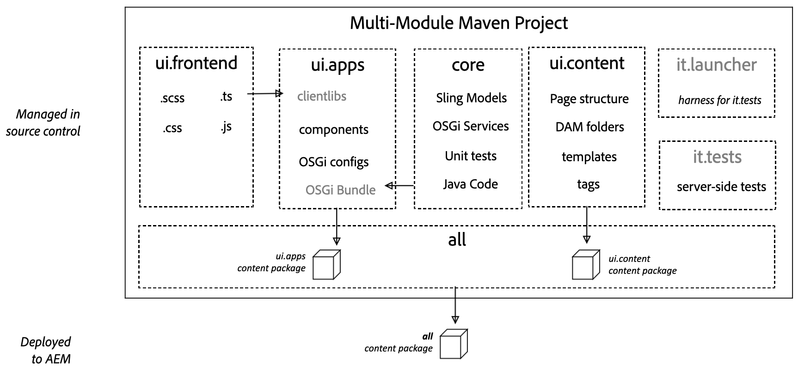

# AEM Project Archetype {#aem-project-archetype}

The AEM Project Archetype creates a minimal, best-practices-based Adobe Experience Manager project as a starting point for your own AEM projects. The properties that must be provided when using this archetype allow you to specify the names for all parts of this project as well as control certain optional features.

>[!NOTE]
>
>The latest AEM Project Archetype and full technical details [can be found on GitHub](https://github.com/adobe/aem-project-archetype).

>[!NOTE]
>
>See the [Getting Started with AEM Sites - WKND Tutorial](https://docs.adobe.com/content/help/en/experience-manager-learn/getting-started-wknd-tutorial-develop/overview.html) in the AEM documentation for a practical example that walks you through using the archetype to implement a simple project.

## Features {#features}

The archetype has a number features that are intended to offer a convenient starting point for new AEM projects:

* English and French pages with example content
* A content template based on the editable template feature with example content policy
* Page component based on the [AEM Page Core Component](page.md)
* Examples of content components implemented with the recommended proxy pattern and an example helloworld custom component all based on [AEM Core Components](introduction.md).
* Examples of [form components](form-container.md)
* Configurations for device emulators, drag-and-drop setup, and internationalization
* Client libraries following BEM naming conventions as well as component-specific styles
* Example bundles including sample models, servelets, filters, and schedulers
* Unit, integration, and client-side tests

## Why Use the Archetype {#why-use-the-archetype}

Using the AEM Project Archetype sets you on the path towards building a best-practices-based AEM project with just a few keystrokes. By using the archetype, all of the pieces will already in place so that while the resulting project is minimal, it already implements all of the [key features](#features) of AEM so that all you have to do is build on top and extend.

Of course there are many elements that go into a successful AEM project, but using the AEM Project Archetype is a sound foundation and is strongly recommended for any AEM project.

## What You Get Using the Archetype {#what-you-get}

The AEM Archetype is made up of modules:

* **[core](core.md)**: is a Java bundle containing all core functionality like OSGi services, listeners, and schedulers, as well as component-related Java code such as servlets and request filters.
* **[ui.apps](uiapps.md)**: contains the `/apps` and `/etc` parts of the project, i.e. JS and CSS clientlibs, components, templates, runmode-specific configs, as well as Hobbes tests.
* **[ui.content](uicontent.md)**: contains sample content using the components from the ui.apps module.
* **ui.tests**: is a Java bundle containing JUnit tests that are executed server-side. This bundle is not to be deployed onto production.
* **ui.launcher**: contains glue code that deploys the ui.tests bundle (and dependent bundles) to the server and triggers the remote JUnit execution.
* **[ui.frontend](uifrontend.md)**: **(optional)** contains the artifacts required to use the Webpack-based front-end build module.



The modules of AEM Archetype represented in Maven are deployed to AEM as content packages representing the application, the content, and the necessary OSGi bundles.

## Requirements {#requirements}

The current version of the archetype has the following requirements:

* Adobe Experience Manager 6.3.3.0 or higher
* Apache Maven (3.3.9 or newer)
* Adobe Public Maven Repository in your Maven settings. See this [Knowledge Base article for details](https://helpx.adobe.com/experience-manager/kb/SetUpTheAdobeMavenRepository.html).

For a list of supported AEM versions of previous archetype versions, see the [historical supported AEM versions](https://github.com/adobe/aem-project-archetype/blob/master/VERSIONS.md).

## How to Use the Archetype {#how-to-use-the-archetype}

To use the archetype, you first need to create a project, which generates the modules in a local file structure as [previously described](#what-you-get). As part of project generation, a number of properties for your project can be defined such as project name, version, etc.

Building the project with Maven creates the artifacts (packages and OSGi bundles), that can be deployed to AEM. Additional Maven commands and profiles can be used to deploy the project artifacts to an AEM instance.

### Creating a Project {#create-project}

To get started you can most simply use the [AEM Eclipse extension](https://docs.adobe.com/content/help/en/experience-manager-65/developing/devtools/aem-eclipse.html) and follow the New Project wizard and choosing **AEM Sample Multi-Module Project** to use a released version of the archetype.

Of course you can also invoke Maven directly.

```
mvn archetype:generate \
 -DarchetypeGroupId=com.adobe.granite.archetypes \
 -DarchetypeArtifactId=aem-project-archetype \
 -DarchetypeVersion=XX
```

Where `XX` is the [version number](https://github.com/adobe/aem-project-archetype/blob/master/VERSIONS.md) of the latest AEM Project Archetype.

>[!NOTE]
>
>It is best practice to add the `adobe-public` profile to your Maven `settings.xml` file in order to automatically add repo.adobe.com to the maven build process.
>
>An example POM [can be found here](https://helpx.adobe.com/experience-manager/kb/SetUpTheAdobeMavenRepository.html).

### Properties {#properties}

The following properties are available when creating a project using the archetype.

Name                        | Default | Description
----------------------------|---------|--------------------
`groupId`                     |         | Base Maven `groupId`
`artifactId`                  |         | Base Maven ArtifactId
`version`                     |         | Version
`package`                     |         | Java Source Package
`appsFolderName`              |         | `/apps` folder name
`artifactName`                |         | Maven Project Name
`componentGroupName`          |         | AEM component group name
`contentFolderName`           |         | `/content` folder name
`confFolderName`              |         | `/conf` folder name
`cssId`                       |         | prefix used in generated css
`packageGroup`                |         | Content Package Group name
`siteName`                    |         | AEM site name
`optionAemVersion`            |  6.5.0  | Target AEM version
`optionIncludeExamples`       |    y    | Include a [Component Library](http://opensource.adobe.com/aem-core-wcm-components/library.html) example site
`optionIncludeErrorHandler`   |    n    | Include a custom 404 response page
`optionIncludeFrontendModule` |    n    | [Include a dedicated front-end module](uifrontend.md)

>[!NOTE]
> If the archetype is executed in interactive mode the first time, properties with default values can't be changed (see [ARCHETYPE-308](https://issues.apache.org/jira/browse/ARCHETYPE-308) for more details). The value can be changed when the property confirmation at the end is denied and the questionnaire gets repeated, or by passing the parameter in the command line (e.g. `-DoptionIncludeExamples=n`).

### Profiles {#profiles}

The generated maven project supports different deployment profiles when running `mvn install`.

Profile ID                        | Description
--------------------------|------------------------------
`autoInstallBundle`         | Installs core bundle with the maven-sling-plugin to OSGi
`autoInstallPackage`        | Installs the ui.content and ui.apps content package with the content-package-maven-plugin to the package manager to the default author instance on localhost, port 4502. Hostname and port can be changed with the `aem.host` and `aem.port` user-defined properties.
`autoInstallPackagePublish` | Install the ui.content and ui.apps content package with the content-package-maven-plugin to the package manager to default publish instance on localhost, port 4503. Hostname and port can be changed with the `aem.host` and `aem.port` user-defined properties.
`integrationTests` | Runs the provided integration tests on the AEM instance (only for the `verify` phase)

### Building and Installing {#building-and-installing}

To build all the modules run in the project root directory, use the following Maven command.

```
mvn clean install
```

If you have a running AEM instance, you can build and package the whole project and deploy into AEM with the following Maven command.

```
mvn clean install -PautoInstallPackage
```

To deploy it to a publish instance, run this command.

```
mvn clean install -PautoInstallPackagePublish
```

Alternatively, to deploy to a publish instance, run this command.

```
mvn clean install -PautoInstallPackage -Daem.port=4503
```

Or to deploy only the bundle to the author, run this command.

```
mvn clean install -PautoInstallBundle
```

## Parent POM {#parent-pom}

The `pom.xml` at the root of the project (`<src-directory>/<project>/pom.xml`) is known as the parent POM and drives the structure of the project as well as manages dependencies and certain global properties of the project.

### Global Project Properties {#global-properties}

The `<properties>` section of the parent POM defines several global properties that are important to the deployment of your project on an AEM instance such as user name/password, host name/port, etc.

These properties are set up to deploy to a local AEM instance, as this is the most common build that developers will do. Notice there are properties to deploy to an author instance as well as a publish instance. This is also where the credentials are set to authenticate with the AEM instance. The default admin:admin credentials are used.

These properties are set up so that they can be overridden when deploying to higher level environments. In this way the POM files do not have to change, but variables like `aem.host` and `sling.password` can be overridden via command line arguments:

````
mvn -PautoInstallPackage clean install -Daem.host=production.hostname -Dsling.password=productionpasswd
````

### Module Structure {#module-structure}

The `<modules>` section of the parent POM defines the modules that the project will build. By default the project builds [the standard modules previously defined](#what-you-get): core, ui.apps, ui.content, ui.tests, and it.launcher. More modules can always be added as a project evolves.

### Dependencies {#dependencies}

The `<dependencyManagement>` section of the parent POM defines all of the dependencies and versions of APIs that are used in the project. Versions should be managed in the Parent POM. Sub-modules like core and ui.apps should not include any version information.

#### Uber-Jar {#uber-jar}

One of the key dependencies is the [AEM uber-jar](https://docs.adobe.com/content/help/en/experience-manager-65/developing/devtools/ht-projects-maven.html#ExperienceManagerAPIDependencies). This will include all of the AEM APIs with just a single dependency entry for the version of AEM.

>[!NOTE]
>
>As a best practice you should update the uber-jar version to match the target version of AEM. For example, if you plan to deploy to AEM 6.4 you should update the version of the uber-jar to 6.4.0.

#### Core Components {#core-components}

The AEM Project Archetype of course leverages the Core Components.

The Core Components are installed in AEM automatically in the default runmode and used by the sample We.Retail site. In a [production runmode](https://docs.adobe.com/content/help/en/experience-manager-65/administering/security/production-ready.html) (`nosamplecontent`) the Core Components are not available.

Therefore, in order to leverage the Core Components in all deployments, it is a best practice to include them as part of the Maven project.

>[!NOTE]
>
>Each release of the Core Components is generally followed by a release of the AEM Project Archetype so that the latest archetype uses the latest version of the core components.
>
>However a new version of the archetype may not directly follow a new version of the Core Components, so you may wish to update the dependency on the Core Components to the latest version.

>[!NOTE]
>
>The core.wcm.components.examples are a set of sample pages that illustrate examples of the Core Components. As a best practice, when deploying a project for production use you should remove this dependency and subpackage inclusion.

## Testing {#testing}

There are three levels of testing contained in the project and because they are different types of tests, they are executed in different ways or in different places.

* Unit test in core: This showcases classic unit testing of the code contained in the bundle. To test, execute:
  * `mvn clean test`
* Server-side integration tests: These run unit-like tests in the AEM-environment, i.e. on the AEM server. To test, execute:
  * `mvn clean verify -PintegrationTests`
* Client-side Hobbes.js tests: These are JavaScript-based browser-side tests that verify browser-side behavior. To test:
  1. Load AEM in your browser as you would to author a page.
  1. Open the page in [Developer mode](https://docs.adobe.com/content/help/en/experience-manager-65/developing/components/developer-mode.html)
  1. Open the left panel and switch to the **Tests** tab.
  1. Find the generated **MyName Tests** and run them.

## Next Steps {#next-steps}

So you have built and installed the AEM Project Archetype. What now? Well, the archetype is small, but consists of many examples of powerful AEM features configured according to recommended best practices. Use these are indicatory of how you can leverage these features in your project. For any project you likely need to:

* [Customize components by extending the existing core components](customizing.md)
* [Add additional templates](https://docs.adobe.com/content/help/en/experience-manager-cloud-service/sites/authoring/features/templates.html)
* [Adapt the localization structure](https://docs.adobe.com/content/help/en/experience-manager-65/administering/introduction/tc-prep.html)
* [Learn about the front-end build module](uifrontend.md)
