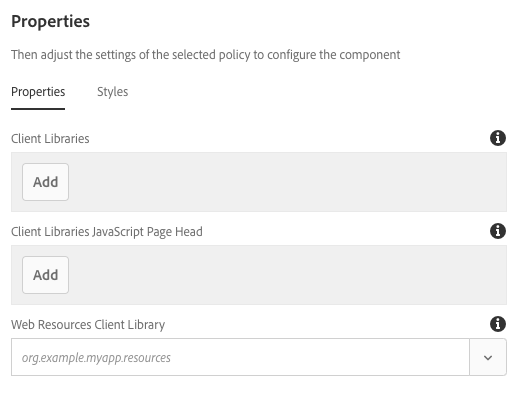

# Page Component{#page-component}

The Page Component is an extensible page component designed to work with the [template editor](https://docs.adobe.com/content/help/en/experience-manager-cloud-service/sites/authoring/features/templates.html) and allows page header/footer and structure components to be assembled with the template editor.

## Usage {#usage}

The page component forms the basis of all pages designed with the core components as well as editable templates. By using the page component, headers, footers, and the structure of the page can be defined as a template using the other core components.

Using the [design dialog](#design-dialog), custom client-side libraries can be defined for the page. Unlike other components which have an edit dialog accessible directly from the component, because the component is the page itself, the [edit dialog](#edit-dialog) of the page component is the page properties window.

## Version and Compatibility {#version-and-compatibility}

The current version of the Page Component is v2, which was introduced with release 2.0.0 of the Core Components in January 2018, and is described in this document.

The following table details all supported versions of the component, the AEM versions with which the versions of the component is compatible, and links to documentation for previous versions.

|Component Version|AEM 6.3|AEM 6.4|AEM 6.5|
|---|---|---|---|
|[v2](page-v1.md)|Compatible|Compatible|Compatible|
|v1|Compatible|Compatible|Compatible|

For more information about Core Component versions and releases, see the document [Core Components Versions](versions.md).

>[!NOTE]
>
>To enable redirect at `cq:Page` level for version 2 of the page component and AEM 6.3, [service pack 2](https://helpx.adobe.com/experience-manager/6-3/release-notes/sp2-release-notes.html) or later is required. Such redirection was not available in prior releases.

## Sample Component Output {#sample-component-output}

The following is sample taken from [We.Retail](https://docs.adobe.com/content/help/en/experience-manager-65/developing/bestpractices/we-retail/we-retail.html).

### Screenshot {#screenshot}

### Technical Details {#technical-details}

The latest technical documentation about the Page Component [can be found on GitHub](https://adobe.com/go/aem_cmp_tech_page_v2).

Further details about developing Core Components can be found in the [Core Components developer documentation](developing.md).

## Edit Dialog {#edit-dialog}

Because the component represents the entire page, settings that would normally be in an edit dialog are found in the [Page Properties](https://docs.adobe.com/content/help/en/experience-manager-cloud-service/sites/authoring/fundamentals/page-properties.html) window.

## Design Dialog {#design-dialog}

Because the component represents the entire page, the design dialog is accessed via **Page Information -&gt; Page Policy** when editing the page template.

>[!NOTE]
>
>In previous versions of AEM, **Page Policy** was called **Page Design**.

### Properties Tab {#properties-tab}

Using the Page Design window, you can define the client libraries to be loaded as well as the web resources library for the page.

* **Client Libraries**
  This defines the client library categories to load. JavaScript is added at the body end and the CSS is added to the page head.
* **Client Libraries JavaScript Page Head**
  This defines the JavaScript Client library categories to load in the page head.
  * Categories defined here that are also present in the **Client Libraries** field will have JavaScript loaded in the page head instead of at body end.  
  * No CSS will be loaded unless the category is also present in the **Client Libraries** field.

* **Web Resources Client Library**
  The client library category that is used to serve web resources such as favicons.

Libraries can be configured for both the **Client Libraries** and **Client Libraries JavaScript Page Head** fields as follows:

* To add a new field click or tap the **Add** button below the fields.
* To remove a field click or tap the trash can icon next to the field to be removed.
* To rearrange the load order, click or tap and drag the handle next to the field to be moved.

For more information about using client-side libraries see [Using Client Side Libraries](https://helpx.adobe.com/experience-manager/6-5/sites/developing/using/clientlibs.html).

>[!CAUTION]
>
>The ability to separately define client libraries for the page head was introduced with core components release 2.2.0.

### Styles Tab {#styles-tab}

The Page Component supports the AEM [Style System](authoring.md#component-styling).
