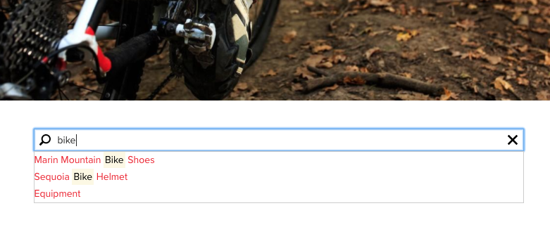
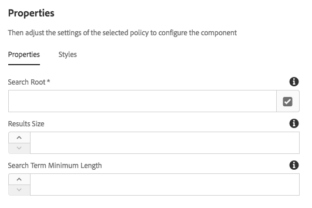

# Quick Search Component{#quick-search-component}

The Quick Search Component provides search capabilities to a website and presents search results so that visitors can easily find matching content and view results.

## Usage {#usage}

The Quick Search component offers site visitors the ability to search for content, view the results in-place, and easily navigate to the matching pages. New results are fetched dynamically as the user scrolls the search results.

The [edit dialog](quick-search.md#main-pars_title) allows the content author to define where in the content tree the search should start. Using the [design dialog](quick-search.md#main-pars_title_1995166862), the template author can set the default value for where in the content tree the search should begin as well as a maximum result set size and minimum search term length.

## Version and Compatibility {#version-and-compatibility}

The current version of the Quick Search Component is v1, which was introduced with release 2.0.0 of the Core Components in January 2018, and is described in this document.

The following table details all supported versions of the component, the AEM versions with which the versions of the component is compatible, and links to documentation for previous versions.

|Component Version|AEM 6.3|AEM 6.4|
|--- |--- |--- |
|v1|Compatible|Compatible|

For more information about Core Component versions and releases, see the document [Core Components Versions](versions.md).

## Sample Component Output {#sample-component-output}

The following is sample taken from [We.Retail](https://helpx.adobe.com/experience-manager/6-3/sites/developing/using/we-retail.html).

### Screenshot {#screenshot}

 

### HTML {#html}

```
<section class="cmp-search" role="search" data-cmp-is="search" data-cmp-min-length="3" data-cmp-results-size="10">
    <form class="cmp-search__form" data-cmp-hook-search="form" method="get" action="/content/we-retail/us/en/equipment.searchresults.json/_jcr_content/root/responsivegrid/search" autocomplete="off">
        <div class="cmp-search__field">
            <i class="cmp-search__icon" data-cmp-hook-search="icon"></i>
            <span class="cmp-search__loading-indicator" data-cmp-hook-search="loadingIndicator"></span>
            <input class="cmp-search__input" data-cmp-hook-search="input" type="text" name="fulltext" placeholder="Search" role="combobox" aria-autocomplete="list" aria-haspopup="true" aria-invalid="false">
            <button class="cmp-search__clear" data-cmp-hook-search="clear">
                <i class="cmp-search__clear-icon"></i>
            </button>
        </div>
    </form>
    <div class="cmp-search__results" data-cmp-hook-search="results" role="listbox" aria-multiselectable="false"></div>
    
<script data-cmp-hook-search="itemTemplate" type="x-template">
    <a class="cmp-search__item" data-cmp-hook-search="item">
        <span class="cmp-search__item-title" data-cmp-hook-search="itemTitle"></span>
    </a>
</script>
</section>
```

### JSON {#json}

```
"search":{  
                     "columnClassNames":"aem-GridColumn aem-GridColumn--default--12",
                     "relativePath":"/jcr:content/root/responsivegrid/search",
                     "resultsSize":10,
                     "searchTermMinimumLength":3,
                     ":type":"core/wcm/components/search/v1/search"
                  }
```

## Edit Dialog {#edit-dialog}

The edit dialog allows the content author to define where in the content tree the search should start.


**Search Root** - The root page from where to start the search. The Search Root can be a blueprint master, language master or regular page.

## Design Dialog {#design-dialog}

Using the design dialog, the template author can set the default value for where in the content tree the search should begin as well as a maximum result set size and minimum search term length.The design dialog allows the template author to define which text formatting options are available to the content authors.

### Properties Tab {#properties-tab}



* **Search Root**
  The default value of search root when a content author places the Quick Search Component on a content page
* **Results Size**
  The maximum number of results fetched by a search request
* **Search Term Minimum Length**
  Minimum length of the search term to start the search

>[!NOTE]
>
>**Results Size** and **Search Term Minimum Length** can only be set in design mode and therefore only at the template level, meaning content authors are not able to modify these values.

>[!CAUTION]
>
>**Results Size** and **Search Term Minimum Length** can have performance impacts if they are set too high or too low, respectively.

### Styles Tab {#styles-tab}

The Quick Search Component supports the AEM [Style System](authoring.md#component-styling).

## Technical Details {#technical-details}

>[!NOTE]
>
>Protecting the Search Component or any AEM based application against DOS attacks should be implemented at a higher level, for example by using `mod_security` on the dispatcher.

The latest technical documentation about the Quick Search Component [can be found on GitHub](https://github.com/adobe/aem-core-wcm-components/blob/master/content/src/content/jcr_root/apps/core/wcm/components/search/v1/search).

The entire core components project can be downloaded from GitHub.

Further details about developing Core Components can be found in the [Core Components developer documentation](developing.md). 
