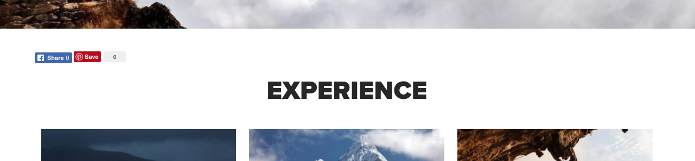

# Sharing Component (v1){#sharing-component-v}

The Core Component Sharing Component is a Facebook and Pinterest sharing widget.

## Usage {#usage}

The sharing component adds Facebook and Pinterest sharing links to the page. It is often included in page headers or footers.

Unlike other components, the settings for the sharing component is done by the template author via [Initial Page properties](/content/help/en/experience-manager/6-3/sites/authoring/using/templates#main-pars_title_1651978509) and by the content author via [Page Properties](/content/help/en/experience-manager/6-3/sites/authoring/using/editing-page-properties).

## Version and Compatibility {#version-and-compatibility}

This document describes version 1 of the Sharing Component, originally introduced with release 1.0.0 of the Core Components with AEM 6.3.

The following table lists the compatibility of version 1 of the Sharing Component.

<table border="1" cellpadding="1" cellspacing="0" width="100%"> 
 <tbody> 
  <tr> 
   <td><strong>AEM Version</strong></td> 
   <td><strong>Sharing Component<br /> Version 1</strong><br /> </td> 
  </tr> 
  <tr> 
   <td>6.3</td> 
   <td>Compatible</td> 
  </tr> 
 </tbody> 
</table>

>[!CAUTION]
>
>This document describes version 1 of the Sharing Component.
>
>For details of the current version of the Sharing Component, see the [Sharing Component](sharing.md) document.

## Sample Component Output {#sample-component-output}

The following is sample taken from [We.Retail](/content/help/en/experience-manager/6-3/sites/developing/using/we-retail).

### Screenshot {#screenshot}

 

### HTML {#html}

```
<div class="sharing aem-GridColumn aem-GridColumn--default--12">

 <div class="fb-share-button fb_iframe_widget" data-href="http://localhost:4503/content/we-retail/us/en/experience.html" data-layout="button_count" data-size="small" data-mobile-iframe="false" fb-xfbml-state="rendered" fb-iframe-plugin-query="app_id=&container_width=1152&href=http%3A%2F%2Flocalhost%3A4503%2Fcontent%2Fwe-retail%2Fus%2Fen%2Fexperience.html&layout=button_count&locale=en_US&mobile_iframe=false&sdk=joey&size=small">
  <span style="vertical-align: bottom; width: 69px; height: 20px;">
   <iframe name="f1a82811f6fd74c" width="1000px" height="1000px" frameborder="0" allowtransparency="true" allowfullscreen="true" scrolling="no" title="fb:share_button Facebook Social Plugin" src="https://www.facebook.com/v2.7/plugins/share_button.php?app_id=&channel=http%3A%2F%2Fstaticxx.facebook.com%2Fconnect%2Fxd_arbiter%2Fr%2F0sTQzbapM8j.js%3Fversion%3D42%23cb%3Df38232e0a09a468%26domain%3Dlocalhost%26origin%3Dhttp%253A%252F%252Flocalhost%253A4503%252Ff6280155038f28%26relation%3Dparent.parent&container_width=1152&href=http%3A%2F%2Flocalhost%3A4503%2Fcontent%2Fwe-retail%2Fus%2Fen%2Fexperience.html&layout=button_count&locale=en_US&mobile_iframe=false&sdk=joey&size=small" style="border: none; visibility: visible; width: 69px; height: 20px;" class=""></iframe>
  </span>
 </div>

 <a class="PIN_1504774323488_button_pin PIN_1504774323488_beside PIN_1504774323488_save PIN_1504774323488_padded" href="https://uk.pinterest.com/pin/create/button/?guid=QQU2S8Pj8VNo-1&url=http%3A%2F%2Flocalhost%3A4503%2Fcontent%2Fwe-retail%2Fus%2Fen%2Fexperience.html&media=http%3A%2F%2Flocalhost%3A4503%2Fcontent%2Fwe-retail%2Fus%2Fen%2Fexperience.thumb.800.480.png%3Fck%3D1504774306&description=Experience" data-pin-log="button_pinit" data-pin-href="https://uk.pinterest.com/pin/create/button/?guid=QQU2S8Pj8VNo-1&url=http%3A%2F%2Flocalhost%3A4503%2Fcontent%2Fwe-retail%2Fus%2Fen%2Fexperience.html&media=http%3A%2F%2Flocalhost%3A4503%2Fcontent%2Fwe-retail%2Fus%2Fen%2Fexperience.thumb.800.480.png%3Fck%3D1504774306&description=Experience" data-pin-x="0">
  <span class="PIN_1504774323488_count" data-pin-href="https://uk.pinterest.com/pin/create/button/?guid=QQU2S8Pj8VNo-1&url=http%3A%2F%2Flocalhost%3A4503%2Fcontent%2Fwe-retail%2Fus%2Fen%2Fexperience.html&media=http%3A%2F%2Flocalhost%3A4503%2Fcontent%2Fwe-retail%2Fus%2Fen%2Fexperience.thumb.800.480.png%3Fck%3D1504774306&description=Experience" data-pin-log="button_pinit" data-pin-x="0">
   0
  </span>
  Save
 </a>

</div>
```

### JSON {#json}

```
"sharing": {
              "columnClassNames": "aem-GridColumn aem-GridColumn--default--12",
              ":type": "weretail/components/content/sharing"
            }
```

>[!NOTE]
>
>JSON export from the Core Components requires release 1.1.0 of the Core Components. Please see the [compatibility information for Core Components v1](versions.md#main-pars_title_236368006) for more information.

## Edit Dialog {#edit-dialog}

Because sharing requires special page headers, any sharing must be enabled at the page level. Therefore, for the content author the edit options for the sharing component are available through the sharing tab the [page properties](/content/help/en/experience-manager/6-3/sites/authoring/using/editing-page-properties).

## Design Dialog {#design-dialog}

Because sharing requires special page headers, any sharing must be enabled at the page level. Therefore, for the template author the design options for the sharing component are available through the [initial page properties](/content/help/en/experience-manager/6-3/sites/authoring/using/templates#main-pars_title_1651978509).

## Technical Details {#technical-details}

The latest technical documentation about the Sharing Component [can be found on GitHub](https://github.com/Adobe-Marketing-Cloud/aem-core-wcm-components/tree/master/content/src/content/jcr_root/apps/core/wcm/components/sharing/v1/sharing).

The entire core components project can be downloaded from GitHub.

Further details about developing Core Components can be found in the [Core Components developer documentation](developing.md). 
