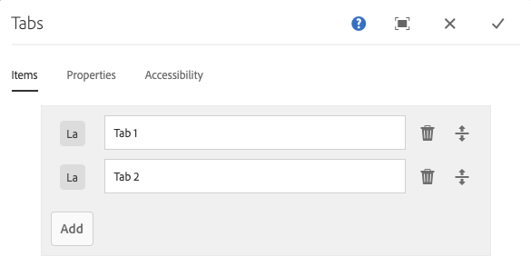
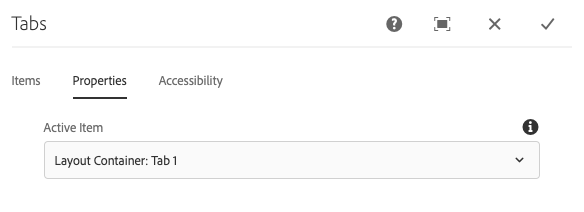
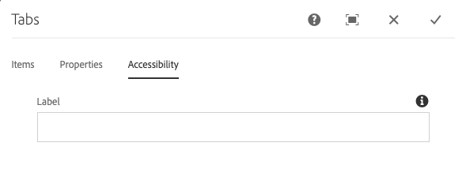

# Tabs Component

The Core Component Tabs Component allows organization of content onto multiple tabs.

## Usage {#usage}

The Tabs Component allows the content author to organize page content within multiple tabs.

The [edit dialog](#edit-dialog) allows the content author to define multiple tabs as well as set the active tab. Using the [design dialog](#design-dialog), the template author can define which components can be added to tabs and customize the styles.

>[!NOTE]
>
>Nested tab components (tabs within tabs) are supported.
>
>Simple (non-nested) tab components can be located/selected using the [content tree](https://docs.adobe.com/content/help/en/experience-manager-cloud-service/sites/authoring/fundamentals/environment-tools.html#content-tree), however nested tabs can not be.

## Version and Compatibility {#version-and-compatibility}

The current version of the Tabs Component is v1, which was introduced with release 2.2.0 of the Core Components in October 2018, and is described in this document.

The following table details all supported versions of the component, the AEM versions with which the versions of the component is compatible, and links to documentation for previous versions.

|Component Version|AEM 6.3|AEM 6.4|AEM 6.5|AEM as a Cloud Service|
|--- |--- |--- |--- |---|
|v1|Compatible|Compatible|Compatible|Compatible|

For more information about Core Component versions and releases, see the document [Core Components Versions](versions.md).

## Sample Component Output {#sample-component-output}

To experience the Tabs Component as well as see examples of its configuration options as well as HTML and JSON output, visit the [Component Library](https://adobe.com/go/aem_cmp_library_tabs).

### Technical Details {#technical-details}

The latest technical documentation about the Tabs Component [can be found on GitHub](https://adobe.com/go/aem_cmp_tech_tabs_v1).

Further details about developing Core Components can be found in the [Core Components developer documentation](developing.md).

## Edit Dialog {#edit-dialog}

The edit dialog allows the content author to create, rename, and rearrange tabs as well as define the active tab.

### Items Tab {#items-tab}

Use the **Add** button to open the component selector to choose which component to add as a tab. Once added, an entry is added to the list, which contains the following columns:

* **Icon** - The icon of the component type of the tab for easy identification in the list. Mouse over to see the full component name as a tooltip.
* **Description** - The description used as the text of the tab, defaulting to the name of the component selected for the tab.
* **Delete** - Tap or click to delete the tab from the tab component.
* **Rearrange** - Tap or click and drag to rearrange the order of the tabs.

>[!TIP]
>
>If the viewport of the page is reduced so that the edit dialog becomes full screen, the **Add** button will be hidden. Components can still be added to the Tabs Component by [dragging from the components browser and dropping on the Tabs Component in the page editor](https://docs.adobe.com/content/help/en/experience-manager-cloud-service/sites/authoring/fundamentals/editing-content.html#inserting-a-component).

### Properties Tab {#properties-tab}

On the **Properties** tab, the content author can define which tab is active when the page is loaded. With the **Default** option, the first tab will be selected.

### Accessibility Tab {#accessibility-tab}

On the **Accessibility** tab, values can be set for [ARIA accessibility](https://www.w3.org/WAI/standards-guidelines/aria/) labels for the component.

* **Label** - Value of an ARIA label attribute for the component

## Select Panel {#select-panel}

The content author can use the **Select Panel** option on the component toolbar to change to a different panel for editing as well as to easily rearrange the order of the tabs.

Once selecting the **Select Panel** option in the component toolbar, the configured tabs are displayed as a drop-down.

* The list is ordered by the assigned arrangement of the tabs and is reflected in the numbering.
* The component type of the tab is displayed first, followed by the description of the tab in lighter font.

* Tapping or clicking an entry in the dropdown, switches the view in the editor to that tab.
* The tabs can be rearranged in-place by using the drag handles.

>[!NOTE]
>
>Tabs are not selectable by the author when in **Edit** mode. Use **[Preview](https://docs.adobe.com/content/help/en/experience-manager-cloud-service/sites/authoring/fundamentals/editing-content.html#preview-mode)** mode or the **[View as Published](https://docs.adobe.com/content/help/en/experience-manager-cloud-service/sites/authoring/fundamentals/editing-content.html#view-as-published)** option to interact with the tabs as a reader of the published content would.

## Design Dialog {#design-dialog}

The design dialog allows the template author to define which components can be added as items to the tabs component as well as define which custom styles are available to the content author.

### Allowed Components Tab {#allowed-components-tab}

The **Allowed Components** tab is used to define which components can be added as items to the tabs component by the content author.

The Allowed Components tab functions in the same way as the tab of the same name when [defining the policy and properties of a Layout Container in the Template Editor.](https://docs.adobe.com/content/help/en/experience-manager-cloud-service/sites/authoring/features/templates.html)

### Styles Tab {#styles-tab}

The Tabs Component supports the AEM [Style System](authoring.md#component-styling).
