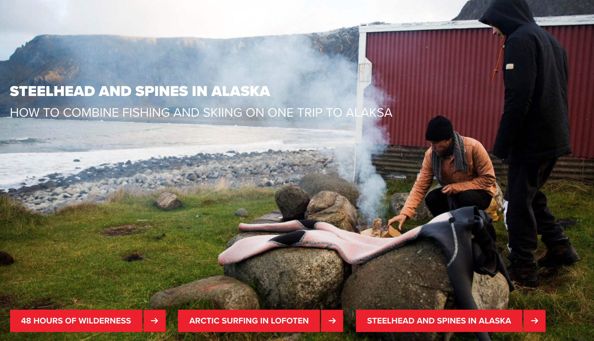
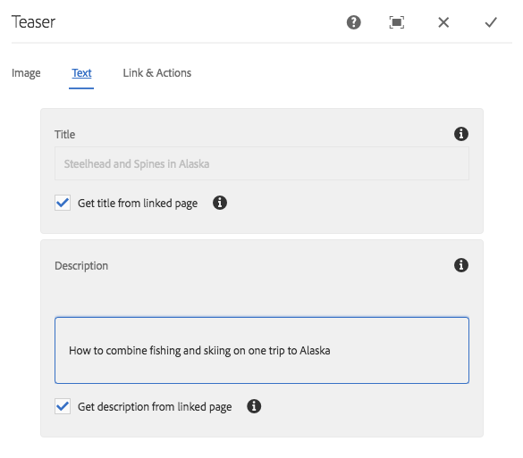
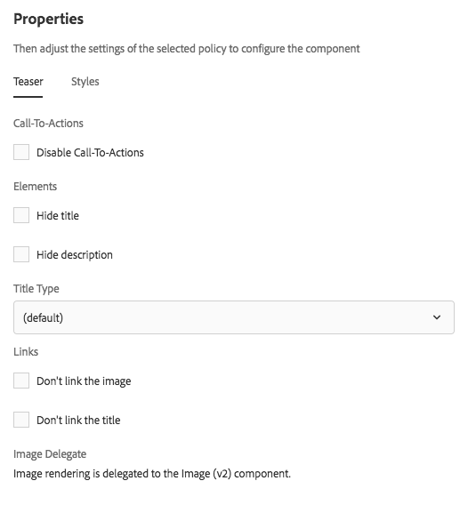

# Teaser Component{#teaser-component}

The Core Component Teaser Component can show an image, a title, rich-text, and optionally link to further content.

## Usage {#usage}

The Teaser Component allows the content author to easily create a teaser to further content using an image, title, or rich text and linking to further content or other actions.

The template author can use the [design dialog](teaser.md#main-pars_header_922510664) to define if the options to create call-to-actions and add links are available as well as disabling various display options. The content author can use the [configure dialog](teaser.md#main-pars_header_2140981519) to set an image, define CTAs, set titles and descriptions, and configure links to the individual teaser. The [edit dialog](teaser.md#main-pars_header_1229227054) of the [Image Component](image.md) can be accessed to modify the teaser image.

## Version and Compatibility {#version-and-compatibility}

The current version of the Teaser Component is v1, which was introduced with release 2.1.0 of the Core Components in July 2018, and is described in this document.  
  
The following table details all supported versions of the component, the AEM versions with which the versions of the component is compatible, and links to documentation for previous versions.

| Component Version |AEM 6.3 |AEM 6.4 |
|---|---|---|
| v1 |Compatible |Compatible |

## Sample Component Output {#sample-component-output}

The following is a sample taken from [We.Retail](https://helpx.adobe.com/experience-manager/6-4/sites/developing/using/we-retail.html).

### Screenshot {#screenshot}

 

### Component Library

To experience the Teaser Component as well as see examples of its configuration options as well as HTML and JSON output, visit the [Component Library](http://opensource.adobe.com/aem-core-wcm-components/library/teaser.html).

## Configure Dialog {#configure-dialog}

The content author can use the configure dialog to define the properties of the individual teaser. There is also an [edit dialog](teaser.md#main-pars_header_1229227054) to modify the teaser image if one is selected.

### Image {#image}

* **Image asset**
  * Drop an asset from the [asset browser](https://helpx.adobe.com/experience-manager/6-4/sites/authoring/using/author-environment-tools.html#main-pars_title) or tap the **browse** option to upload from a local file system.
  * Tap or click **Clear** to de-select the currently selected image.
  * Tap or click **Edit** to [mange the renditions of the asset](https://helpx.adobe.com/experience-manager/6-4/assets/using/managing-assets-touch-ui.html#main-pars_title_19) in the asset editor.

### Text {#text}

* **Title**
  Defines a title to display as the headline for the teaser.
* **Get title from linked page**
  When checked, the title will be populated with the linked page's title.
* **Description**
  Defines a description to display as the subheadind of the teaser.
* **Get description from linked page**
  When checked, the description will be populated with the linked page's description.

### Links & Actions {#links-actions}

* **Link**
  Link applied to the teaser. Use the path browser to select the link target.
* **Enable Call-To-Actions**
  When checked, enables definition of Call-To-Actions. The first Call-To-Action link in the list is used as the link for other teaser elements.

## Edit Dialog {#edit-dialog}

The Teaser Component delegates image rendering to the [Image Component](image.md). Therefore the [edit dialog](image.md#main-pars_title) of the Image Component is available to the content author to manipulate the teaser image.

## Design Dialog {#design-dialog}

The design dialog allows the template author to define the teaser options that the content author has when using this component.

### Teaser Tab {#teaser-tab}

* **Call-To-Actions**
  * **Disable Call-To-Actions**
    Hide the **Call-To-Actions** option for content authors
* **Elements**
  * **Hide title**
    * Hides the **Title** option for content authors
    * When selected the **Title Type** is hidden
  * **Hide description**
    Hide the **Description** option for content authors
* **Title Type**
  Defines the H tag to be used by the title of the teaser.  
* **Links**
  * **Don't link the image**
    When selected, the teaser image is not linked  
  * **Don't link the title**
    When selected, the teaser title is not linked

### Styles Tab {#styles-tab}

The Teaser Component supports the AEM [Style System](authoring.md#component-styling).

## Technical Details {#technical-details}

The latest technical documentation about the Teaser Component [can be found on GitHub](https://github.com/adobe/aem-core-wcm-components/blob/master/content/src/content/jcr_root/apps/core/wcm/components/teaser/v1/teaser).

The entire core components project can be downloaded from GitHub.

Further details about developing Core Components can be found in the [Core Components developer documentation](developing.md).  
