# Text Component (v1){#text-component-v}

The Text Component is a rich text editing and composing component that features in-place editing.

## Usage {#usage}

The Text Component offers a robust rich text editor that allows for easy text editing in a simplified, in-line editor as well as a full screen format.

The [edit dialog](text-v1.md#main-pars_title) features in-line editing with limited options with full functionality available in the full-screen edit dialog. Using the [design dialog](text-v1.md#main-pars_title_1995166862), text formatting options such as headings, special characters, and paragraph styles can be configured for the template for the content author.

## Version and Compatibility {#version-and-compatibility}

This document describes v1 of the Text Component, originally introduced with release 1.0.0 of the Core Components with AEM 6.3.

The following table lists the compatibility of v1 of the Text Component.

|AEM Version|Text Component v1|
|--- |--- |
|6.3|Compatible|
|6.4|Compatible|

>[!CAUTION]
>
>This document describes v1 of the Text Component.
>
>For details of the current version of the Text Component, see the [Text Component](text.md) document.

## Sample Component Output {#sample-component-output}

The following is sample taken from [We.Retail](https://helpx.adobe.com/experience-manager/6-4/sites/developing/using/we-retail.html).

### Screenshot {#screenshot}

 

### HTML {#html}

```
<div class="cmp cmp-text aem-GridColumn aem-GridColumn--default--12">
<p>Lorem ipsum dolor sit amet, consectetur adipiscing elit. Integer porttitor ante a tortor volutpat maximus. Donec eu porta eros. Aenean sit amet eleifend arcu, eu vestibulum magna. Fusce eget nisi tincidunt, tristique felis quis, tincidunt est. Aliquam consequat aliquam quam non eleifend. Phasellus ut magna luctus, aliquam risus eget, fermentum augue. Aliquam lobortis accumsan magna, quis efficitur enim dictum eu. Pellentesque iaculis felis eget felis commodo, non euismod dolor euismod. Quisque nec arcu rutrum, mollis tortor non, sollicitudin odio. Sed dictum nulla mauris, eu pretium dui vulputate a. Maecenas lacus massa, egestas vitae tincidunt eu, interdum et magna. Lorem ipsum dolor sit amet, consectetur adipiscing elit. In eleifend ex lacus, in consectetur nunc interdum et. Donec interdum mi vitae dolor pretium mattis. In quis arcu sapien. Phasellus at metus vitae nisi tincidunt varius.<br />
</p>
</div>
```

### JSON {#json}

```
"text": {
              "columnClassNames": "aem-GridColumn aem-GridColumn--default--12",
              "text": "<p>Lorem ipsum dolor sit amet, consectetur adipiscing elit. Integer porttitor ante a tortor volutpat maximus. Donec eu porta eros. Aenean sit amet eleifend arcu, eu vestibulum magna. Fusce eget nisi tincidunt, tristique felis quis, tincidunt est. Aliquam consequat aliquam quam non eleifend. Phasellus ut magna luctus, aliquam risus eget, fermentum augue. Aliquam lobortis accumsan magna, quis efficitur enim dictum eu. Pellentesque iaculis felis eget felis commodo, non euismod dolor euismod. Quisque nec arcu rutrum, mollis tortor non, sollicitudin odio. Sed dictum nulla mauris, eu pretium dui vulputate a. Maecenas lacus massa, egestas vitae tincidunt eu, interdum et magna. Lorem ipsum dolor sit amet, consectetur adipiscing elit. In eleifend ex lacus, in consectetur nunc interdum et. Donec interdum mi vitae dolor pretium mattis. In quis arcu sapien. Phasellus at metus vitae nisi tincidunt varius.</p>\n",
              "richText": true,
              ":type": "weretail/components/content/text"
            }
```

>[!NOTE]
>
>JSON export from the Core Components requires release 1.1.0 of the Core Components. Please see the [compatibility information for Core Components v1](versions.md#main-pars_title_236368006) for more information.

## Edit Dialog {#edit-dialog}

The edit dialog offers the standard rich text formatting tools a user would expect to compose text.


* Bold

  

  Used to apply bold formatting to selected text or boldly format text entered after the cursor.

  **Ctrl+B** can be used as a keyboard shortcut.

* Italic

  

  Used to apply italicized formatting to selected text or italicize text entered after the cursor.

  **Ctrl+I** can be used as a keyboard shortcut.

* Underline

  

  Used to apply underlined formatting to selected text or underline text entered after the cursor.

  **Ctrl+U** can be used as a keyboard shortcut.

* Subscript

  

  Used to format selected text or text entered after the cursor as subscript.

* Superscript

  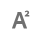

  Used to format selected text or text entered after the cursor as superscript.

* Paste as Text

  

  Pastes any copied text as plain text without any formatting.

  When selecting this option a window opens where the text can be pasted as plain text with no formatting as a preview before it is inserted into the text. Accept by tapping or clicking the checkmark, cancel by tapping or clicking the x.

  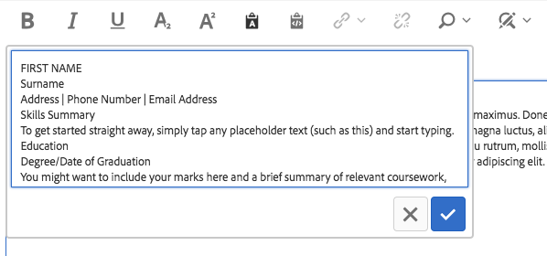

* Paste from Word

  

  When selecting this option a window opens where the text can be pasted maintaining its formatting as a preview before it is inserted into the text. Accept by tapping or clicking the checkmark, cancel by tapping or clicking the x.

  

* Hyperlink

  

  Use this option to convert the selected text into a hyperlink or modify an already defined link. This option is only active when text is already selected and opens a window with additional options for setting the link.

  

    * Enter the location

        * Use the Open Selection Dialog to choose a path in AEM
        * If the link is not within AEM, enter the absolute URL (non-absolute paths are interpreted as relative to AEM)

    * Enter alternative descriptive text for the link
    * Select link behavior

        * Target
        * Same Tab
        * New Tab
        * Parent Frame
        * Top Frame

  Tap or click the checkmark to apply the link or the x to cancel.

* Unlink

  

  Use this option to remove a link already applied to the selected text. This option is only active when a link is already selected.

* Find

  

  Use this option to search the text for occurrences of a specified text string. Selecting this option opens a window for specifying the search options.

  

  Enter the text for which you want to search and tap or click **Find** to begin the search. Tap or click the x to cancel.

  If you wish to do an exact match according to the case, select the option **Match Case** before starting the search.

  If a match is found, it is highlighted and the search dialog is dimmed. Tap or click the **Find** button again in the dimmed dialog to search for the next occurrence.

  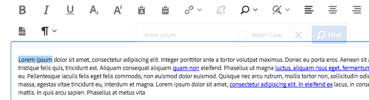

  If no additional occurrences are found, a message will be displayed and the search will restart from the beginning of the text.

  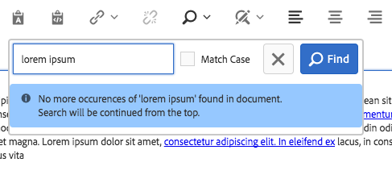

* Replace

  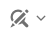

  Use this option to search the text for occurrences of a specified text string and replace the matches with another string. Selecting this option opens a window for specifying the search and replace options.

  

  Enter the text for which you want to search as well as the text with which it should be replaced.

  Tap or click **Find** to begin the search. Click or tap the x to cancel.

  If you wish to do an exact match according to the case, select the option **Match Case** before starting the search.

  If a match is found, it is highlighted and the search dialog is dimmed. Click the **Find** button again in the dimmed dialog to search for the next occurrence or select the **Replace** button to replace the highlighted, matched text. Note that the **Replace** button is only active once a match is made.

  Select **Replace all** to replace all occurrences of the text at once.

* Align Text Left

  

  Used to align the text to the left margin.

* Center Text

  

  Used to center the text.

* Align Text Right

  

  Used to align the text to the right margin.

* Bullet

  

  Used to format the selected text as a bulleted list or begin the insertion of a bulleted list after the cursor.

  To end a bulleted list, tap or click the **Bullet** button again or enter two carriage returns.

* Numbered

  

  Used to format the selected text as a numbered list or begin the insertion of a numbered list after the cursor.

  To end a numbered list, tap or click the **Numbered** button again or enter two carriage returns.

* Outdent

  

  Used to decrease the indentation level of the selected text or text entered after the cursor.

  Only active if the selected text or position of the cursor is already indented.

* Indent

  

  Used to increase the indentation level of the selected text or text entered after the cursor.

* Table

  

  Used to insert a table into the text. Selecting this option opens a window for specifying the details of the table.

  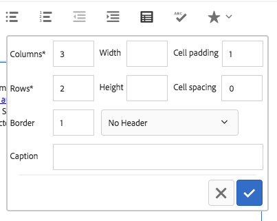

    * **Columns** - The number of columns of the table (required)
    * **Rows** - The number of rows of the table (required)
    * **Width** - The width of the table
    * **Height** - The height of the table
    * **Cell paddin**g - The space around the cell content
    * **Cell spacing** - The space between cells
    * **Border** - The weight of the border lines of the table
    * If for the header of the table:

        * The first row should be used
        * The first column should be used
        * The first row and first column should be used
        * Or no header should be used.

    * **Caption** - The caption of the table

* Check Spelling

  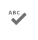

  Used to check the spelling of the text content. Possible misspellings are underlined with broken, red lines.

* Special Characters

  

  Used to insert special characters into the text. Selecting this option opens a window where the available characters are displayed.

  

  Tap or click the desired character to insert it into the text after the cursor. Multiple characters can be inserted. Tap or click the x to close the selection window.

* Source Edit

  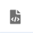

  Used to view and modify the HTML source of the text.

  Tap or click the **Source Edit** icon to change the content of the text from the formatted view to view the raw HTML. In this mode, all other formatting options are disabled. Tap or click the **Source Edit** icon again to return to the formatted view.

  >[!CAUTION]
  >
  >As always the case with access to raw HTML, care must be exercised when using the **Source Edit** option!
  >
  >
  >HTML entered via **Source Edit** is scanned for XSS risks and any scripts that are inserted are removed and will not appear on the resulting page. However malformed HTML entered in **Source Edit** can break the template for the page resulting in unexpected formatting or rendering the resulting page unusable.

* Paragraph Format

  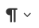

  Used to apply paragraph formatting to the selected text or to text inserted after the cursor. Selecting this options opens a dropdown from which the paragraph format is selected.

  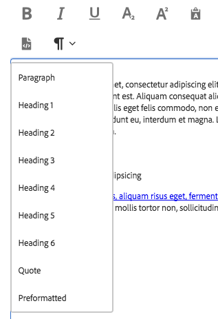

The text component can be edited in-line as well, but due to space restraints, not all formatting options are available in-line. To see all options, switch to full-screen mode.

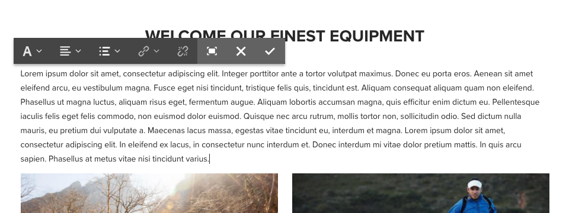 

## Design Dialog {#design-dialog}

The design dialog allows the template author to define which text formatting options are available to the content authors.

### Features {#features}

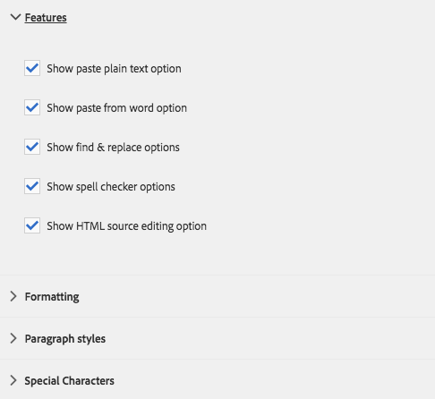

The following features can be activated or deactivated for the component.

* Paste plain text
* Past from word
* Find and replace
* Spell checker
* Source editing

### Formatting {#formatting}


The following formatting options can be activated or deactivated for the component.

* Table
* Lists
* Alignment
* Bold, italic, underline
* Links
* Sub/superscript

### Paragraph Styles {#paragraph-styles}

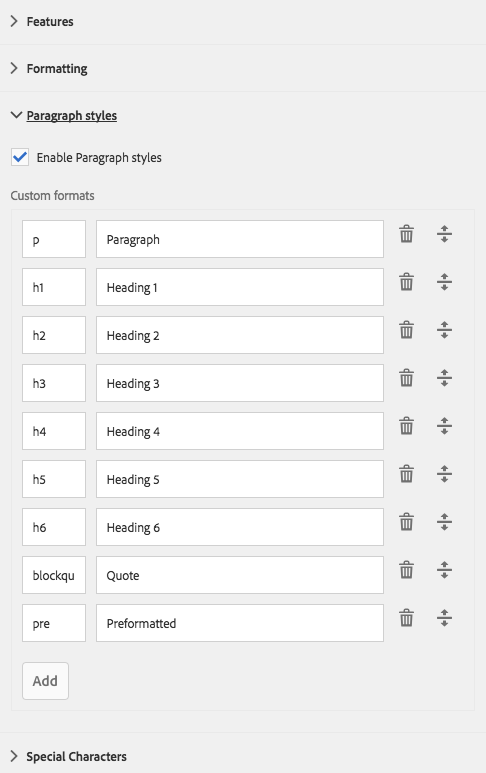

Paragraph styles can be activated or deactivated for the component. When activated, the allowed formats can be defined.

* Tap or click the **Add** button to insert a new style.
* Enter the code of the style and a description that will be displayed in the edit dialog.
* To remove a style tap or click the **Delete** button.
* To rearrange the order of the formats tap or click and drag the handles.

### Special Characters {#special-characters}


The option to insert special characters can be activated or deactivated for the component. When activated, the allowed characters can be defined.

* Tap or click the **Add** button to insert a new character.
* Enter the HTML code of the character and a description that will be displayed in the edit dialog.
* To remove a character tap or click the **Delete** button.
* To rearrange the order of the characters tap or click and drag the handles.

## Technical Details {#technical-details}

The latest technical documentation about the Text Component [can be found on GitHub](https://github.com/adobe/aem-core-wcm-components/tree/master/content/src/content/jcr_root/apps/core/wcm/components/text/v1/text).

The entire core components project can be downloaded from GitHub.

Further details about developing Core Components can be found in the [Core Components developer documentation](developing.md). 
