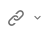
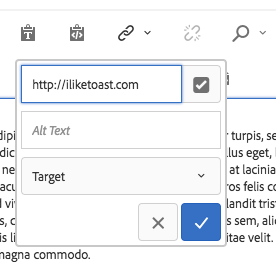
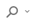
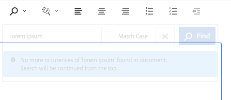
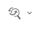
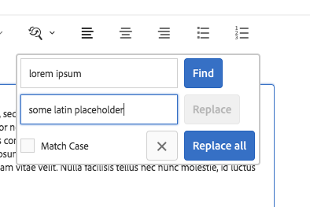
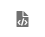
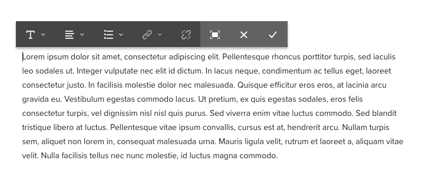

# Text Component{#text-component}

The Core Component Text Component is a rich text editing and composing component that features in-place editing.

## Usage {#usage}

The Text Component offers a robust rich text editor that allows for easy text editing in a simplified, in-line editor as well as a full screen format.

The [edit dialog](text.md#main-pars_title) features in-line editing with limited options with full functionality available in the full-screen edit dialog. Using the [design dialog](text.md#main-pars_title_1995166862), text formatting options such as headings, special characters, and paragraph styles can be configured for the template for the content author.

## Version and Compatibility {#version-and-compatibility}

The current version of the Text Component is v2, which was introduced with release 2.0.0 of the Core Components in January 2018, and is described in this document.

The following table details all supported versions of the component, the AEM versions with which the versions of the component is compatible, and links to documentation for previous versions.

|Component Version|AEM 6.3|AEM 6.4|
|--- |--- |--- |
|v2|Compatible|Compatible|
|[v1](text-v1.md)|Compatible|Compatible|

For more information about Core Component versions and releases, see the document [Core Components Versions](versions.md).

## Sample Component Output {#sample-component-output}

The following is a sample taken from [We.Retail](https://helpx.adobe.com/experience-manager/6-4/sites/developing/using/we-retail.html).

### Screenshot {#screenshot}

 

### HTML {#html}

```
<div class="cmp-text">
    <p>Lorem ipsum dolor sit amet, consectetur adipiscing elit. Etiam et nisl nec ante fermentum sollicitudin vitae vitae lectus. Phasellus non posuere augue. Nam porta nibh id sapien laoreet mollis. Nullam tincidunt in urna et placerat. Maecenas porttitor tristique ex id cursus. Integer quis tincidunt risus. Donec et enim fermentum purus condimentum tristique. Maecenas eleifend risus nibh, in blandit eros ullamcorper non. Sed scelerisque non metus vel blandit. Phasellus a odio non est fringilla auctor.</p>

</div>
```

### JSON {#json}

```
"text":{  
             "columnClassNames":"aem-GridColumn aem-GridColumn--default--12",
             "text":"\u003Cp\u003ELorem ipsum dolor sit amet, consectetur adipiscing elit. Pellentesque rhoncus porttitor turpis, sed iaculis leo sodales ut. Integer vulputate nec elit id dictum. In lacus neque, condimentum ac tellus eget, laoreet consectetur justo. In facilisis molestie dolor nec malesuada. Quisque efficitur eros eros, at lacinia arcu gravida eu. Vestibulum egestas commodo lacus. Ut pretium, ex quis egestas sodales, eros felis consectetur turpis, vel dignissim nisl nisl quis purus. Sed viverra enim vitae luctus commodo. Sed blandit tristique libero at luctus. Pellentesque vitae ipsum convallis, cursus est at, hendrerit arcu. Nullam turpis sem, aliquet non lorem in, consequat malesuada urna. Mauris ligula velit, rutrum et laoreet a, aliquam vitae velit. Nulla facilisis tellus nec nunc molestie, id luctus magna commodo.\u003C/p\u003E\n",
             "richText":true,
             ":type":"weretail/components/content/text"
}
```

## The Text Component and the Rich Text Editor {#the-text-component-and-the-rich-text-editor}

The Core Components Text Component leverages the AEM Rich Text Editor (RTE). The RTE provides content authors with a wide range of functionality for editing their text content. The RTE is very flexible in its configuration and offers a number of options. Further details about how the RTE can be configured can be found in the articles [Configure the Rich Text Editor](https://helpx.adobe.com/experience-manager/6-4/sites/administering/using/rich-text-editor.html) and [Configure the Rich Text Editor plug-ins](https://helpx.adobe.com/experience-manager/6-4/sites/administering/using/configure-rich-text-editor-plug-ins.html).

The remainder of this article demonstrates the standard configuration of the Core Components Text Component with the out-of-the-box RTE configuration.

## Edit Dialog {#edit-dialog}

The edit dialog offers the standard rich text formatting tools a user would expect to compose text.


### Bold


Used to apply bold formatting to selected text or boldly format text entered after the cursor.

**Ctrl+B** can be used as a keyboard shortcut.

### Italic


Used to apply italicized formatting to selected text or italicize text entered after the cursor.

**Ctrl+I** can be used as a keyboard shortcut.

### Underline


Used to apply underlined formatting to selected text or underline text entered after the cursor.

**Ctrl+U** can be used as a keyboard shortcut.

### Subscript


Used to format selected text or text entered after the cursor as subscript.

### Superscript


Used to format selected text or text entered after the cursor as superscript.

### Paste as Text


Pastes any copied text as plain text without any formatting.

When selecting this option a window opens where the text can be pasted as plain text with no formatting as a preview before it is inserted into the text. Accept by tapping or clicking the check mark, cancel by tapping or clicking the x.


### Paste from Word


When selecting this option a window opens where the text can be pasted maintaining its formatting as a preview before it is inserted into the text. Accept by tapping or clicking the check mark, cancel by tapping or clicking the x.


### Hyperlink



Use this option to convert the selected text into a hyperlink or modify an already defined link. This option is only active when text is already selected and opens a window with additional options for setting the link.



* Enter the location
  * Use the Open Selection Dialog to choose a path in AEM
  * If the link is not within AEM, enter the absolute URL (non-absolute paths are interpreted as relative to AEM)
* Enter alternative descriptive text for the link
* Select link behavior
  * Target
  * Same Tab
  * New Tab
  * Parent Frame
  * Top Frame

  Tap or click the check mark to apply the link or the x to cancel.

### Unlink


Use this option to remove a link already applied to the selected text. This option is only active when a link is already selected.

### Find



Use this option to search the text for occurrence of a specified text string. Selecting this option opens a window for specifying the search options.


Enter the text for which you want to search and tap or click **Find** to begin the search. Tap or click the x to cancel.
If you wish to do an exact match according to the case, select the option **Match Case** before starting the search.
If a match is found, it is highlighted and the search dialog is dimmed. Tap or click the **Find** button again in the dimmed dialog to search for the next occurrence.


If no additional occurrences are found, a message will be displayed and the search will restart from the beginning of the text.



### Replace



Use this option to search the text for occurrences of a specified text string and replace the matches with another string. Selecting this option opens a window for specifying the search and replace options.



Enter the text for which you want to search as well as the text with which it should be replaced.

Tap or click **Find** to begin the search. Click or tap the x to cancel.

If you wish to do an exact match according to the case, select the option **Match Case** before starting the search.

If a match is found, it is highlighted and the search dialog is dimmed. Click the **Find** button again in the dimmed dialog to search for the next occurrence or select the **Replace** button to replace the highlighted, matched text. Note that the **Replace** button is only active once a match is made.

Select **Replace all** to replace all occurrences of the text at once.

### Align Text Left


Used to align the text to the left margin.

### Center Text


Used to center the text.

### Align Text Right


Used to align the text to the right margin.

### Bullet


Used to format the selected text as a bulleted list or begin the insertion of a bulleted list after the cursor.

To end a bulleted list, tap or click the **Bullet** button again or enter two carriage returns.

### Numbered


Used to format the selected text as a numbered list or begin the insertion of a numbered list after the cursor.

To end a numbered list, tap or click the **Numbered** button again or enter two carriage returns.

### Outdent


Used to decrease the indentation level of the selected text or text entered after the cursor.

Only active if the selected text or position of the cursor is already indented.

### Indent


Used to increase the indentation level of the selected text or text entered after the cursor.

### Table


Used to insert a table into the text. Selecting this option opens a window for specifying the details of the table.


* **Columns**
  The number of columns of the table (required)
* **Rows**
  The number of rows of the table (required)
* **Width**
  The width of the table
* **Height**
  The height of the table
* **Cell padding**
  The space around the cell content
* **Cell spacing**
  The space between cells
* **Border**
  The weight of the border lines of the table
* If for the header of the table:
  * The first row should be used
  * The first column should be used
  * The first row and first column should be used
  * Or no header should be used.
* **Caption**
  The caption of the table

### Check Spelling


Used to check the spelling of the text content. Possible misspellings are underlined with broken, red lines.

Further details about spell checking and customizing spell check dicitionaries can be found in the document [Configure the Rich Text Editor Plug-Ins](https://helpx.adobe.com/experience-manager/6-4/sites/administering/using/configure-rich-text-editor-plug-ins.html#adddict).

### Special Characters {#special-characters}


Used to insert special characters into the text. Selecting this option opens a window where the available characters are displayed.


Tap or click the desired character to insert it into the text after the cursor. Multiple characters can be inserted. Tap or click the x to close the selection window.

### Source Edit



Used to view and modify the HTML source of the text.

Tap or click the **Source Edit** icon to change the content of the text from the formatted view to view the raw HTML. In this mode, all other formatting options are disabled. Tap or click the **Source Edit** icon again to return to the formatted view.

>[!CAUTION]
>
>As always the case with access to raw HTML, care must be exercized when using the **Source Edit** option!
>
>HTML entered via **Source Edit** is scanned for XSS risks and any scripts that are inserted are removed and will not appear on the resulting page. However malformed HTML entered in **Source Edit** can break the template for the page resulting in unexpected formatting or rendering the resulting page unusable.

>[!NOTE]
>
>Because HTML entered via **Source Edit** is scanned for XSS risks and any scripts and automatically removes those found, the actual content persisted may vary from what was entered in **Source Edit**. For this reason, in order to save changes made using **Source Edit**, you must first exit **Source Edit** to view the text in the normal editor before saving.

### Paragraph Format


Used to apply paragraph formatting to the selected text or to text inserted after the cursor. Selecting this options opens a dropdown from which the paragraph format is selected.


The text component can be edited in-line as well, but due to space restraints, not all formatting options are available in-line. To see all options, switch to full-screen mode.

 

## Design Dialog {#design-dialog}

The design dialog allows the template author to define which text formatting options are available to the content authors.

### Plugins Tab {#plugins-tab}

The Plugins tab is used to enable and disable various text formatting options available to the content authors.

### Features {#features}


The following features can be activated or deactivated for the component.

* Paste plain text
* Past from word
* Find and replace
* Spell checker
* Source editing

### Formatting {#formatting}


The following formatting options can be activated or deactivated for the component.

* Table
* Lists
* Alignment
* Bold, italic, underline
* Links
* Sub/superscript

### Paragraph Styles {#paragraph-styles}


Paragraph styles can be activated or deactivated for the component. When activated, the allowed formats can be defined.

* Tap or click the **Add** button to insert a new style.
* Enter the code of the style and a description that will be displayed in the edit dialog.
* To remove a style tap or click the **Delete** button.
* To rearrange the order of the formats tap or click and drag the handles.

### Configuring Special Characters {#configuring-special-characters}


The option to insert special characters can be activated or deactivated for the component. When activated, the allowed characters can be defined.

* Tap or click the **Add** button to insert a new character.
* Enter the HTML code of the character and a description that will be displayed in the edit dialog.
* To remove a character tap or click the **Delete** button.
* To rearrange the order of the characters tap or click and drag the handles.

## Styles Tab {#styles-tab}

The Text Component supports the AEM [style system](authoring.md#component-styling).

## Technical Details {#technical-details}

The latest technical documentation about the Text Component [can be found on GitHub](https://github.com/adobe/aem-core-wcm-components/blob/master/content/src/content/jcr_root/apps/core/wcm/components/text/v2/text).

The entire core components project can be downloaded from GitHub.

Further details about developing Core Components can be found in the [Core Components developer documentation](developing.md). 
