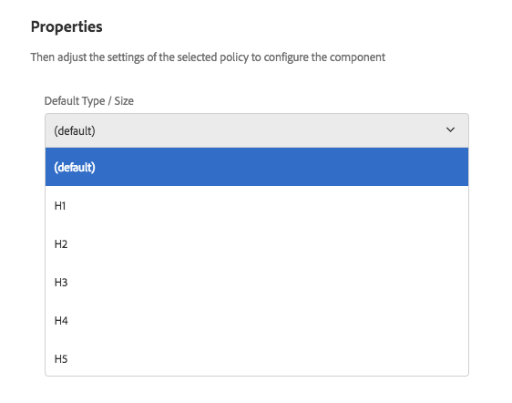

# Title Component (v1){#title-component-v}

The Core Component Title Component is a section heading component that features in-place editing.

## Usage {#usage}

The Title Component is intended to be used as the title or heading of a section of content.

The available heading levels can be defined by the template author in the [design dialog](title-v1.md#main-pars_title_1995166862). The content editor can select from available headings levels in the [edit dialog](title-v1.md#main-pars_title). For added convenience, simple in-place editing of the heading text is also available.

## Version and Compatibility {#version-and-compatibility}

This document describes v1 of the Title Component, originally introduced with release 1.0.0 of the Core Components with AEM 6.3.

The following table lists the compatibility of v1 of the Title Component.

<table border="1" cellpadding="1" cellspacing="0" width="100%"> 
 <tbody> 
  <tr> 
   <td><strong>AEM Version</strong></td> 
   <td><strong>Title Component<br /> v1</strong><br /> </td> 
  </tr> 
  <tr> 
   <td>6.3</td> 
   <td>Compatible</td> 
  </tr> 
  <tr> 
   <td>6.4</td> 
   <td>Compatible</td> 
  </tr> 
 </tbody> 
</table>

>[!CAUTION]
>
>This document describes version 1 of the Title Component.
>
>For details of the current version of the Title Component, see the [Title Component](title.md) document.

## Sample Component Output {#sample-component-output}

The following is sample taken from [We.Retail](https://helpx.adobe.com/experience-manager/6-3/sites/developing/using/we-retail.html).

### Screenshot {#screenshot}

 

### HTML {#html}

```
<div class="cmp cmp-title aem-GridColumn aem-GridColumn--default--12">
     <h2>Welcome! This is our finest equipment!</h2>
</div>
```

### JSON {#json}

```
"title": {
              "columnClassNames": "aem-GridColumn aem-GridColumn--default--12",
              ":type": "weretail/components/content/title",
              "jcr:title": "Welcome! This is our finest equipment!",
              "type": "h2"
            }
```

>[!NOTE]
>
>JSON export from the Core Components requires release 1.1.0 of the Core Components. Please see the [compatibility information for Core Components v1](versions.md#main-pars_title_236368006) for more information.

## Edit Dialog {#edit-dialog}

The edit dialog allows the content author to define the title text as well as select the heading level.

>[!NOTE]
>
>An empty value for the title will cause the page title to be displayed.


The in-place editor can also be used to edit the text of the title component.

 

## Design Dialog {#design-dialog}

The design dialog allows the template author to define the default heading level that title components will have when created by the content authors.

 

## Technical Details {#technical-details}

The latest technical documentation about the Title Component [can be found on GitHub](https://github.com/adobe/aem-core-wcm-components/tree/master/content/src/content/jcr_root/apps/core/wcm/components/title/v1/title).

The entire core components project can be downloaded from GitHub.

Further details about developing Core Components can be found in the [Core Components developer documentation](developing.md). 
