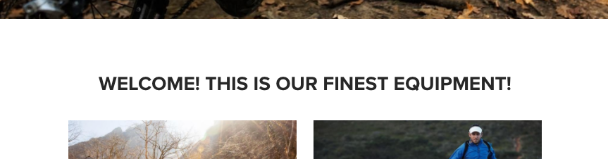
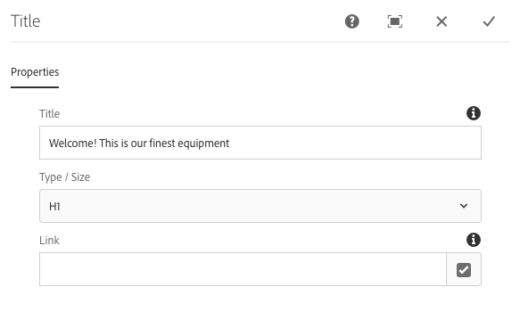

# Title Component{#title-component}

The Core Component Title Component is a section heading component that features in-place editing.

## Usage {#usage}

The Title Component is intended to be used as the title or heading of a section of content. The available heading levels can be defined by the template author in the [design dialog](title.md#main-pars_title_1995166862). The content editor can select from available headings levels in the [edit dialog](title.md#main-pars_title). For added convenience, simple in-place editing of the heading text is also available.

## Version and Compatibility {#version-and-compatibility}

The current version of the Title Component is v2, which was introduced with release 2.0.0 of the Core Components in January 2018, and is described in this document.

The following table details all supported versions of the component, the AEM versions with which the versions of the component is compatible, and links to documentation for previous versions.

<table border="1" cellpadding="1" cellspacing="0" width="100%"> 
 <tbody> 
  <tr> 
   <td>Component Version<br /> </td> 
   <td>AEM 6.3</td> 
   <td>AEM 6.4</td> 
  </tr> 
  <tr> 
   <td>v2<br /> </td> 
   <td>Compatible</td> 
   <td>Compatible</td> 
  </tr> 
  <tr> 
   <td><a href="../using/text-v1.md">v1</a></td> 
   <td>Compatible</td> 
   <td>Compatible</td> 
  </tr> 
 </tbody> 
</table>

For more information about Core Component versions and releases, see the document [Core Components Versions](versions.md).

## Sample Component Output {#sample-component-output}

The following is sample taken from [We.Retail](/content/help/en/experience-manager/6-3/sites/developing/using/we-retail).

### Screenshot {#screenshot}

 

### HTML {#html}

```
<div class="cmp-title">
    <h2 class="cmp-title__text">Welcome this is our finest equipment</h2>
</div>
```

### JSON {#json}

```
"title":{  
                     "columnClassNames":"aem-GridColumn aem-GridColumn--default--12",
                     "type":"h2",
                     "text":"Welcome this is our finest equipment",
                     ":type":"weretail/components/content/title"
                  }
```

## Edit Dialog {#edit-dialog}

The edit dialog allows the content author to define the title text as well as select the heading level.

* **Title** - If empty the page title will be used
* **Type / Size** - Defines the heading level of the title
* **Link** - Defines the content to which the title will link. This can be a path to a content page, an external URL, or a page anchor.



>[!CAUTION]
>
>The ability to define a link for the title was introduced with release 2.2.0 of the Core Components.

The in-place editor can also be used to edit the text of the title component.

 

## Design Dialog {#design-dialog}

The design dialog allows the template author to define the default heading level that title components will have when created by the content authors.

### Sizes Tab {#sizes-tab}


* **Allowed Types / Sizes for Authors** - Enable or disable heading types that will be available for content authors when they use the Title Component.
* **Default Type / Size **- Define the heading type that will be automatically assigned when a content author adds the Title Component to a page.
* **Disable Link **- Disable support for links in the title component to disallow content authors from linking from titles.

>[!CAUTION]
>
>The ability to define a link for the title was introduced with release 2.2.0 of the Core Components.

### Styles Tab {#styles-tab}

The Title Component supports the AEM [Style System](authoring.md#main-pars_header).

## Technical Details {#technical-details}

The latest technical documentation about the Title Component [can be found on GitHub](https://github.com/adobe/aem-core-wcm-components/blob/master/content/src/content/jcr_root/apps/core/wcm/components/title/v2/title).

The entire core components project can be downloaded from GitHub.

Further details about developing Core Components can be found in the [Core Components developer documentation](developing.md). 
