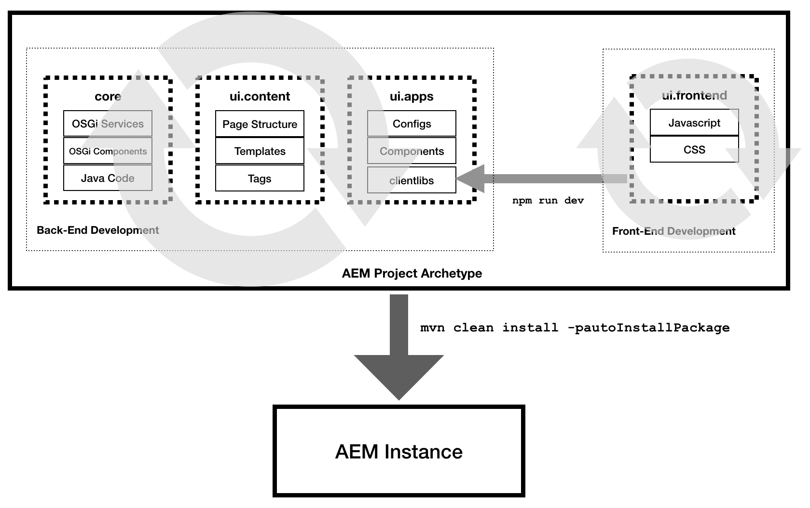

# ui.frontend Module of the AEM Project Archetype {#uifrontend-module}

The AEM Project Archetype includes an optional, dedicated front-end build mechanism based on Webpack. The ui.frontend module thus becomes the central location for all of the project's front-end resources including JavaScript and CSS files. To fully take advantage of this useful and flexible feature, it is important to understand how front-end development fits into an AEM project.

## AEM Projects and Front-End Development {#aem-and-front-end-development}

In greatly-simplified terms, AEM projects can be thought of as consisting of two separate but related parts:

* Back-end development that drives the logic of AEM and produces Java libraries, OSGi services, etc.
* Front-end development that drives the presentation and behavior of the resulting web site and produces JavaScript and CSS libraries

Because these two development processes are focused on different parts of the project, back-end and front-end development can happen in parallel.



However, any resulting project needs to use the output of both of these development efforts i.e. both back-end and front-end.

Running `npm run dev` starts the front-end build process that gathers the JavaScript and CSS files stored in the ui.frontend module and produces a two, minified client libraries or clientlibs called `clientlib-site` and `clientlib-dependencies` and deposits them in the ui.apps module. clientlibs are deployable to AEM and allow you to store your client-side code in the repository.

When the entire AEM project archetype is run using `mvn clean install -PautoInstallPackage` all project artifacts including the clientlibs are then pushed to the AEM instance.

>[!TIP]
>Learn more about clientlibs in the [AEM development documentation](https://docs.adobe.com/content/help/en/experience-manager-65/developing/introduction/clientlibs.html) and [how the ui.frontend module uses them below](#clientlib-generation).

## Possible Front-End Development Workflows {#possible-workflows}

The front-end build module is a useful and very flexible tool, but imposes no particular opinion on how it should be used. The following are two examples of *possible* usage, but your individual project needs may dictate other use models.

### Using Webpack Static Development Server {#using-webpack}

Using Webpack you can style and develop based on static output of AEM webpages within the ui.frontend module.

1. Preview page in AEM using page preview mode or passing in `wcmmode=disabled` in the URL
1. View page source and save as static HTML within the ui.frontend module
1. [Start webpack](#webpack-dev-server) and begin styling and generating the necessary JavaScript and CSS
1. Run `npm run dev` to generate the clientlibs

In this flow, an AEM developer may perform steps one and two and pass the static HTML off to the front-end developer who develops based on the AEM HTML output.

>[!TIP]
>
>One could also leverage the [Component Library](https://adobe.com/go/aem_cmp_library) to capture samples of the markup output of each component in order to work at the component level rather than the page level.

### Using Storybook {#using-storybook}

Using [Storybook](https://storybook.js.org) you can perform more atomic front-end development. Although Storybook is not included in the AEM Project Archetype, you can install it and store your Storybook artifacts within the ui.frontend module. When ready for testing within AEM, they can be deployed as clientlibs by running `npm run dev`.

>[!NOTE]
>
>[Storybook](https://storybook.js.org) is not included in the AEM Project Archetype. If you choose to use it, you must install it separately.

### Determining the Markup {#determining-markup}

Whichever front-end development workflow you decide to implement for your project, the back-end developers and front-end developers must first agree on the markup. Typically AEM defines the markup, which is provided by the core components. [However this can be customized if necessary](customizing.md#customizing-the-markup).

## The ui.frontend Module {#ui-frontend-module}

The AEM Project Archetype includes an optional dedicated front-end build mechanism based on Webpack with the following features.

* Full TypeScript, ES6 and ES5 support (with applicable Webpack wrappers)
* TypeScript and JavaScript linting using a TSLint rule set
* ES5 output, for legacy browser support
* Globbing
  * No need to add imports anywhere
  * All JS and CSS files can now be added to each component.
    * Best practice is under `/clientlib/js`, `/clientlib/css`, or `/clientlib/scss`
  * No `.content.xml` or `js.txt`/`css.txt` files are needed as everything is run through Webpack.
  * The globber pulls in all JS files under the `/component/` folder.
    * Webpack allows CSS/SCSS files to be chained in via JS files.
    * They are pulled in through the two entry points, `sites.js` and `vendors.js`.
  * The only file consumed by AEM is the output files `site.js` and `site.css` in `/clientlib-site` as well as `dependencies.js` and `dependencies.css` in `/clientlib-dependencies`
* Chunks
  * Main (site js/css)
  * Vendors (dependencies js/css)
* Full Sass/Scss support (Sass is compiled to CSS via Webpack)
* Static webpack development server with built in proxy to a local instance of AEM

>[!NOTE]
>
>For more technical information regarding the ui.frontend module, please see the [documentation on GitHub](https://github.com/adobe/aem-project-archetype/blob/master/src/main/archetype/ui.frontend/README.md).

## Installation {#installation}

1. Install [NodeJS](https://nodejs.org/en/download/) (v10+), globally. This will also install npm.
1. Navigate to ui.frontend in your project and run `npm install`.

>[!NOTE]
>
>You must have [run the archetype](overview.md) with the option `-DoptionIncludeFrontendModule=y` to populate the ui.frontend folder.

## Usage {#usage}

The following npm scripts drive the frontend workflow:

* `npm run dev` - full build with JS optimization disabled (tree shaking, etc) and source maps enabled and CSS optimization disabled.
* `npm run prod` - full build with JS optimization enabled (tree shaking, etc), source maps disabled and CSS optimization enabled.
* `npm run start` - Starts a static webpack development server for local development with minimal dependencies on AEM.

## Output {#output}

The ui.frontend module compiles the code under the `ui.frontend/src` folder and outputs the compiled CSS and JS, and any resources beneath a folder named `ui.frontend/dist`.

* **Site** - `site.js`, `site.css` and a `resources/` folder for layout dependent images and fonts are created in a `dist/`clientlib-site folder.
* **Dependencies** - `dependencies.js` and `dependencies.css` are created in a `dist/clientlib-dependencies` folder.

### JavaScript {#javascript}

* Optimization - For production builds, all JS that is not being used or called is removed.

### CSS {#css}

* Autoprefixing - All CSS is run through a prefixer and any properties that require prefixing will automatically have those added in the CSS.
* Optimization - At post, all CSS is run through an optimizer (cssnano) which normalizes it according to the following default rules:
  * Reduces CSS calc expression wherever possible, ensuring both browser compatibility and compression
Converts between equivalent length, time and angle values. Note that by default, length values are not converted.
  * Removes comments in and around rules, selectors & declarations
  * Removes duplicated rules, at-rules and declarations
    * Note that this only works for exact duplicates.
  * Removes empty rules, media queries and rules with empty selectors, as they do not affect the output
  * Merges adjacent rules by selectors and overlapping property/value pairs
  * Ensures that only a single @charset is present in the CSS file and moves it to the top of the document
  * Replaces the CSS initial keyword with the actual value, when the resulting output is smaller
  * Compresses inline SVG definitions with SVGO
* Cleaning - Includes explicit clean task for wiping out the generated CSS, JS and Map files on demand.
* Source Mapping - development build only

>[!NOTE]
>The front end build option utilizes dev-only and prod-only webpack config files that share a common config file. This way the development and production settings can be modified independently.

### Client Library Generation {#clientlib-generation}

The ui.frontend module build process leverages the [aem-clientlib-generator](https://www.npmjs.com/package/aem-clientlib-generator) plugin to move the compiled CSS, JS and any resources into the ui.apps module. The aem-clientlib-generator configuration is defined in `clientlib.config.js`. The following client libraries are generated:

* **clientlib-site** - `ui.apps/src/main/content/jcr_root/apps/<app>/clientlibs/clientlib-site`
* **clientlib-dependencies** - `ui.apps/src/main/content/jcr_root/apps/<app>/clientlibs/clientlib-dependencies`

### Including Client Libraries on Pages {#clientlib-inclusion}

`clientlib-site` and `clientlib-dependencies` categories are included on pages via the [Page Policy configuration](https://helpx.adobe.com/experience-manager/6-5/sites/developing/using/page-templates-editable.html#TemplateDefinitions) as part of the default template. To view the policy, edit the **Content Page Template > Page Information > Page Policy**.

The final inclusion of client libraries on the sites page is as follows:

```
<HTML>
    <head>
        <link rel="stylesheet" href="clientlib-base.css" type="text/css">
        <script type="text/javascript" src="clientlib-dependencies.js"></script>
        <link rel="stylesheet" href="clientlib-dependencies.css" type="text/css">
        <link rel="stylesheet" href="clientlib-site.css" type="text/css">
    </head>
    <body>
        ....
        <script type="text/javascript" src="clientlib-site.js"></script>
        <script type="text/javascript" src="clientlib-base.js"></script>
    </body>
</HTML>
```

The above inclusion can of course be modified by updating the Page Policy and/or modifying the categories and embed properties of respective client libraries.

### Static Webpack Development Server {#webpack-dev-server}

Included in the ui.frontend module is a webpack-dev-server that provides live reloading for rapid front-end development outside of AEM. The setup leverages the html-webpack-plugin to automatically inject CSS and JS compiled from the ui.frontend module into a static HTML template.

#### Important files {#important-files}

* `ui.frontend/webpack.dev.js`
  * This contains the configuration for the webpack-dev-serve and points to the html template to use.
  * It also contains a proxy configuration to an AEM instance running on localhost:4502.
* `ui.frontend/src/main/webpack/static/index.html`
  * This is the static HTML that the server will run against.
  * This allows a developer to make CSS/JS changes and see them immediately reflected in the markup.
  * It is assumed that the markup placed in this file accurately reflects generated markup by AEM components.
  * Markup in this file does not get automatically synced with AEM component markup.
  * This file also contains references to client libraries stored in AEM, like Core Component CSS and Responsive Grid CSS.
  * The webpack development server is set up to proxy these CSS/JS includes from a local running AEM instance based on the configuration found in `ui.frontend/webpack.dev.js`.

#### Using {#using-webpack-server}

1. From within the root of the project run the command `mvn -PautoInstallSinglePackage clean install` to install the entire project to an AEM instance running at `localhost:4502`.
1. Navigate inside the `ui.frontend` folder.
1. Run the following command `npm run start` to start the webpack dev server. Once started it should open a browser (`localhost:8080` or the next available port).

You can now modify CSS, JS, SCSS, and TS files and see the changes immediately reflected in the webpack dev server.
